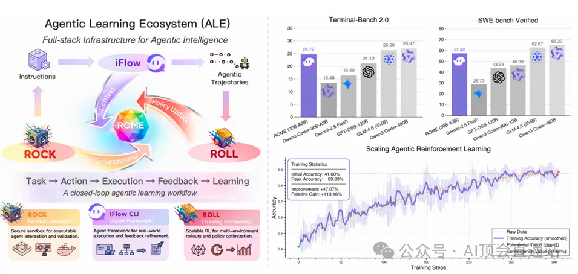
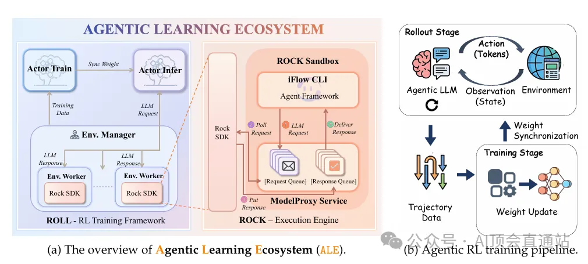
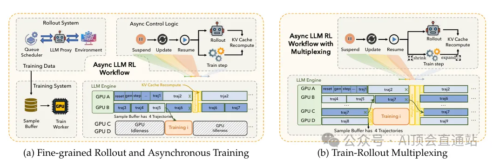
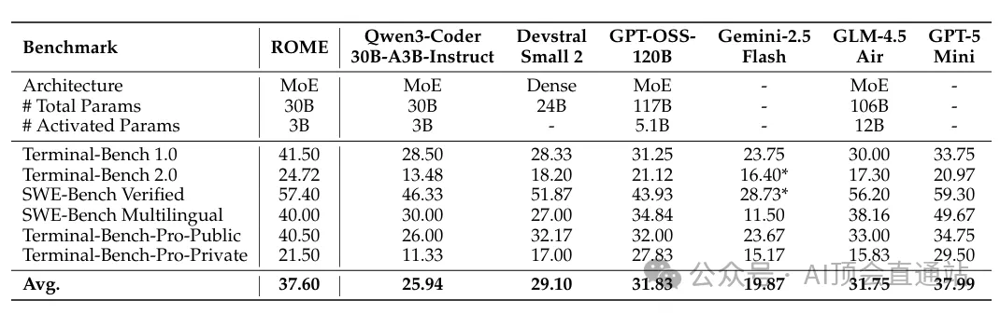

题目：Let It Flow: Agentic Crafting on Rock and Roll

论文地址：https://arxiv.org/abs/2512.24873

题目：Let It Flow: Agentic Crafting on Rock and Roll

论文地址：https://arxiv.org/abs/2512.24873

本图系统展示了面向智能体智能的全栈基础设施ALE在构建、训练与评估智能体模型过程中的关键性能指标与训练动态变化。左侧柱状图对比了ROME模型在Terminal-Bench 2.0与SWE-bench Verified基准上的性能表现，验证了ALE框架在提升智能体任务解决能力方面的有效性；中间部分通过“任务→动作→执行→反馈→学习”的闭环流程图，初始准确率为41.60%，经持续策略优化后峰值达到89.83%，整体提升47.07%，相对增益达113.16%，并通过二次多项式拟合揭示其收敛趋势，最终收敛值稳定于87.68%，充分验证了ALE基础设施在扩展智能体强化学习过程中的稳定性与高效性。

智能体学习生态系统（ALE）架构与强化学习训练流程总览图

本图从系统视角阐释了智能体学习生态系统（ALE）的双阶段协同机制：图(a)以分层架构形式展示了由ROLL-RL训练框架、ROCK执行引擎与iFlow CLI智能体框架构成的全栈基础设施，其中ROCK沙盒环境通过SDK与请求/响应队列实现与多环境工作节点的异步交互，Actor模型在训练与推理角色间切换，权重同步模块保障分布式训练一致性，形成“状态→动作→观测→反馈”的闭环数据流；图(b)进一步细化强化学习训练管线，揭示ALE如何通过Rollout阶段在ROCK环境中生成高多样性交互轨迹，并在Training阶段利用ROLL框架对智能体LLM进行策略梯度优化，实现从环境交互到权重更新的端到端可扩展强化学习迭代，最终支持百万级轨迹规模下的稳定收敛与能力涌现。

细粒度 rollout 与异步强化学习训练的多路复用协同机制示意图

本图揭示了在大规模异步强化学习系统中，通过细粒度 rollout 与训练阶段的多路复用调度实现 GPU 资源极致利用与样本吞吐最大化的核心机制：图(a) 以时空交错方式刻画了 Rollout System 与 Training System 的异步协同流程避免 GPU 空转；图(b) 进一步在同一 GPU 设备内展开 Train-Rollout Multiplexing 时序，展示 GPU A–D 上的 traj1–traj9 如何在 reset、gen、sample、train 等微任务间动态切换，利用细粒度调度器将生成、采样与参数更新步骤拆解为可抢占的微操作，从而在单卡内实现“rollout 产生轨迹→缓存→训练消费”的流水线并行，使得 rollout 与训练在时空维度重叠运行，显著降低端到端迭代延迟并提升系统整体吞吐量。

实验

该表格在Terminal-Bench 1.0/2.0、SWE-Bench Verified、SWE-Bench Multilingual与Terminal-Bench-Pro-Public/Private五类智能体任务基准上，系统对比了ROME与六款代表性模型的端到端解决能力，结果显示：尽管ROME仅以30B总参数、3B激活参数的轻量级MoE结构参赛，其在最具挑战的SWE-Bench Verified上取得57.40分，仅次于GPT-5的59.30分，且平均得分37.60位列榜眼，仅次于GPT-5的37.99，验证了在参数效率与任务泛化性之间实现最优权衡的ALE训练范式可使中小规模模型在真实软件工程环境中逼近甚至超越超大 dense 模型的代理性能。

# 参考

[1] https://mp.weixin.qq.com/s?__biz=MzYzMTIxMDk3Mw==&mid=2247484191&idx=1&sn=48cf6b02c2965d67d87aa779c690ffcc&chksm=f1e234cd356238135fc9d30e5d655fd7d316ce0f883a7201ac70ba1c424b656b97a94ab08a78&mpshare=1&scene=1&srcid=0115LE2T0wQC4NsnJjvY0e9J&sharer_shareinfo=d4e017084582ed694f72133ece4eed91&sharer_shareinfo_first=d4e017084582ed694f72133ece4eed91&key=daf9bdc5abc4e8d05dbbe0ac75652b8de7aab69e54ce2576564b8e97f9718f9cc084b0b89ff323724d3564284bba77d280339a202a88b42e04993c2239a3086ff3b91340f53af41b20dfd72816a14b7975d934de84d7cb95b57999fa60092a87c15bd9c4bba9c431562a5d7c2cda138e96331f6a200c37ce61bfbf1897fcefb8&ascene=0&uin=NjMyODE1MTgy&devicetype=UnifiedPCWindows&version=f254151e&lang=zh_CN&countrycode=CN&exportkey=n_ChQIAhIQcBJc8bH4Sjkx1fgQKWAslRLoAQIE97dBBAEAAAAAALPGCndGtioAAAAOpnltbLcz9gKNyK89dVj0mTsccb2nO%2Bk2dUkFiGsP1ybY%2FCow7Fp2hgtsyzKPVLGUc8YJIu94vgAc5N1XBe1iCoHUhKKXuTtpbRXA1V%2F6BKj7zTNJT1F6xfksS%2FzOG%2By1Xfux3S%2F0LqiJcEzJpZsYFQnHs3I7gb9DM7Qr0LCE6z8IlS3kChGyH3g3pykfJKS%2BjnOdpRM8kn1uy5mZ4vaEWDqfthW2iaKCyESOzlK8xU9AA2JGdMILrAl0iV9gtMACqRLAFAZrKc4G9m%2BgvgDopD0%3D&acctmode=0&pass_ticket=ovKclmQldCdLmS0msJt8k4w40QIhjDx32J2e1aLFXk1vtNzrP5RBvjKVor%2FroMCQ&wx_header=0