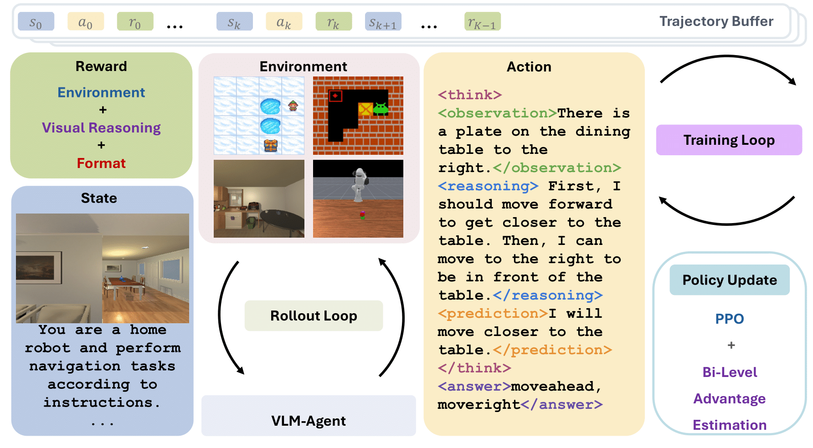

# 1. VAGEN

- Github (185 stars): https://github.com/RAGEN-AI/VAGEN
- 论文：Reinforcing Visual State Reasoning for Multi-Turn VLM Agents

针对3D、2D视频类

我们介绍了 VAGEN，这是一个专为训练视觉语言模型 （VLM） 代理而设计的多轮强化学习框架。基于这个框架，我们提出了视觉推理 RL，这是一种新颖的强化学习方法，通过显式监督其视觉状态推理过程，显著提高了 VLM 的多轮性能。

