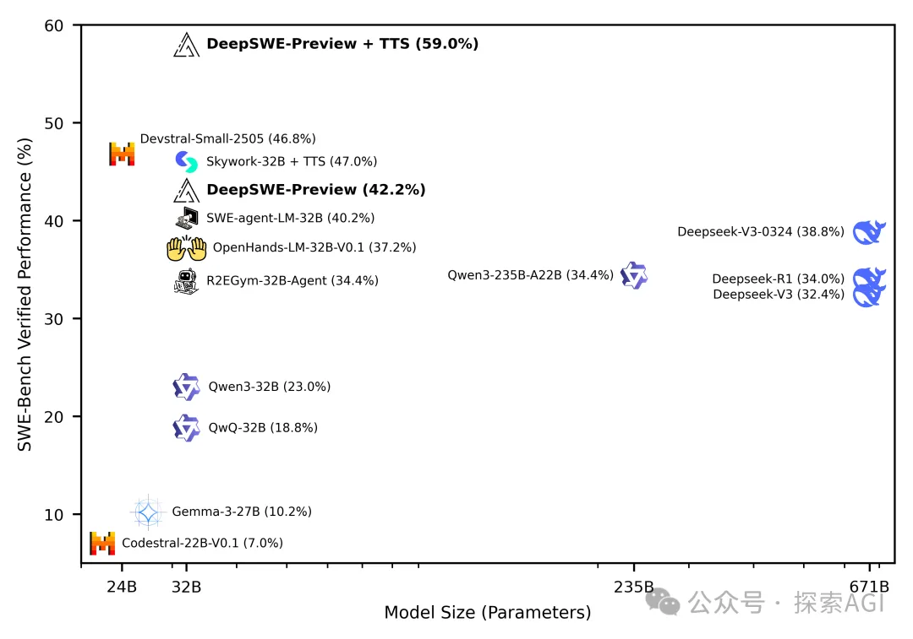
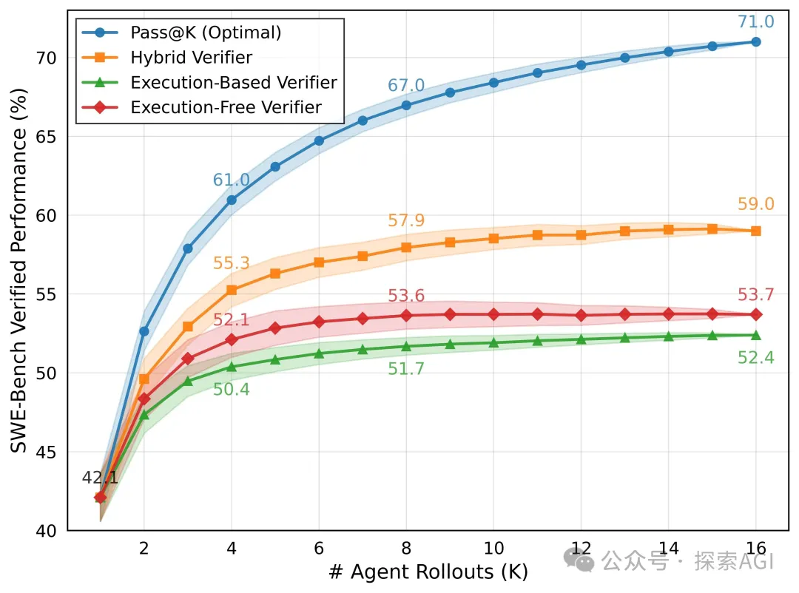

# 资源

- 模型权重: https://huggingface.co/agentica-org/DeepSWE-Preview
- 训练框架: https://github.com/agentica-project/rllm
- 训练数据集: https://huggingface.co/datasets/R2E-Gym/R2E-Gym-Subset
- 训练日志: https://wandb.ai/mluo/deepswe

# 效果

基于开源的Qwen模型，使用RL，在 SWE-Bench-Verified 以 59% 的成绩登顶，干翻了一堆对手。

它完全抛弃了SFT，从头到尾只用强化学习（RL）进行训练！

# 原理

传统做Agent，思路往往是先用高质量数据（比如GPT-4生成的轨迹）做一轮SFT，让模型先“学会说话”，然后再用RL去“优化行为”。

但DeepSWE团队发现，这条路可能走窄了。他们直接在一个高质量的交互环境 R2E-Gym 中，让模型从零开始“试错”，只用最简单的0/1稀疏奖励（通过测试给1分，否则0分）来驱动学习。

仅仅经过200步的RL训练，模型的Pass@1成功率就从23%直接干到了42.2%，实现了接近 20% 的性能暴涨。这充分说明，只要环境和算法给力，Agent完全可以从与真实世界的交互中，自己学会解决复杂问题的能力，而不需要一个“教师爷”（SFT数据）在旁边指手画脚。

## 训练秘籍

当然，能把纯RL玩得这么溜，背后肯定有独门绝技。他们使用的算法是 GRPO++，一个被魔改过的稳定版GRPO，可以说是集百家之长。我把核心要点给你们扒下来了：

- Clip High (源自DAPO): 提高损失函数的上限，鼓励探索，防止模型“躺平”。
- No KL Loss (源自DAPO): 去掉KL散度损失，让模型可以大胆地超越原始SFT模型的限制，探索更广阔的空间。
- No Reward Standard Deviation (源自Dr.GRPO): 移除奖励标准差，让模型能更好地区分难题和简单题，不会因为难度而产生偏见。
- Length Normalization (源自Dr.GRPO): 避免模型为了刷分而生成又臭又长的无效答案。
- Leave One Out (源自Loop/RLOO): 在计算优势时去掉一个样本，用一种巧妙的方式降低策略梯度的方差。
- Compact Filtering (团队自创): 这是个新东西。他们会直接“屏蔽”掉那些因为达到最大长度、超时或达到最大步骤而失败的轨迹的损失。这样做能防止模型学到一些“碰巧成功”的坏习惯，鼓励模型更有目的地去提交最终答案。
- No Entropy Loss (团队自创): 只要基础模型的熵在合理范围，就果断去掉熵损失，避免训练崩溃。

这一套组合拳下来，直接把RL训练的稳定性和性能拉满了。

## TTS

模型训练好了，怎么在实际测试时发挥最大威力？

必须是 Test-Time Scaling了。他们发现，对于Agent任务，单纯增加上下文长度（塞更多token）带来的性能提升有限。真正有效的是增加“Rollouts”的数量，也就是让Agent多试几次。

通过对比可以发现，结合了执行验证和LLM验证的 混合扩展（Hybrid Scaling） 效果最好。仅仅用16次尝试（K=16），就能把模型的性能从42.2%提升到59%，性价比极高。

# 最后

总的来说，这份工作所有垂直领域的Agent训练提供了一个全新的、可参考的范本。

对于复杂的、长周期的Agent任务，纯RL不仅可行，而且可能比传统SFT路线更有效。

好了，这就是我今天想分享的内容。如果你对构建AI智能体感兴趣，别忘了点赞、关注噢~

# 参考

[1] 模型、代码、数据全开源！轻松训练自己的垂类Agent！https://mp.weixin.qq.com/s/Nghfrx5zMEqzTpdUA2bZKg