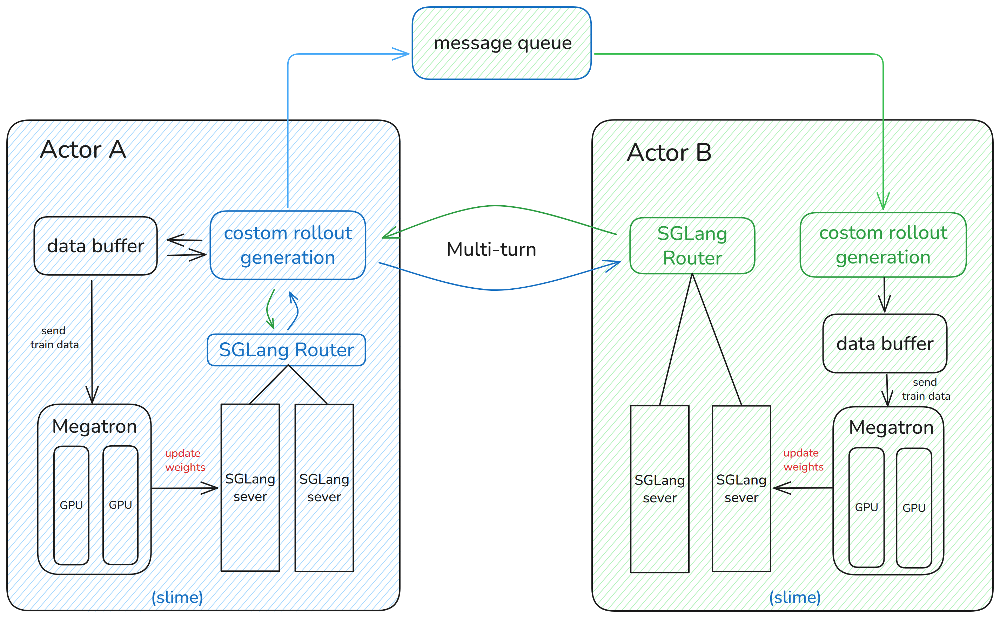
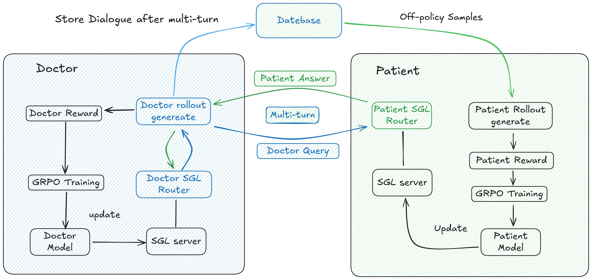

# 1. 介绍

- Github (91 stars):https://github.com/AQ-MedAI/MrlX

多智能体强化学习框架

在 MrlX 中，代理 A 和代理 B 作为独立的代理运行，通过消息队列进行通信，支持跨代理 API 调用，将内部逻辑抽象为外部请求，并支持多轮交互、推理结果共享和协作决策。

在运行时，代理 A 启动多轮对话生成，而代理 B 也参与多轮响应。协调模块评估两个代理的对话，计算双边奖励，并通过消息队列驱动迭代。每个代理都维护一个完整的训练-推理循环：数据缓冲区管理训练样本，SGLang Router 调度推理任务，威震天执行模型训练，形成“生成→训练→同步”飞轮机制。

训练数据从数据缓冲区流入威震天，更新后的权重被同步回推理服务。这使得智能体之间的高效知识转移和持续共同进化成为可能，超越单任务限制，并允许多智能体系统提高动态环境中的决策能力。

模块说明

- 训练（威震天）：负责主要训练过程;从 Data Buffer 读取数据，训练模型，并将更新的参数同步到 Rollout 模块
- rollout（SGLang + router）：生成新数据（包括奖励计算和验证）并将其存储在数据缓冲区中
- 数据缓冲区：充当训练和推理之间的桥梁，管理提示初始化、自定义数据加载和推出生成的内容
- 自定义推出生成：实现自定义数据生成逻辑，定制多轮交互策略，输出格式
- 消息队列：在 Agent A 和 Agent B 之间传输多轮交互信息，支持跨 Agent API 通信、任务分发和状态同步，驱动迭代循环

# 2. 案例

我们提出了一种基于医患交互会诊的新型强化学习方法，可以同时提高医生和患者的模型能力。

在这个存储库中，我们演示了一个使用 Qwen3-8B 作为患者模型和 Qwen3-32B 作为医生模型的工作流程，执行多轮交互并通过 GRPO 训练更新每个模型并具有各自的奖励。主要组成部分是：

- 医生工作者：负责通过调用患者模型工具，更新医生模型本身，进行多回合对话模拟。
- 患者工作者：负责更新患者模型，并为医生工作者运行数据库服务和SGLang Router服务，以存储和模拟对话。使用存储在数据库中的样本在政策外更新患者模型。

