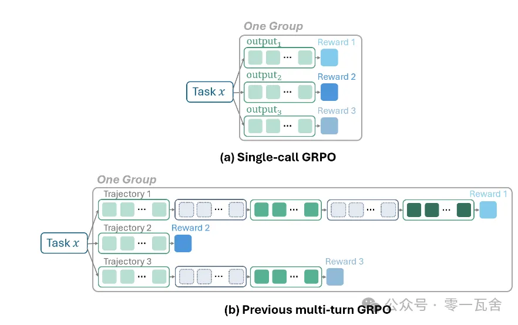
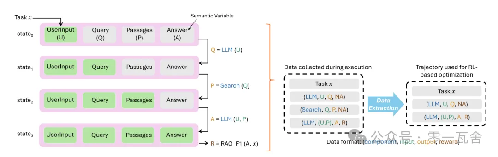
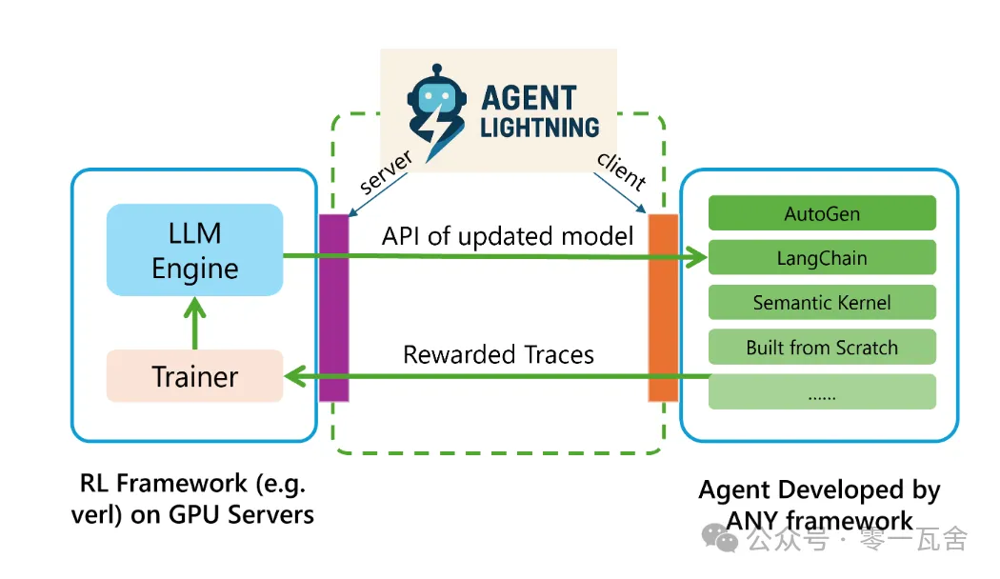
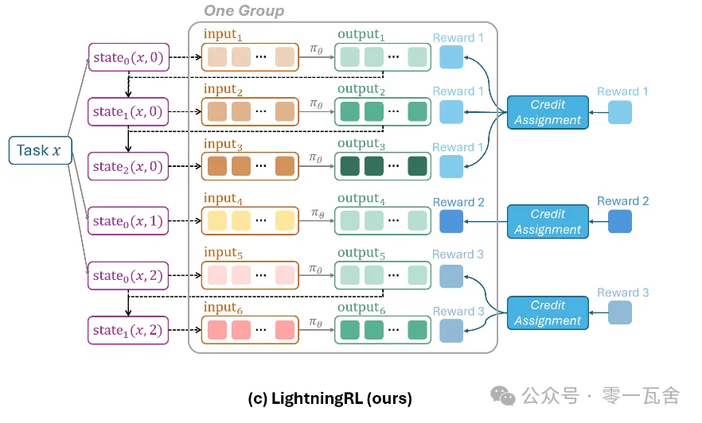
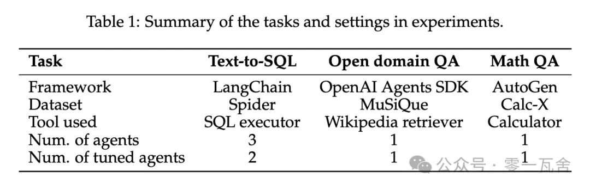
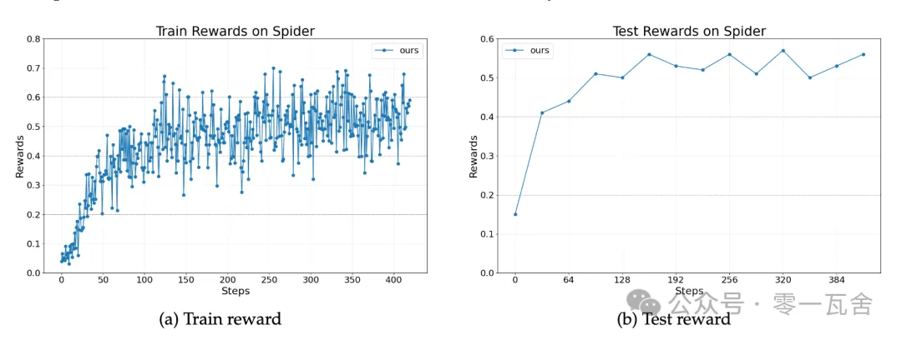
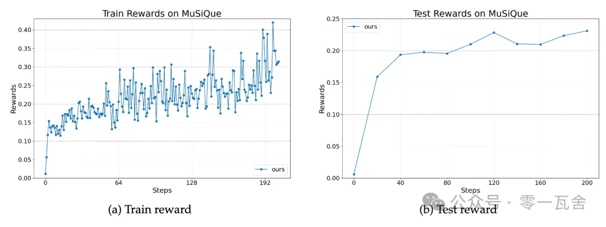
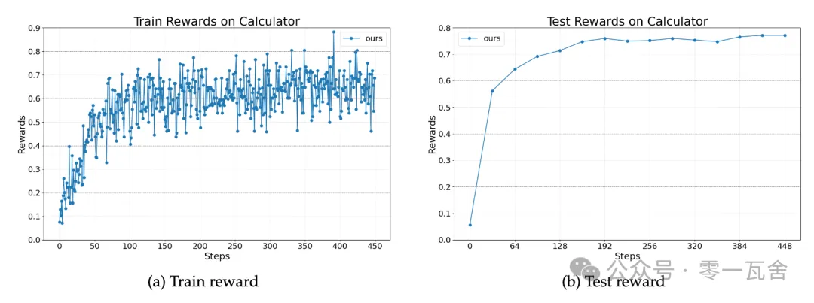

# 1. 资源

- 论文： Agent Lightning: Train ANY AI Agents with Reinforcement Learning
- 代码：https://github.com/microsoft/agent-lightning

# 2. 简介

微软研究院提出了一个名为「Agent Lightning」的创新框架，其核心目标是实现对任何类型的 AI 智能体进行强化学习（RL）训练。

RL 应用于复杂智能体面临巨大挑战，因为训练过程通常与智能体的具体实现方式（如使用了哪种框架、内部逻辑如何）紧密耦合。

Agent Lightning 通过几个手段应对这个问题：
- 首先，在算法层面，它将智能体的执行过程抽象为标准的马尔可夫决策过程（MDP），并设计了一套统一的数据接口，能将任意智能体的行为轨迹分解为可供训练的 (状态-动作-奖励) 序列；
- 其次，在系统层面，它提出了 「训练 - 智能体解耦」（Training-Agent Disaggregation）架构，将重量级的模型训练服务与轻量级的智能体运行环境彻底分开。

这使得开发者几乎无需修改现有智能体代码，就能将其接入 Agent Lightning 进行持续优化，极大地降低了 AI 智能体进化的门槛。

# 3. 原理
## 3.1 背景知识：AI 智能体如何学习进化？

一个现代 AI 智能体，我们可以将其简单理解为：

AI 智能体 = 大脑（一个或多个 LLM） + 手脚（各种工具，如搜索引擎、计算器、API）

它的大脑负责思考、推理和决策，而手脚则负责与外部世界互动。比如，一个帮你分析财报的智能体，它的大脑是 LLM，手脚可能是一个能查询股价的 API、一个计算器工具和一个能读取 PDF 文件的工具。

**监督学习 vs. 强化学习**
要让模型进化，主流的技术路径有两条：监督学习（Supervised Learning）和强化学习（Reinforcement Learning）。

监督学习（Supervised Fine-Tuning, SFT）：你需要为智能体提供大量「标准答案」，告诉它在每一种情况下，每一步应该怎么做。这种方法简单直接，效果稳定。但对于复杂的交互任务，制作「标准答案」的成本是天文数字。想象一下，要为一个能帮你预订跨国旅行的智能体制作所有可能情况下的完美操作流程，这几乎是不可能的。
强化学习（Reinforcement Learning, RL）：你不需要告诉智能体每一步怎么做，只需要在它完成整个任务后，根据结果给出一个奖励（Reward） 或惩罚。无需昂贵的「过程标注」，更适合探索性的、面向目标的复杂任务。这与智能体的本质不谋而合。

**将 RL 应用于智能体的「耦合」困境**
过去，当研究者们尝试用 RL 训练智能体时，他们普遍采用一种被称为 「序列拼接 + 掩码（Sequence Concatenation with Masking）」 的方法。

工作原理是：将智能体与环境的多轮交互（用户输入、LLM 的思考过程、工具的调用和返回结果等）全部拼接成一个超长的文本序列。然后，在训练时，用掩码（mask）告诉模型：你只需要学习你自己生成的那部分内容，其他部分（比如用户说的话、工具返回的信息）看看就行，不要学。



上图（b）为传统的基于拼接和掩码的多轮 RL 训练方法。

这种方法看似可行，实则充满了陷阱：

- 紧密耦合：训练代码必须对智能体的内部工作流程了如指掌，才能正确地拼接序列和设置掩码。这意味着，如果你用 LangChain 框架写了一个智能体，你就得为它量身定做一套训练代码。如果你想换成 AutoGen 框架，对不起，训练代码得推倒重来。这导致 RL 训练无法规模化，更谈不上赋能「任何」智能体。
- 上下文长度爆炸：智能体的交互轮次越多，拼接后的序列就越长。很快，它就会超出 LLM 能处理的上下文长度限制，同时带来巨大的计算和存储开销。
- 技术实现复杂且低效：复杂的掩码逻辑不仅容易出错、难以调试，还可能破坏 LLM 的位置编码机制（如 RoPE），影响模型性能。

## 3.2 Agent Lightning：解耦的艺术
Agent Lightning 的核心思想，就是解耦（Decoupling）。

**算法解耦：马尔可夫决策过程（MDP）**

面对五花八门的智能体（用不同语言、不同框架编写），如何找到一种通用的语言来描述它们的行为？Agent Lightning 的答案是回归强化学习的理论基石——马尔可夫决策过程（Markov Decision Process, MDP）。

它的核心思想很简单：任何决策过程，都可以被看作是一个智能体（Agent）在一系列状态（State）中，通过执行动作（Action）来获得奖励（Reward）的过程。

Agent Lightning 将 AI 智能体的执行过程映射到了 MDP 框架上：

- 状态（State）：智能体在某一时刻的「内存快照」，包含了所有对未来决策有影响的关键信息。
- 动作（Action）：一次 LLM 的调用及其输出。这是智能体进行思考和决策的核心步骤。
- 奖励（Reward）：对任务完成情况的最终评价。

让我们以一个常见的检索增强生成（RAG） 智能体为例，看看 Agent Lightning 是如何工作的：



上图为 Agent Lightning 的统一数据接口如何捕捉 RAG 智能体的执行过程。这个智能体的任务是根据用户问题，先去知识库检索，然后回答问题。

- 初始状态  ：内存里只有 {UserInput: "Agent Lightning是什么？"}。
- 动作  ：调用 LLM，LLM 根据  生成了一个检索词。LLM_Output = "Agent Lightning 强化学习框架"。
- 状态  ：内存更新为 {UserInput: "…", Query: "Agent Lightning…"}。
- 动作  (工具调用) ：调用 Search 工具，输入 Query，得到 Passages（检索到的相关段落）。
- 状态  ：内存更新为 {UserInput: "…", Query: "…", Passages: "…"}。
- 动作  ：再次调用 LLM，LLM 根据  里的所有信息，生成最终答案 Answer。
- 最终奖励  ：评估 Answer 的质量，给出一个分数（比如，与标准答案对比计算 F1 Score）。

通过这种方式，无论智能体内部的逻辑多么复杂，它的整个执行轨迹（Trajectory）都可以被分解成一个由 (输入, 输出, 奖励) 组成的序列。Agent Lightning 称之为统一数据接口（Unified Data Interface）。这个接口屏蔽了所有智能体内部的实现细节，只暴露了 RL 训练所需要的最核心信息。

**系统解耦：训练 - 智能体分离架构**

有了通用的数据语言还不够，我们还需要一个能让智能体「无感」接入的训练系统。Agent Lightning 为此设计了 「训练 - 智能体解耦（Training-Agent Disaggregation）」 架构。



这个架构可以类比为我们熟悉的「前后端分离」：

Lightning Server（后端）：

这是一个强大的云端服务，负责所有「脏活累活」：管理模型、运行 RL 训练算法、分配 GPU 资源等。

它向外暴露了一个和 OpenAI 完全一样的 API 接口。

Lightning Client（前端）：

这是用户智能体实际运行的地方，可以是你自己的笔记本电脑，也可以是一台普通的云服务器。

它负责运行智能体的业务逻辑，并与 Lightning Server 通信。

假设你有一个用 LangChain 写的智能体，它原本是这样调用 OpenAI 的：

```python
# 原始代码
from openai import OpenAI
client = OpenAI(api_key="YOUR_OPENAI_KEY")
```

现在，你想用 Agent Lightning 来训练它，你只需要做一件事——更换 API 的地址，几乎是零代码修改：

```python
 使用Agent Lightning的代码
from openai import OpenAI
# 几乎零代码修改！
client = OpenAI(
    api_key="any_string_will_do",
    base_url="http://your-lightning-server-address/v1" # 指向你的Lightning Server
)
```

你的智能体以为自己还在和 OpenAI 聊天，但实际上，它的每一次请求和响应都被 Lightning Server 默默地记录下来，转换成 MDP 格式的训练数据，然后在后台用强大的 GPU 集群进行训练，并悄悄更新模型。你的智能体就在这一次次的「无感」交互中，变得越来越聪明。

这种设计，彻底将智能体开发者从复杂的 RL 系统配置中解放出来，让他们可以专注于智能体本身的逻辑和创意。

## 3.3 深入核心：LightningRL 算法与智能体运行时
**LightningRL：一种为智能体设计的「分层」RL 算法**

有了从 MDP 中提取的 (输入, 输出, 奖励) 数据流，我们还需要一个 RL 算法来利用它们。Agent Lightning 为此设计了 LightningRL。

在智能体任务中，奖励往往是稀疏的（Sparse Reward），即只有在任务全部完成后才有一个最终奖励。那么，这个最终的奖励，应该如何分配给过程中的每一步「动作」（LLM 调用）呢？是第一步的功劳大，还是最后一步？这就是经典的信用分配（Credit Assignment） 问题。

LightningRL 采用了一种简单的分层策略：

- 高层信用分配：它首先将整个任务的最终奖励  分配给轨迹中的每一次LLM 调用。在最简单的实现中，它直接让每一次调用的奖励都等于 。
- 低层策略更新：一旦每一步都有了奖励，每一次 LLM 调用 (input, output, reward) 就变成了一个独立的「单次调用」RL 问题。这时，就可以直接套用任何现成的、成熟的单次调用 RL 算法（如 PPO、DPO，或论文中使用的 GRPO）来更新模型参数了。

你可能会觉得这样的分配方式太粗糙，万一中间有一步是错的，不也被奖励了吗？确实如此。但在 RL 的框架下，这种粗糙的方法之所以有效，是基于大数定律的统计效应。一个真正好的动作，会系统性地、更高概率地出现在最终成功的任务中。经过成千上万次训练后，它被关联到正奖励的次数会远超负奖励。反之亦然。虽然单次分配的「信噪比」很低，但只要训练样本足够多，正确的「信号」最终会浮现出来。



如上图，LightningRL 将轨迹分解为独立的转换（transitions），每个转换都可以用单次调用 RL 算法进行优化。

这种简单设计换来了一些优势：

- 极致的灵活性和复用性：无需为智能体重新发明 RL 算法，可以直接利用社区中最先进的单次调用 RL 算法成果。
- 告别上下文长度焦虑：因为它将长轨迹分解成了短的转换片段，从根本上解决了序列拼接导致的上下文过长问题。
- 实现简单优雅：彻底告别了复杂、易错的掩码操作。

**智能体运行时（Agent Runtime）**
Lightning Client 不仅仅是一个简单的 API 转发器，它还是一个功能强大的智能体运行时，提供了许多贴心功能，确保训练过程顺畅高效。

- 无侵入式数据捕获：它如何在你不知不觉中收集数据？
- 利用可观测性（Observability）框架：它可以与 OpenTelemetry 等业界标准的监控框架集成。这些框架原本是用来监控软件性能的，Agent Lightning 巧妙地借用它们来自动捕获 LLM 调用等关键事件，形成训练数据。
- API 内置追踪：你调用的那个「假」的 OpenAI API 本身，就内置了数据追踪和上报的功能。
- 自动中间奖励（Automatic Intermediate Rewarding, AIR）：为了缓解奖励稀疏问题，Client 可以监控一些系统信号，并自动生成中间奖励。例如，如果智能体生成的 SQL 查询执行失败了，Client 可以立刻给这一步一个小的负奖励，而无需等到任务最终结束。这就像一个即时反馈系统，能帮助智能体更快地学会避开错误。

# 4. 实验效果
## 4.1 实验设置
Agent Lightning 在三个不同的、极具代表性的任务上进行了验证，以证明其通用性和有效性。



这三个实验覆盖了：

不同的实现框架：证明了 Agent Lightning 与主流生态的兼容性。
不同的任务类型：从结构化的数据库查询，到开放式的文本检索，再到逻辑严谨的数学计算。
不同的交互模式：包括多智能体协作和复杂的工具使用。

## 4.2 主要结果
Text-to-SQL 任务的奖励曲线：



RAG 任务的奖励曲线：



数学计算器任务的奖励曲线：



核心结果：在所有任务中，奖励曲线都呈现出持续、稳定的上升趋势。 这说明 Agent Lightning 确实能够让不同背景、不同构造的 AI 智能体在实践中不断学习，提升性能。

# 5. 总结
## 5.1 贡献与启发
- 范式创新：训练与执行彻底解耦 提出将强化学习训练与智能体执行逻辑完全分离的框架，打破传统紧耦合限制。
- 通用抽象：统一数据接口 将智能体执行过程形式化为标准 MDP，并设计统一的 input/output/reward 接口，实现 RL 对多样智能体的通用赋能。
- 工程突破：零修改接入 通过客户端 - 服务器架构和类 OpenAI API，支持智能体代码「零修改」或「最小修改」接入，大幅降低 RL 应用门槛。
- 数据飞轮：经验数据标准化采集 提供标准化管道收集高质量交互数据，为「智能体产生数据→数据训练更强模型→模型提升智能体」的良性循环奠定基础。
- 民主化：RL 能力普及 封装复杂 RL 系统为易用服务，让无深厚 RL 背景的开发者也能持续优化智能体，推动 AI 自我进化的普及。

## 5.2 5.2 局限与挑战
- 信用分配：奖励机制过于简化 LightningRL 将最终奖励平均分配到每一步，可能导致长序列任务中奖励分配不准确，影响学习效率和收敛性。
- 状态表征：复杂智能体难建模 对复杂智能体，自动且完整捕获所有关键语义变量极具挑战，不完整的状态表征会破坏马尔可夫假设。
- 样本效率：在线策略依赖高 主要依赖 On-Policy RL，需大量实时交互数据，样本效率低，数据收集成本高，亟需高效集成 Off-Policy 算法。
- 多智能体支持：实验验证不足 虽提出多智能体 RL 方案，但未充分实验验证，真实多智能体场景下的合作、竞争、通信等复杂性远高于当前框架。
- 系统成本：部署与维护复杂 虽降低开发门槛，但分布式训练、任务调度、API 服务等系统部署和维护仍有工程和资源成本，对小团队有挑战。


# 参考

[1] Agent Lightning：可以训练「任何」AI 智能体的强化学习框架, https://mp.weixin.qq.com/s/DE-AUDaLLZDuaoUiXfZyHA