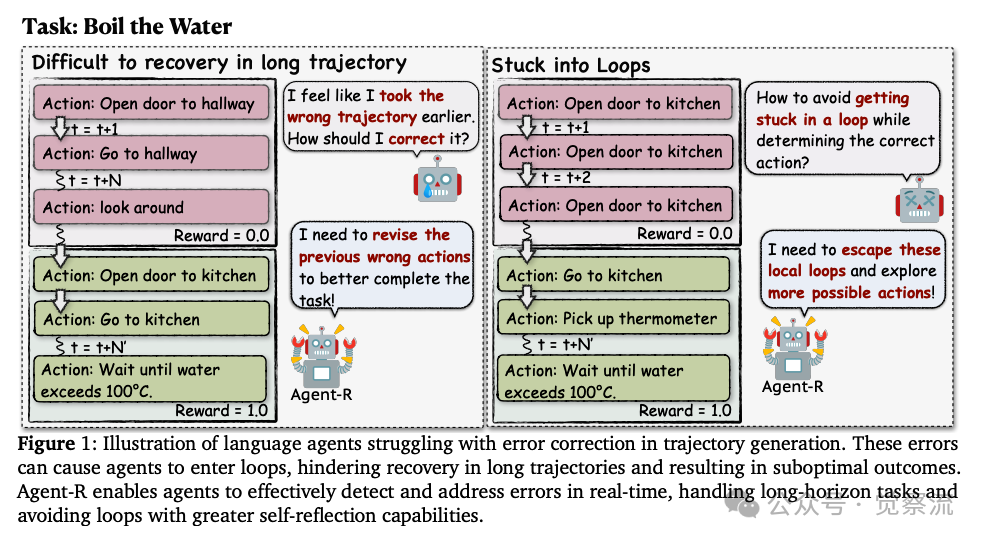
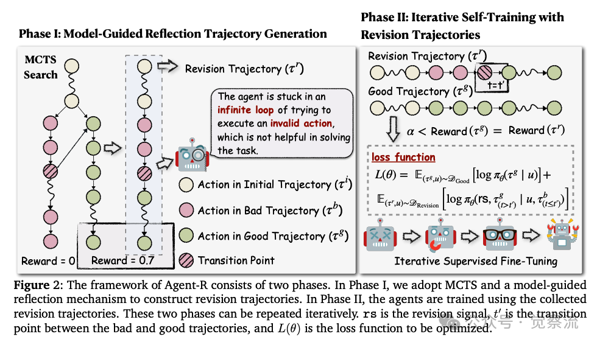
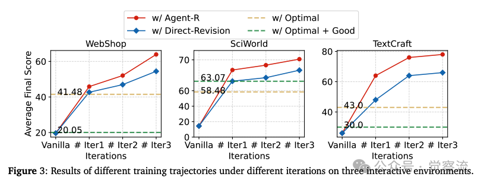

# 1. 资源

- Yuan, S., Chen, Z., Xi, Z., Ye, J., Du, Z., & Chen, J. (2025). Agent-R: Training Language Model Agents to Reflect via Iterative Self-Training.
  - https://arxiv.org/pdf/2501.11425
- Agent-R github Repo
  - https://github.com/bytedance/Agent-R

在互动和Agent环境中，大型语言模型（LLM）Agent正变得越来越重要，但现有的方法在现实世界的应用中往往因为无法从错误中恢复而表现不佳。为此，Agent-R 提出了一种迭代自我训练框架，使语言Agent能够实时反思并纠正错误。本文将深入探讨 Agent-R 的工作原理、实验结果以及其在互动环境中的应用前景。

# 背景与挑战
大型语言模型（LLM）在解决复杂任务方面已经取得了显著的成果，尤其是在需要自主决策、错误纠正和任务优化的场景中。然而，现有的方法主要依赖于从更强的专家模型中进行行为克隆，这导致它们在实际应用中难以主动自我纠正错误，从而引发连锁失败和次优任务表现。例如，当Agent在执行任务时遇到错误，如果没有及时的修正能力，它可能会陷入死循环或无法完成任务。这种局限性主要源于以下几个问题：

1. 缺乏实时修正能力：现有的方法通常在任务结束后才评估结果，无法在执行过程中及时发现并纠正错误。
2. 依赖专家数据：许多方法依赖于专家提供的正确轨迹，但在现实世界中，专家数据往往难以获取且成本高昂。
3. 错误传播：一旦Agent在早期步骤中犯了错误，后续的行动可能会基于错误的上下文，导致错误进一步传播。

为了解决这些问题，Agent-R 提出了一种迭代自我训练框架，使语言Agent能够在互动环境中实时反思并纠正错误。

# Agent-R 的工作原理

Agent-R 的核心在于通过迭代自我训练，使语言Agent能够在互动环境中进行实时反思和自我改进。其框架分为两个主要阶段：

**第一阶段：模型引导的反思轨迹生成**

在这个阶段，Agent-R 利用蒙特卡洛树搜索（MCTS）动态生成反思轨迹。具体来说，它会识别出错误轨迹中的第一个错误步骤，并将其与相邻的正确路径拼接，从而构建出修正后的轨迹。这种方法使Agent能够基于当前策略进行学习，从而提高学习效率。

轨迹生成的关键步骤
1. 轨迹定义：
   - 初始轨迹（Initial Trajectory）：Agent在环境中的初始行动序列。
   - 错误轨迹（Bad Trajectory）：初始轨迹后接一系列次优行动，导致错误或低奖励的结果。
   - 正确轨迹（Good Trajectory）：初始轨迹后接一系列高奖励行动，导致成功完成任务。
   - 修正轨迹（Revision Trajectory）：将错误轨迹中的某个步骤替换为正确轨迹中的步骤，从而实现修正。
2. 蒙特卡洛树搜索（MCTS）：
   - 选择（Selection）：使用UCT策略选择下一个节点进行扩展。
   - 扩展（Expansion）：基于当前节点生成新的子节点。
   - 模拟（Simulation）：从新节点开始进行多次模拟，直到达到终止状态或最大深度。
   - 反向传播（Backpropagation）：根据模拟结果更新节点的值。
3. 修正点确定：
   - Agent会评估错误轨迹中的每个行动，识别出第一个错误步骤，并将其作为修正点。
   - 修正点之后的行动将被替换为正确轨迹中的行动，从而构建出修正轨迹。

修正轨迹的构建
- 修正信号（Revision Signal）：在修正轨迹中，添加一个修正信号（如“我需要修正之前的错误”），以标记修正点。
- 动态修正：通过模型引导的方式，动态确定修正点，而不是简单地将正确轨迹拼接到错误轨迹的末尾。这种方法能够更有效地避免错误传播。

**第二阶段：基于反思轨迹的迭代自我训练**

在这一阶段，Agent使用动态构建的反思轨迹进行训练。通过迭代训练，Agent能够不断改进其错误纠正能力，并探索更早的修正步骤，从而避免进入错误循环。

迭代训练的关键步骤

1. 数据收集：
   - 使用 MCTS 收集反思轨迹，并将其与正确轨迹混合，用于训练。
   - 在每次迭代中，逐步提高正确轨迹的质量，鼓励Agent学习更优的行动策略。
2. 训练过程：
   - 采用监督式微调（SFT）方法，优化Agent的策略模型。
   - 在训练过程中，逐步增加反思轨迹的比例，使Agent能够更好地学习如何在执行过程中及时发现并纠正错误。
3. 多任务训练：
   - 通过多任务训练，Agent能够在不同任务中共享知识，提高泛化能力。
   - 多任务训练还能够帮助Agent更好地理解不同任务之间的相似性和差异性，从而提高整体性能。

# 实验结果

Agent-R 在三个代表性的互动环境中进行了广泛的实验，包括 WebShop、ScienceWorld 和 TextCraft。实验结果表明，Agent-R 显著提高了语言Agent的性能，尤其是在错误纠正和避免循环方面。

实验设置

1. 数据集：
   - WebShop：包含 12k 指令和超过 100 万种真实商品的在线购物环境。
   - ScienceWorld：包含 30 种科学任务的文本环境，评估Agent的科学推理能力。
   - TextCraft：基于 Minecraft 配方的文本环境，评估Agent的物品制作能力。
   
   

2. 训练设置：
   - 使用 Llama-3.1-8B 作为基础模型，进行三次迭代训练。
   - 每次迭代中，逐步提高正确轨迹的质量，鼓励Agent学习更优的行动策略。
3. 评估指标：
   - WebShop 和 ScienceWorld：使用平均最终奖励作为评估指标。
   - TextCraft：使用成功率作为评估指标。

主要结果
- WebShop：
  - Agent-R 在第三轮迭代中达到了 63.91% 的平均最终得分，相比基线方法提升了 5.59%。
  - 通过使用反思轨迹，Agent-R 显著提高了Agent的错误纠正能力和任务完成率。
- ScienceWorld：
  - Agent-R 在第三轮迭代中达到了 70.23% 的平均最终得分，表现出色。
  - 通过实时反思和修正，Agent-R 使Agent能够更有效地完成科学任务，避免了错误传播。
- TextCraft：
  - Agent-R 在第三轮迭代中达到了 78.00% 的成功率，显著优于其他方法。
  - 通过动态修正轨迹，Agent-R 使Agent能够更准确地制作目标物品，避免了错误操作。

关键发现

1. 及时修正的重要性：
   - Agent-R 通过在错误发生时及时修正，避免了错误的传播，从而提高了模型的质量和性能。
   - 实验结果表明，及时修正能够显著提高Agent的错误纠正能力和任务完成率。
2. 自我反思能力：
   - 训练使用 Agent-R 轨迹的Agent能够更有效地识别和纠正错误，表现出更强的自我反思能力。
   - 通过动态修正轨迹，Agent-R 使Agent能够在执行过程中及时发现并纠正错误，从而提高任务完成的成功率。
3. 避免循环：
   - Agent-R 显著减少了Agent陷入死循环的情况，使Agent更倾向于探索新的动作，从而提高了整体性能。
   - 通过动态修正轨迹，Agent-R 使Agent能够避免重复错误操作，从而提高任务完成的效率。
4. 多任务训练的优势：
   - 多任务训练使 Agent-R 能够在不同任务中共享知识，提高泛化能力。
   - 实验结果表明，多任务训练显著提高了Agent的性能，尤其是在复杂任务中。

# 结论

Agent-R 通过迭代自我训练和动态反思机制，显著提升了语言Agent在互动环境中的错误纠正能力和决策效率。这一框架不仅提高了Agent的性能，还为未来研究提供了新的方向，特别是在如何进一步增强Agent的自我反思和自主学习能力方面。Agent-R 的提出，为构建更智能、更可靠的 AI Agent迈出了重要的一步。

# 参考

[1] AI学会自我反思？Agent-R 使用蒙特卡洛树搜索(MCTS)自我训练自动纠错，让AI更聪明, https://mp.weixin.qq.com/s/VMK-7PTNN7Z7axBydkDhlg