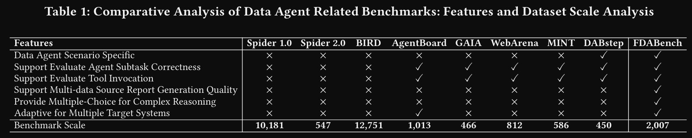

# 1. agent
- SWE-Bench-Verified
- SQLEval
- WorfBench（任务规划）
- GAIA

AgentBoard[38]andGAIA[40]focusprimarilyonagents’gen
eraltask-solvingabilities,suchaswebbrowsing,roboticpathplan
ning,orsystemfunctioncalls

 DAgent[52]constructsadatasetforevaluationbutfocusessolely
 onstructuredtabulardatainthefinancedomain, lackingcoverage
 ofothermodalitiesordomainsprevalentinmoderndatalakes

Taiji[56],
 usestheCraigslistfurnituredataset[27]forevaluation,butthis
 datasetremainsconstrainedtoasinglefurnituredomainwithout
 taskvariety.Furthermore, thediversityofdataagentworkflow
 patterns[46]andfoundationmodelssignificantlycomplicatesfair
 performanceevaluationandcomparison.

---

# 2. 代码

- PaperBench

# 参控

[1] https://arxiv.org/pdf/2509.02473