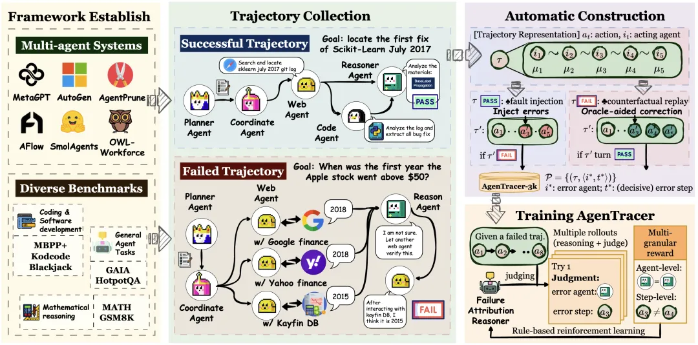
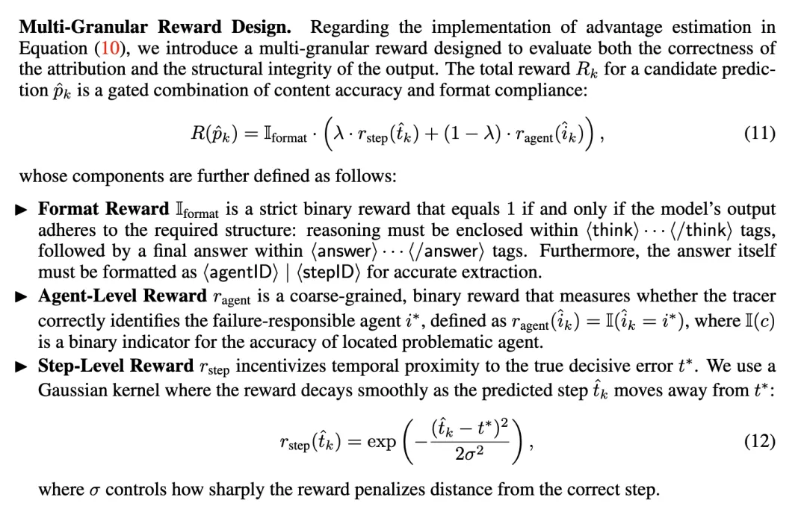
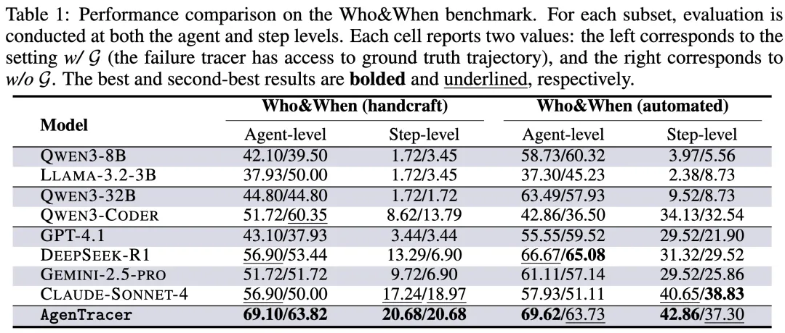
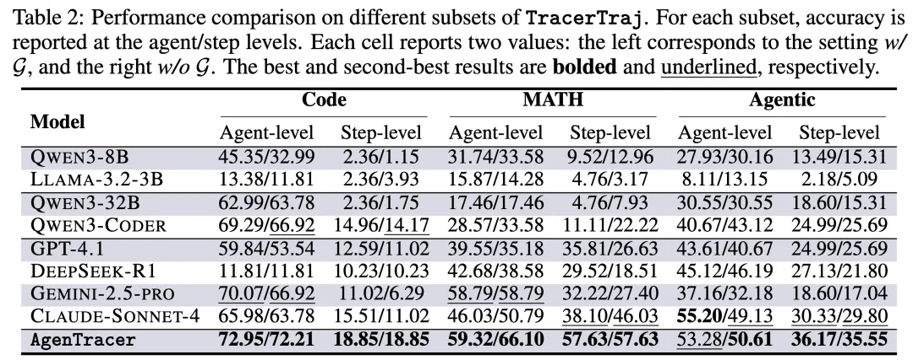
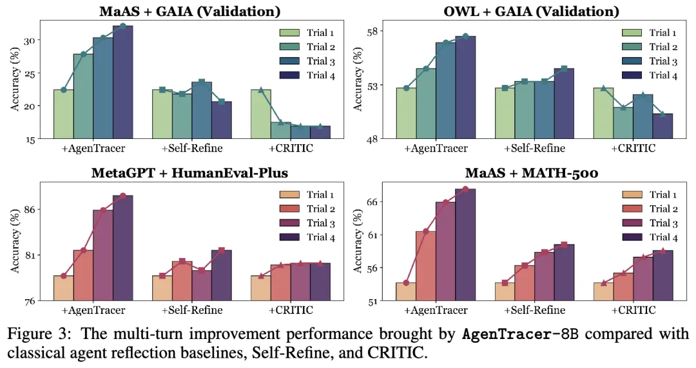

# 1. 资源

- 论文标题：AgenTracer: Who Is Inducing Failure in the LLM Agentic Systems?
- 论文链接：https://arxiv.org/abs/2509.03312
- 项目主页：https://bingreeky.github.io/atracer/

# 2. 简介

系统脆弱性（System Fragility）。实证研究表明，当前主流的多智能体框架在复杂任务中的失败率可高达86.7%，这严重制约了其在关键场景的可靠应用。

在这一背景下，一个核心的科学问题亟待解决：当一个多智能体系统执行失败时，我们如何精确、高效地定位导致失败的根本原因？这个问题，我们称之为智能体系统中的失败归因（Failure Attribution）。

来自新加坡国立大学等机构的研究者在最新的论文《AgenTracer: Who Is Inducing Failure in the LLM Agentic Systems?》中，首次为该问题提供了系统性的框架。这项工作不仅提出了首个全自动的失败轨迹标注管线，其微调得到的8B专用模型 AgenTracer-8B，更是在失败归因这一任务上，展现了超越GPT-4.1、Gemini-2.5-Pro等大型闭源模型的卓越性能。

# 3. 01. 问题定义：
失败归因的复杂性与现有方法的局限
失败归因的目标是，在一次失败的执行轨迹中，识别出那个关键的“决定性错误”（Decisive Error）。根据论文的严格定义，决定性错误指轨迹中最早发生的一个错误行为，只要该行为被修正，整个系统便能从失败转向成功。

这项任务的难度远超常规的文本理解或代码调试，原因在于：

1. 长程依赖性：多智能体系统的执行轨迹通常包含数十乃至上百步的交互，错误的影响可能在多步之后才显现，导致根源与表象在时序上分离。
2. 归因模糊性：轨迹中可能存在多个次优或轻微错误的行为，但只有少数是真正导致任务失败的“决定性”因素。
3. 现有模型能力不足：论文的基线实验表明，即便是当前最强的推理模型，在没有针对性训练的情况下，进行失败归因的准确率也普遍低于10%，缺乏实用价值。
长期以来，该领域的研究受限于高质量标注数据的匮乏，以及缺乏有效的方法论来处理这种复杂的因果追踪问题。

# 4. 02. AgenTracer框架：
数据与方法的双重创新
为解决上述挑战，研究者提出了AgenTracer框架，其核心贡献体现在两个方面：

第一：构建全自动、高保真的失败轨迹标注管线
为了从根本上解决数据瓶颈，AgenTracer设计了一套无需人工干预的数据生成流程，该流程由两个互补的机制构成：

- 反事实回放（Counterfactual Replay）：针对真实的失败轨迹，系统从第一步开始，依次将每一步的智能体行为替换为由Oracle（理想的正确行为）提供的行为，并重新模拟后续所有步骤。一旦在某一步替换后，任务结果由失败转为成功，该步骤即被自动标注为决定性错误的发生点。
- 程序化故障注入（Programmatic Fault Injection）：针对成功的执行轨迹，系统在其中选择一个关键步骤，通过程序化的方式（如修改代码返回值、颠倒逻辑判断）引入一个错误，从而生成一个失败的合成样本。由于错误的根源是预先设定的，这为数据集提供了高精度、多样化的负样本。
基于此管线，团队构建了TracerTraj数据集，包含超过2000条覆盖编码、数学和通用智能体任务的高保真度失败轨迹，为后续模型的监督与优化提供了坚实的基础。

# 5. 第二：基于多粒度强化学习的轻量级追踪器 AgenTracer-8B
在数据的基础上，团队以Qwen3-8B为基座模型，设计了多粒度强化学习（Multi-granular Reinforcement Learning） 配合 GRPO的训练范式来优化失败归因的准确性。其奖励函数（Reward Function）经过精心设计，旨在同时满足两个层面的定位需求：

- 智能体级（Agent-level）奖励：一个离散的二元奖励，用于判断模型预测的责任智能体是否正确。
- 步骤级（Step-level）奖励：一个连续的奖励信号，采用高斯核函数来度量预测的错误步骤与真实错误步骤之间的时序距离，距离越近，奖励越高。

通过优化这一复合奖励目标，AgenTracer-8B学会在一次推理中，同时输出对责任智能体和错误步骤的精准判断。

# 6. 03. 实证评估：
专用模型在特定任务上的性能优势
论文在公开基准Who&When和自建的TracerTraj测试集上，将AgenTracer-8B与一系列不同规模的开源和闭源模型进行了全面对比。评估在两种设置下进行：w/ G（模型可访问真实解以辅助判断）和w/o G（模型在无真实解信息的条件下独立判断，更具现实意义）。

关键实验结果如下：

- 在Who&When基准上，8B参数量的AgenTracer在智能体级(agent-level)和步骤级(step-level)归因的准确率上，均显著优于GPT-4.1、Claude-4-Sonnet等模型。在部分设置下，其性能优势高达18.18%。其中，step-level的准确率更具备现实意义，因为它代表鉴错智能体能否明确地指出到底是哪一步骤导致了错误或系统崩溃。

- 在TracerTraj测试集上，AgenTracer-8B的优势持续存在。尤其在数学推理（MATH）和通用智能体（Agentic）任务中，它在步骤级定位的准确率上大幅领先所有基线模型。这表明其对长链条因果关系的捕捉能力具有很强的泛化性。

这些结果清晰地表明，对于失败归因这类需要深度、细粒度因果追踪的复杂任务，通过专用数据和针对性算法优化的模型，其性能可以超越仅依赖巨大规模和通用能力的模型

# 7. 04. 应用价值：
从诊断工具到系统自进化引擎
AgenTracer的价值不止于事后诊断。论文进一步探索了它作为反馈机制，赋能现有智能体系统实现自我性能提升的潜力。

实验中，研究者将AgenTracer-8B对失败轨迹的归因分析作为外部反馈，注入到包括MaAS、OWL Workforce在内的多个主流多智能体系统中。结果显示，这种精确的反馈能有效指导系统在后续任务中进行调整和改进：

- 在MATH-500基准上，MaAS系统在三轮迭代后性能累计提升了 +14.2%。
- 即使是性能已经非常强大的OWL Workforce，在AgenTracer的辅助下，依然获得了 +4.8% 的性能增益。

相比之下，由GPT-4.1驱动的通用反思方法（如Self-Refine），由于无法定位到根本性错误，其反馈有时甚至会对系统性能产生负面影响。这证明了AgenTracer所提供的反馈的高信息价值和可操作性。

# 6. 05. 结论
AgenTracer为解决多智能体系统的可靠性问题提供了一个系统性的、可扩展的框架。其核心贡献可以概括为：

1. 方法论层面：提出了首个全自动的失败归因数据生成管线，解决了该领域的数据瓶颈。
2. 技术层面：设计了多粒度强化学习范式，显著提升了在长程交互中定位决定性错误的准确率。
3. 实证层面：证明了中等规模的专用模型在特定复杂任务上，性能可以超越大型通用模型。
4. 应用层面：验证了精确的失败归因是实现智能体系统自我进化的有效途径。
这项工作不仅为多智能体系统的调试和优化提供了强大的工具，更重要的是，它为构建未来更鲁棒、更具韧性的高级人工智能系统，迈出了坚实的一步。

# 参考

[1] AgenTracer：Agent系统错误自动归因, https://mp.weixin.qq.com/s/TPxKPrJeu3CDjak8KxmL-w