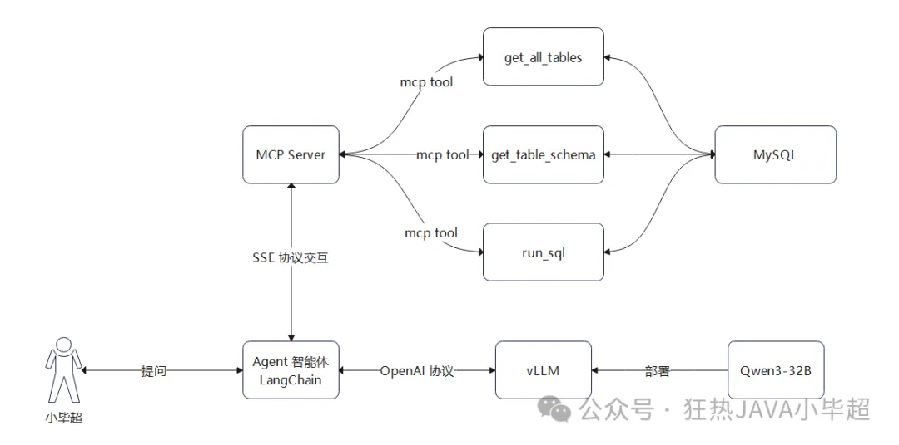
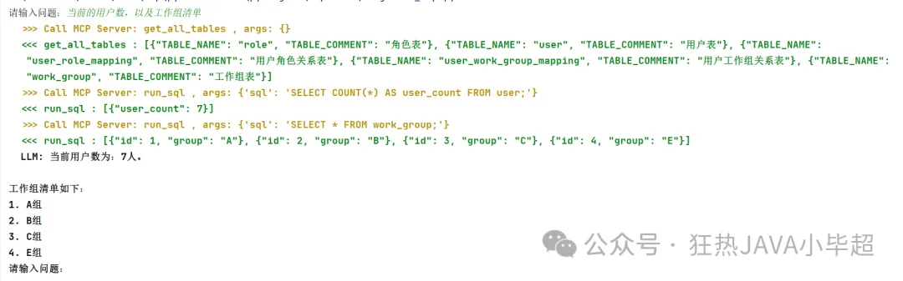
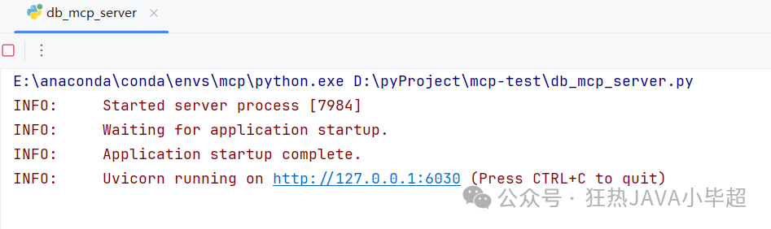
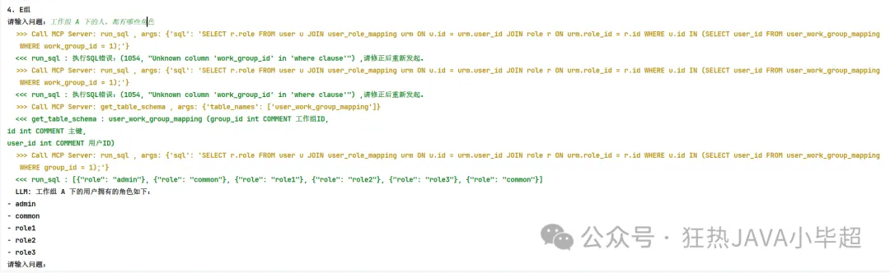

# LangChain + MCP + vLLM + Qwen3-32B 构建本地私有化智能体应用



实现效果如下所示：



# 1. 安装

关于 MySQL 表结构的创建，可以参考下面这篇文章：

实验所使用依赖的版本如下：

```text
torch==2.6.0
transformers==4.51.3
modelscope==1.23.1
vllm==0.8.4
mcp==1.9.2
openai==1.75.0
langchain==0.3.25
langchain-openai==0.3.18
langgraph==0.4.7
pymysql==1.0.3
```

# 2. vLLM 部署 Qwen3-32B

使用 modelscope 下载 Qwen3-32B 模型到本地：

```bash
modelscope download --model="Qwen/Qwen3-32B" --local_dir Qwen3-32B
```

vLLM 读取模型启动API服务。

```bash
export CUDA_VISIBLE_DEVICES=0,1

vllm serve "Qwen3-32B" \
  --host 0.0.0.0 \
  --port 8060 \
  --dtype bfloat16 \
  --tensor-parallel-size 2 \
  --cpu-offload-gb 0 \
  --gpu-memory-utilization 0.8 \
  --max-model-len 8126 \
  --api-key token-abc123 \
  --enable-prefix-caching \
  --enable-reasoning \
  --reasoning-parser deepseek_r1\
  --enable-auto-tool-choice \
  --tool-call-parser hermes \
  --trust-remote-code
```

关键参数说明：

- export CUDA_VISIBLE_DEVICES=0,1 ：指定所使用的GPU。
- dtype: 数据类型，其中 bfloat16，16位浮点数，适合 NVIDIA A100 等设备。
- tensor-parallel-size：Tensor 并行的数量，当多 GPU 分布式推理时使用，建议和GPU的数量一致。
- cpu-offload-gb：允许将部分模型权重或中间结果卸载到 CPU 的内存中，单位为 GB。，模拟 GPU 内存扩展，如果部署的模型大于了显存大小可以设置该参数，但是推理速度会大大下降。
- gpu-memory-utilization：设置 GPU 内存利用率的上限。
- max-model-len：允许模型最大处理的Token数，该参数越大占用显存越大。
- enable-prefix-caching：启用前缀缓存减少重复计算。
- enable-reasoning：启用思考推理能力。
- reasoning-parser deepseek_r1：指定推理解析器。
- enable-auto-tool-choice：启用 function call 模式。
- tool-call-parser hermes：设置 function call 的解析器。

如果启动显存不足，可适当调整 gpu-memory-utilization 和 max-model-len 参数，或通过 cpu-offload-gb 将部分模型权重卸载到内存中。

启动成功后，可通过 /v1/models 接口可查看模型列表：

```bash
curl http://127.0.0.1:8060/v1/models -H "Authorization: Bearer token-abc123"
```

测试API交互，思考模式：

```bash
curl http://127.0.0.1:8060/v1/chat/completions \
    -H "Content-Type: application/json" \
    -H "Authorization: Bearer token-abc123" \
    -d '{
        "model": "Qwen3-32B",
        "messages": [
            {"role": "system", "content": "You are a helpful assistant."},
            {"role": "user", "content": "你是谁"}
        ]
    }'
```

非思考模式测试：

```bash
curl http://127.0.0.1:8060/v1/chat/completions \
    -H "Content-Type: application/json" \
    -H "Authorization: Bearer token-abc123" \
    -d '{
        "model": "Qwen3-32B",
        "messages": [
            {"role": "system", "content": "You are a helpful assistant."},
            {"role": "user", "content": "你是谁/no_think"}
        ]
    }'
```

# 3. 构建DB MCP Server

在 MCP Server 端，依据上面图片的规划，包括三个 MCP Tool ，分别是 获取所有可用的表名：get_all_tables、根据表名获取：Schema get_table_schema、执行SQL：run_sql ，交互协议选择 SSE 模式。

首先实现数据库操作，这里仅仅做了数据库的交互，实际使用你应考虑很多性能细节的优化：

utils_db.py

```bash
import pymysql

def get_conn():
    return pymysql.connect(
        host="127.0.0.1",
        port=3306,
        database="langchain",
        user="root",
        password="root",
        autocommit=True
    )

def query(sql):
    conn = get_conn()
    cursor = conn.cursor()
    cursor.execute(sql)
    columns = [column[0] for column in cursor.description]
    res = list()
    for row in cursor.fetchall():
        res.append(dict(zip(columns, row)))
    cursor.close()
    conn.close()
    return res
```

db_mcp_server.py

```bash
import json

from mcp.server.fastmcp import FastMCP
import utils_db

mcp = FastMCP("DB Mcp Server")
all_tables_sql = "SELECT TABLE_NAME, TABLE_COMMENT FROM INFORMATION_SCHEMA.TABLES WHERE TABLE_SCHEMA = 'langchain'"
schema_sql = """
SELECT COLUMN_NAME, DATA_TYPE, COLUMN_COMMENT FROM INFORMATION_SCHEMA.COLUMNS 
WHERE TABLE_SCHEMA = 'langchain' AND TABLE_NAME = '{table}'
"""


@mcp.tool()
defget_all_tables() -> str:
    """获取所有可用的表名"""
    return json.dumps(utils_db.query(all_tables_sql), ensure_ascii=False)


@mcp.tool()
defget_table_schema(table_names: list[str]) -> str:
    """根据表名获取Schema"""
    table_schema = []
    for table in table_names:
        schemas = utils_db.query(schema_sql.format(table=table))
        schemas = ", \n".join([f"{s['COLUMN_NAME']} {s['DATA_TYPE']} COMMENT {s['COLUMN_COMMENT']}"for s in schemas])
        table_schema.append(f"{table} ({schemas})")
    return"\n\n".join(table_schema)


@mcp.tool()
defrun_sql(sql: str) -> str:
    """执行SQL查询数据，一次仅能执行一句SQL！"""
    try:
        return json.dumps(utils_db.query(sql), ensure_ascii=False)
    except Exception as e:
        returnf"执行SQL错误：{str(e)} ,请修正后重新发起。"


if __name__ == "__main__":
    mcp.settings.port = 6030
    mcp.run("sse")
```

启动 MCP Server 服务：



# 4. Langchain 构建 MCP Client Agent 智能体

官方关于 MCP 的集成介绍文档：

```bash
https://langchain-ai.github.io/langgraph/agents/mcp/
```

实现过程：

```bash
import os, config

os.environ["OPENAI_BASE_URL"] = "http://127.0.0.1:8060/v1"
os.environ["OPENAI_API_KEY"] = "token-abc123"
from langchain_mcp_adapters.client import MultiServerMCPClient
from langgraph.prebuilt import create_react_agent
from langgraph.checkpoint.memory import InMemorySaver
import asyncio
from colorama import Fore, Style, init

asyncdefmain():
    client = MultiServerMCPClient(
        {
            "db": {
                "url": "http://127.0.0.1:6030/sse",
                "transport": "sse",
            }
        }
    )
    tools = await client.get_tools()
    checkpointer = InMemorySaver()
    agent = create_react_agent(
        "openai:Qwen3-32B",
        tools,
        checkpointer=checkpointer
    )
    config = {
        "configurable": {
            "thread_id": "1"
        }
    }
    whileTrue:
        question = input("请输入问题：")
        ifnot question:
            continue
        if question == "q":
            break
        asyncfor chunk in agent.astream(
                {
                    "messages": [
                        {
                            "role": "user",
                            "content": question
                        }
                    ]
                },
                config=config,
                stream_mode="updates"
        ):
            if"agent"in chunk:
                content = chunk["agent"]["messages"][0].content
                tool_calls = chunk["agent"]["messages"][0].tool_calls
                if tool_calls:
                    for tool in tool_calls:
                        print(Fore.YELLOW, Style.BRIGHT, f">>> Call MCP Server: {tool['name']} , args: {tool['args']}")
                else:
                    print(Fore.BLACK, Style.BRIGHT, f"LLM: {content}")
            elif"tools"in chunk:
                content = chunk["tools"]["messages"][0].content
                name = chunk["tools"]["messages"][0].name
                print(Fore.GREEN, Style.BRIGHT, f"<<< {name} : {content}")


if __name__ == '__main__':
    asyncio.run(main())
```

运行智能体，开始测试。

# 4.智能体问答测试

提问：当前的用户数，以及工作组清单


提问：工作组 A 下的人，都有哪些角色

可以看到执行过程，当发现错误后，能够及时的纠正，进而得到正确的结果：



# 参考

[1] LangChain + MCP + vLLM + Qwen3-32B 构建本地私有化智能体应用, https://mp.weixin.qq.com/s/7PyYwlSUSuCceDDtjokpZg