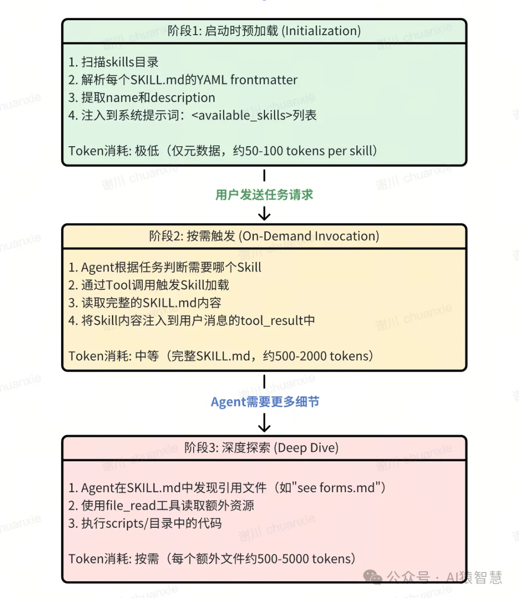
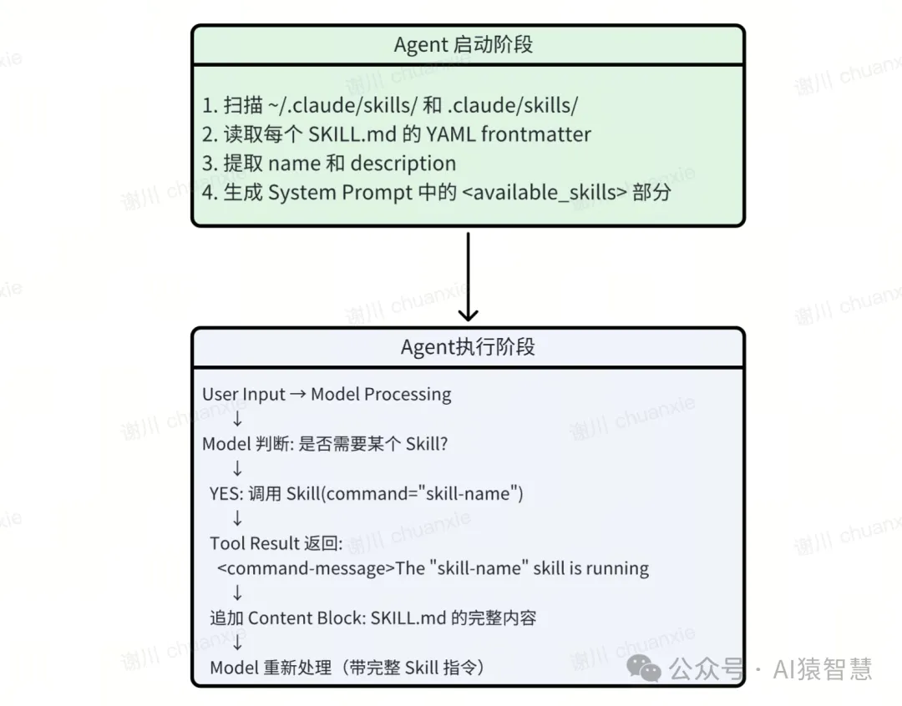
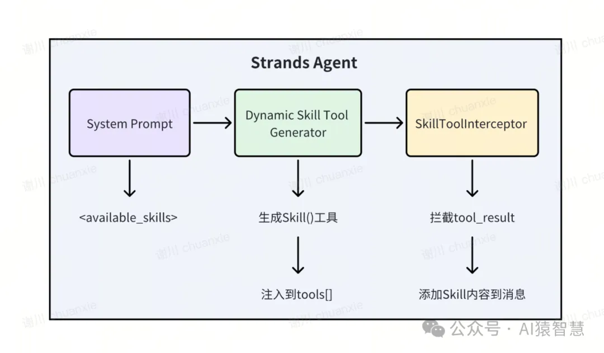
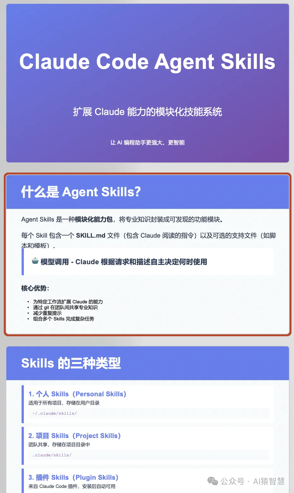
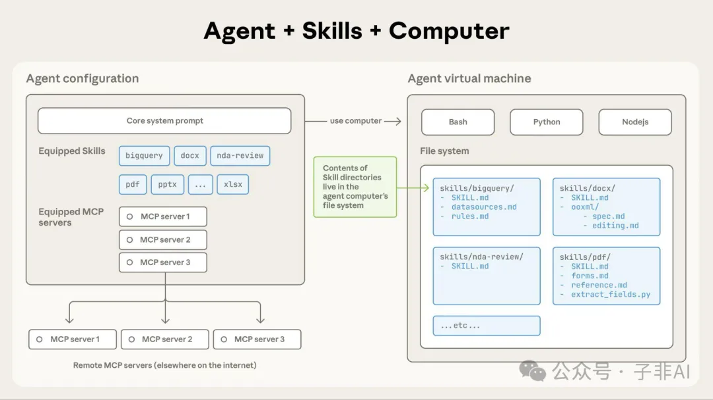

# 0. 资源

完整生成的PPT文件下载 Claude-Code-Agent-Skills-介绍.pptx(https://github.com/xiehust/strands_demos/blob/main/strands_skills_demo/assets/Claude-Code-Agent-Skills-%E4%BB%8B%E7%BB%8D.pptx)

用一句话总结

- Skills = 让 Claude 按规范做事；
- MCP = 让 Claude 能用外部工具；
- Sub-Agent = 让 Claude 分身协作做更多事。

官网github地址：https://github.com/anthropics/skills

1. Anthropic 技术博客：用 Agent Skills 为现实世界装备代理
https://www.anthropic.com/engineering/equipping-agents-for-the-real-world-with-agent-skills
深入解析 Skills 的技术架构和设计哲学
2. Claude 官方文档：Agent Skills 完整指南
https://docs.claude.com/en/docs/agents-and-tools/agent-skills/overview
从入门到精通的官方教程

# 1.引言
最近Anthropic正式发布了Claude Code Skills功能，这是继MCP之后，Anthropic在Agent工具化领域的又一重要创新。不同于传统的硬编码工具调用（Tool Calling），Agent Skills通过文件和文件夹的组织方式，让Agent能够动态发现和加载技能文件，就像为新员工准备一份完整的入职操作手册。

与传统的工具调用（Tool Use）不同，Skills采用了渐进式信息披露（Progressive Disclosure）的设计理念，通过多层次的上下文加载机制，既保证了Agent的响应效率，又提供了深度的领域知识注入能力。这种设计让Agent能够在需要时"即时学习"专业技能，而不是一开始就加载所有可能需要的知识。

本文将深入剖析Agent Skills的技术架构，并展示如何使用Strands Agents SDK完美复刻这一能力。通过逆向工程Anthropic的官方实现，我们将揭开Skills背后的设计哲学和技术细节。

# 2.技术背景：从Tool Calling到Agent Skills

传统Tool Calling的局限

在Agent Skills出现之前，为LLM Agent赋予特定能力主要依赖Tool Calling机制：

```python
# 传统Tool Calling方式
tools = [
    {
        "name": "pdf_extract",
        "description": "Extract text from PDF files",
        "parameters": {...}
    }
]
# 所有工具定义都需要预先加载到系统提示词中
agent = Agent(tools=tools)
```

这种方式存在三个核心问题：

- 上下文窗口压力：所有工具的完整描述必须在启动时加载，占用大量token
- 缺乏可组合性：新增能力需要修改代码，无法通过文件系统灵活分发
- 专业知识难以封装：复杂的领域知识（如pptx生成的最佳实践）无法有效传递给Agent


Agent Skills的设计哲

Anthropic提出的Agent Skills基于两个核心设计原则：

渐进式披露（Progressive Disclosure）

Skills采用三层信息结构：

第一层：Skill的name和description（启动时预加载）

第二层：SKILL.md的完整内容（Agent判断相关时加载）

第三层：额外的参考文件如reference.md、forms.md（按需加载）

这种设计让Agent在需要时才加载详细信息，避免了上下文窗口的浪费。

文件系统作为能力载体

每个Skill本质上是一个包含SKILL.md的文件夹：

```bash
skills/
├── pdf/
│   ├── SKILL.md           # 核心技能描述
│   ├── forms.md           # 表单填写指南
│   ├── reference.md       # API参考
│   └── scripts/
│       └── extract.py     # 可执行脚本
```

这种文件系统结构天然支持：

版本控制：通过Git分发和管理

模块化组合：多个Skills可以共存

跨项目复用：个人Skills（~/.claude/skills/）和项目Skills（.claude/skills/）分离

核心架构解析：Skills的工作机制

三阶段加载流程

通过分析Anthropic的官方文档和实现，我们可以提炼出Skills的完整工作流程：



SKILL.md的标准格式

每个Skill的核心是一个符合特定格式的Markdown文件：

```python

---
name: PDF Processing
description: Extract text, fill forms, merge PDFs. Use when working with PDF files or when the user mentions PDFs, forms, or document extraction.
---
# PDF Processing Skill
## Overview
This skill provides comprehensive PDF manipulation capabilities...
## Instructions
1. To extract text from a PDF, use pdfplumber...
2. For form filling, refer to [forms.md](
forms.md
)
## Code Examples
```python
import pdfplumber
with pdfplumber.open("doc.pdf") as pdf:
    text = pdf.pages[0].extract_text()
```
关键字段解析：

- name：Skill的标识名称，用于在系统提示词中展示

- description：触发条件描述，必须明确说明"何时使用"，这是Agent判断是否加载Skill的核心依据

# 3.逆向工程：解构Claude Code中Agent Skill的实现

核心技术架构

通过分析Claude Code的行为模式和官方文档，我们可以推断出Skills的核心技术架构：



实现架构设计
在Strands Agents SDK中实现Agent Skills需要解决三个技术点：

1. 如何动态生成Skill工具：在Agent启动时扫描Skills并生成tool定义

2. 如何注入Skill内容：在tool调用后将Skill内容添加到消息流

3. 如何支持Message Prompt Caching：利用缓存优化重复加载的成本

我们的实现方案采用了动态工具生成 + Hook拦截器的架构：



关键技术点
动态Tool生成

Skills本质上是一个动态生成的Tool。在Agent启动时：

扫描技能目录

解析所有SKILL.md的frontmatter

动态构建Tool的description（包含所有可用技能列表）

注册为名为Skill的工具

两阶段响应机制

当模型调用Skill工具时，系统返回两部分内容：

第一部分：命令消息（让模型知道Skill正在加载）

```bash
<command-message>The "skill-name" skill is running</command-message>
<command-name>skill-name</command-name>
```

第二部分：完整的Skill内容（作为额外的Content Block）

```text
Base directory for this skill: /path/to/skill
[SKILL.md的完整Markdown内容]
```

这种两阶段设计确保了：

模型先收到确认消息

然后获得完整的Skill指令

最后重新推理，应用Skill知识完成任务


Prompt Cache优化

Skills内容通常很长（几千到上万tokens），重复加载会消耗大量资源。Strands Agents SDK中使用Claude模型，默认只能针对System和Tool设置Prompt Cache，如果需要对Message设置Prompt Cache，则需要自行在Messages列表中添加CachePoint，而我们使用了Strands的Hook机制提供的BeforeModelCallEvent拦截，在调用模型API之前，对Messages列表修改，在最末添加cachePoint。


# 4. 核心代码实现
1. 动态Skill工具生成
skill_tool.py中的generate_skill_tool()函数负责扫描Skills目录并生成动态工具：

```python
def generate_skill_tool():
    """动态生成Skill工具函数"""
    skills_desc = init_skills()  # 扫描并生成<available_skills>列表
    if not skills_desc:
        return None
    # 动态创建函数
    def dynamic_func(command: str) -> str:
        """
        Execute a skill within the main conversation
        Args:
            command: Skill名称，如"pdf"、"xlsx"
        """
        return f"Launching skill: {command}"
    # 设置函数元数据
    function_name = "Skill"
    dynamic_func.__name__ = function_name
    dynamic_func.__doc__ = skill_prompt_template.format(skills=skills_desc)
    # 应用@tool装饰器
    decorated_func = tool(dynamic_func)
    return decorated_func
```

技术要点：

将每个Skill的name和description格式化为XML片段，注入到系统提示词

动态函数通过修改__name__和__doc__属性，让@tool装饰器识别


2. Hook拦截器实现Skill内容注入
Strands SDK的Hook机制允许我们拦截Agent的关键事件。我们实现了SkillToolInterceptor来处理Skill的加载和注入：

```python

class SkillToolInterceptor(HookProvider):
    def __init__(self):
        super().__init__()
        self.tooluse_ids = {}  # 存储待注入的Skill内容
    def register_hooks(self, registry: HookRegistry) -> None:
        """注册三个关键Hook"""
        registry.add_callback(AfterToolCallEvent, self.add_skill_content)
        registry.add_callback(MessageAddedEvent, self.add_skill_message)
        registry.add_callback(BeforeModelCallEvent, self.add_message_cache)
    def add_skill_content(self, event: AfterToolCallEvent) -> None:
        """Hook 1: 工具调用后，加载Skill完整内容"""
        if event.tool_use['name'] == 'Skill':
            command = event.tool_use['input']['command']
            # 读取SKILL.md完整内容
            skill_content = load_skill(command)
            # 暂存到tooluse_ids映射
            self.tooluse_ids[event.tool_use['toolUseId']] = skill_content
    def add_skill_message(self, event: MessageAddedEvent) -> None:
        """Hook 2: 消息添加时，注入Skill内容到tool_result"""
        if event.message['role'] == 'user':
            for block in event.message['content']:
                if 'toolResult' in block:
                    tooluse_id = block['toolResult']['toolUseId']
                    skill_content = self.tooluse_ids.get(tooluse_id)
                    if skill_content:
                        # 将Skill内容追加到消息content数组
                        event.message['content'] += skill_content
                        self.tooluse_ids.pop(tooluse_id)
                        break
    def add_message_cache(self, event: BeforeModelCallEvent) -> None:
        """Hook 3: 模型调用前，添加Prompt Cache标记"""
        # 移除旧的cachePoint
        for message in event.agent.messages:
            content = message['content']
            if any(['cachePoint' in block for block in content]):
                message['content'] = content[:-1]
        # 在最后一条消息添加cachePoint
        if event.agent.messages:
            event.agent.messages[-1]['content'] += [{
                "cachePoint": {"type": "default"}
            }]
```

技术要点：

1. 两阶段注入：

AfterToolCallEvent：工具调用完成后立即读取Skill内容，但不直接修改消息

MessageAddedEvent：等消息正式添加到历史记录时，再将Skill内容注入到tool_result的后续content块中

2. Prompt Caching优化：

BeforeModelCallEvent：在每次调用模型前，将最后一条消息标记为缓存点

Claude会缓存包括Skill内容在内的完整上下文，避免重复加载同一Skill时的token消耗


3. load_skill函数：返回多块内容

```python
def load_skill(command: str) -> list:
    """
    加载指定Skill的完整内容
    返回包含两个content block的列表：
    1. command-message: 提示Skill正在加载
    2. text block: Skill的完整Markdown内容
    """
    try:
        path = os.path.join(SKILLS_ROOT, command, "SKILL.md")
        with open(path, 'r', encoding='utf-8') as f:
            skill_content = f.read()
        # 解析YAML frontmatter，提取Markdown正文
        frontmatter_match = re.match(
            r'^---\n(.*?)\n---\n(.*)', 
            skill_content, 
            re.DOTALL
        )
        if not frontmatter_match:
            return [{
                "text": f"<command-message>The \"{command}\" skill failed to load</command-message>"
            }]
        markdown_content = frontmatter_match.group(2)
        # 返回两个content block
        return [
            {
                "text": f"<command-message>The \"{command}\" skill is running</command-message>\n<command-name>{command}</command-name>"
            },
            {
                "text": f"Base directory for this skill: {os.path.join(SKILLS_ROOT, command)}\n\n{markdown_content}"
            }
        ]
    except Exception as e:
        return [{
            "text": f"<command-message>The \"{command}\" skill failed to load</command-message>"
        }]
```

为什么返回两个block？

第一个block提供元信息（Skill名称、加载状态），使用特殊的<command-message>标签

第二个block包含实际的Skill内容，并告知Agent Skill的基础路径，方便引用相对路径文件


4. Agent初始化完整流程
在main.py中，我们将Skills集成到Strands Agent：

```python
from strands import Agent
from strands.models import BedrockModel
from skill_tool import generate_skill_tool, SkillToolInterceptor
# 动态生成Skill工具
skill_tool = generate_skill_tool()
# 创建Agent，注入Skill工具和Hook
agent = Agent(
    model=agent_model,
    system_prompt=f"""You are a helpful AI assistant with access to various skills.
<IMPORTANT>
- Your working directory is {WORK_ROOT}
- Use 'Skill' tool to load specialized capabilities
</IMPORTANT>
""",
    tools=[file_read, shell, editor, skill_tool],  # 包含动态生成的Skill工具
    hooks=[SkillToolInterceptor()]  # 注入Hook拦截器
)
```

# 5. 实战效果演示

让我们看一个实际运行的例子，市面上很多Agent应用如生成ppt，一般都是HTML格式，往往最终生成pptx文件时，实际效果会差很多，英文从html转换成pptx的难度非常大，一般Agent走到最后这一步都会丢失格式，样式等。我们用Anthropic官方Skills库中的pptx来验证，用Strands Agent+ ppx Skill是否能完美的生成一份pptx文件。

任务输入：

research about Claude Code Agent Skills 
(https://docs.claude.com/en/docs/claude-code/skills),
 and create a ppt in Chinese to introduce it, 
 save it as pptx file in working directory.


执行流程：

1. 模型推理：识别到需要pptx处理能力

2. 调用工具：`Skill(command="pptx")`

3. Hook拦截：`SkillToolInterceptor`捕获调用

4. 加载内容：读取`skills/pptx/SKILL.md`

5. 注入消息：追加完整Skill指令到工具结果

6. 推理-执行各种工具-循环：基于pptx Skill的完整指令，按页生成html格式的ppt文件，然后再生成nodejs代码，调用pptxgenjs这个库，把html内容转换成pptx格式文件。

实际效果如下图，几乎完美的复刻了原有html格式的ppt，并生成了一个完全可编辑的pptx。



6. 总结

Agent Skills代表了Agent 上下文工程的一种新范式，通过文件系统 + 渐进式披露的设计，实现了极高的可扩展性和可维护性。对于开发者而言，深入理解Agent Skills的架构原理，将有助于构建更强大、更灵活的Agentic AI应用。

通过本文的逆向工程Claude Code Agent Skills的设计，我们揭示了其核心技术架构，更展示了如何用Strands Agents SDK通过动态工具生成 + Hook拦截器的架构，完美复刻了这一能力。

Strands Agents SDK实现Skills具有以下优势：

- ✅ 完全开源：代码透明，可自定义扩展

- ✅ 多模型兼容：支持AWS Bedrock、Anthropic /OpenAI 兼容API等多种模型接口

- ✅ Hook系统强大：可扩展更多增强功能（日志、监控、审计）

- ✅ 原生异步支持：高性能的流式响应

- ✅ 企业级特性：本地，云上(无服务/有服务器)多种部署方式, 原生集成OTEL可观测性等



# 参考

[1] Agent Skills 逆向工程解密，用Strands Agents SDK完美实现Agent Skills, https://mp.weixin.qq.com/s?__biz=MzkyMTYzNjk3OA==&mid=2247484090&idx=1&sn=ca5b5c837fbe1b31856441f69bb9fbb1&chksm=c181dba7f6f652b10860b14fbb56fd02746d85323c66ce9cbd2c4e99c4fcc6d07b38cb4b6211&exptype=unsubscribed_card_recommend_article_u2i_mainprocess_coarse_sort_pcfeeds&ranksessionid=1761461355_1&req_id=1761461355644781&scene=1#rd
[2] https://mp.weixin.qq.com/s/tjgDVzcZcp6Eni9N8yHbdw

Anthropic Engineering Blog. Equipping agents for the real world with Agent Skills. https://www.anthropic.com/engineering/equipping-agents-for-the-real-world-with-agent-skills

Claude Documentation. Agent Skills. https://docs.claude.com/en/docs/claude-code/skills

Strands Agents SDK. https://strandsagents.com/latest/