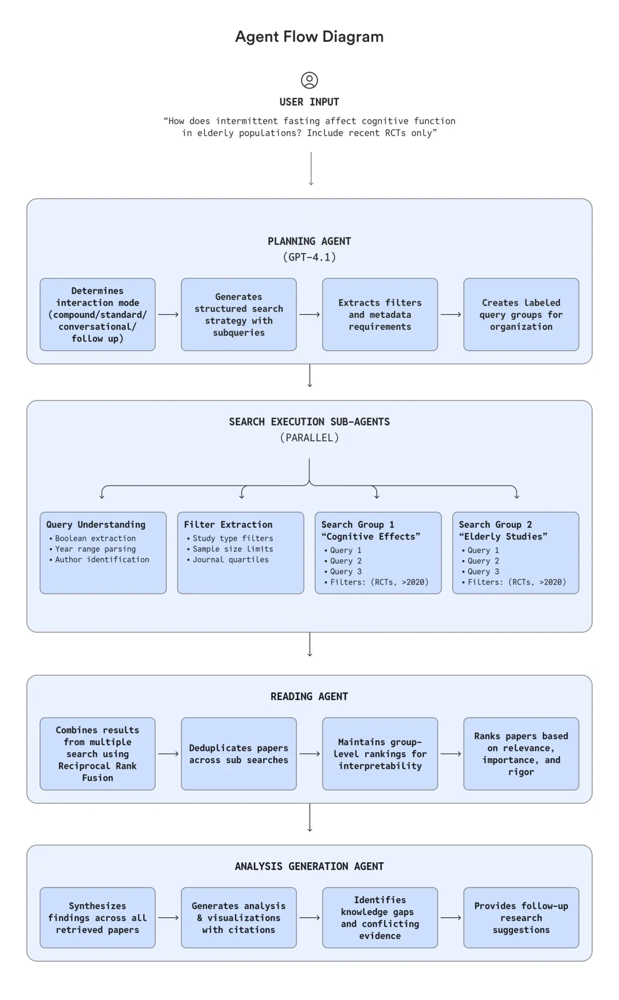
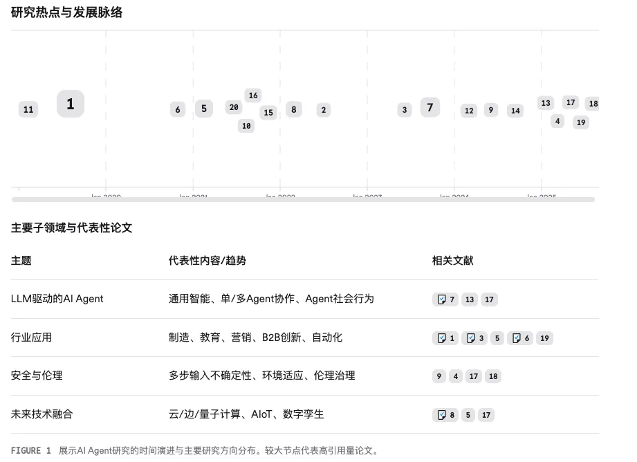

该系统基于 GPT-5 和 Responses API 构建，现在运行代理的协调工作流程：

规划代理分解用户的问题并决定下一步采取什么行动
搜索代理梳理了共识的论文索引、用户的私人图书馆和引用图
阅读代理可以单独或批量翻译试卷
分析代理综合结果，确定结构和视觉效果，并组成最终输出 每个智能体都拥有一个狭窄的推理范围，这确保了推理的精确性，并最大限度地减少了幻觉。该架构还允许共识系统决定何时不回答；如果没有相关的研究达到其质量阈值，助手就会直接回复。而且引入了 context engineering：在生成研究结果之前收集正确的证据。每个答案都附带一个“研究情境包”——一个结构化的包，包含论文、元数据和可追溯到原始研究的关键发现。

# 参考

[1] Consensus 开源多智能体科研助手架构，已服务 800 万科研人员，助力高效阅读论文！https://mp.weixin.qq.com/s/rrZFW89atpjgn81LQkAxyA