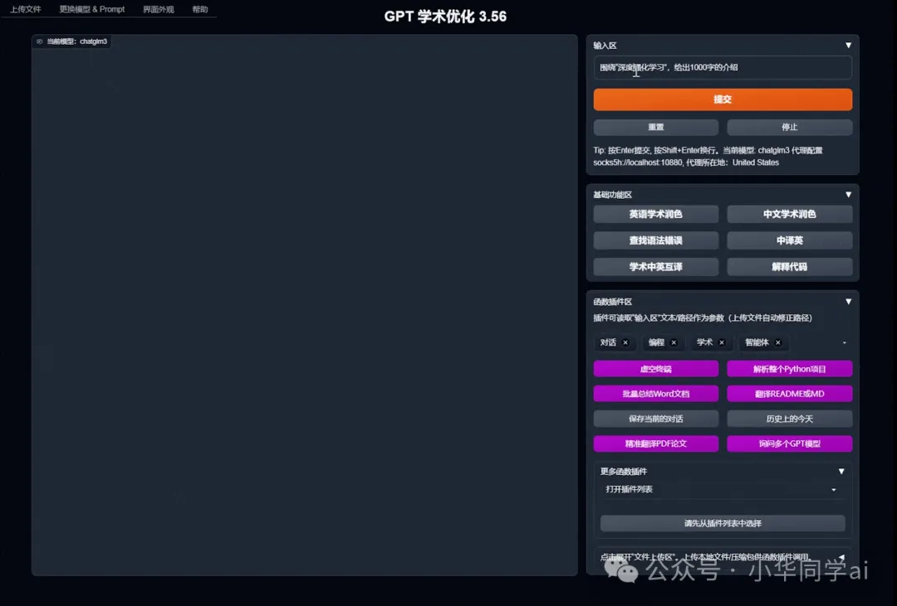
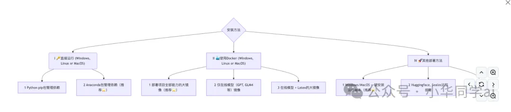

# 资源

- Github (68k stars): https://github.com/binary-husky/gpt_academic

gpt_academic 是一款集成 GPT/GLM 类大模型的学术写作优化神器，学术界和科研领域都在快速拥抱大语言模型 (LLM)，但真正能助力论文阅读、润色、写作的工具却少之又少。gpt_academic（GPT 学术优化）正是为此诞生：聚焦论文生产全流程，从阅读理解、翻译润色、结构优化，到理工项目剖析，提供一站式解决方案。

# 痛点

你是不是也遇到这些痛点？
读论文效率太低？英文论文、LaTeX 排版，阅读起来晦涩、耗时、易卡壳。
润色/翻译靠自我？毕设、投稿、PPT 全靠一个英文老师？效率低、不够灵活。
跨项目分析复杂？Python／C++ 代码混杂，理解逻辑流繁琐。
界面操作还需命令行？每次切换窗口、记命令感觉实在鸡肋……
如果你也在这些痛点中挣扎，那么恭喜你，gpt_academic 可以救你。

gpt_academic 可做什么？
“为 GPT/GLM 等 LLM 提供实用化交互接口，特别优化论文阅读/润色/写作体验，模块化设计，支持自定义快捷按钮 & 函数插件，支持 Python 和 C++ 等项目剖析 & 自译解功能，PDF/LaTeX 论文翻译 & 总结功能，支持并行问询多种 LLM 模型，支持 chatglm3 等本地模型”

它不仅是一套工具，更是一个“学术助理”平台，具备下面这些特色功能：

核心功能亮点

论文翻译/总结/润色PDF 和 LaTeX 格式直接交互，支持中英文对照、高亮注释、结论重写，轻松提升效率。

学术写作辅助内置多种写作模板，一键生成摘要、引言、结构大纲、论文检查，甚至交互式改写建议。

代码解析 + 自译解针对 Python、C++ 项目，自动分析函数调用、依赖关系，并生成中文注释与调用示意。

函数插件 & 快捷按钮定制可自定义按钮，一键调用自定义函数（如特定的翻译、格式检查、代码风格改写）。

多模型并行支持同时接入 OpenAI GPT、ChatGLM3、本地 llama2、CLAUDE2、讯飞星火、文心一言等逐比模型，快速选出效果最优答案。

集成图像与音频支持 OpenAI 图像生成，以及音频解析/摘要，让你能从 PPT 图、会议录音直接获取内容。

小彩蛋：live2d 表情互动界面可以加载 live2d 模型，萌化你枯燥科研体验。

| 特性         | 优势 / 价值                                                                 |
| ------------ | --------------------------------------------------------------------------- |
| 多模型并行   | 支持 OpenAI、ChatGLM、Claude2、Llama2、讯飞星火、文心一言等；快速对比，选出最佳结果 |
| PDF + LaTeX 解析 | 基于 GROBID（可解析图表与结构）；阅读论文更直观、准确                           |
| 代码剖析     | 自动解析函数调用、自译中文注释；理解逻辑关系更简单                           |
| UI 可定制性  | 自定义按钮、函数插件；无缝集成常用脚本工具                                 |
| 多模态支持   | 图像生成 + 语音摘要能力；覆盖口头会议、视觉演示等多场景                       |
| 安装便捷     | 一键脚本支持 Windows/Mac/Linux；零门槛部署、快速上手                       |
| 安全提示     | GPL-3.0 开源协议，社区广泛审计；免费、可商用、无闭源风险                   |

典型场景
博士/硕士论文写作全过程：从阅读、翻译、润色到结构梳理，一站搞定。
科研项目新人上手：阅读导师代码、理解功能逻辑秒懂。
多语言稿件管理：中英双语输出，方便交付国际会议。
会议音频总结：快速获取录音要点，省去手动记录。
科学报告 PPT 制作：生成示意图并自动配以说明文本。

工具对比：

| 工具 / 项目       | 论文阅读能力           | 代码解析能力           | 多模型支持           | UI 定制             | 图像 / 音频         | 社区活跃度         |
| ----------------- | ---------------------- | ---------------------- | -------------------- | ------------------- | ------------------- | ------------------ |
| **gpt_academic**  | ✅ 支持 PDF/LaTeX 高亮翻译 | ✅ 自动剖析函数、依赖    | ✅ 多模型并行对比     | ✅ 插件 + 快捷按钮   | ✅ 图像/音频处理     | ⭐⭐⭐⭐⭐ 68.9 K      |
| **ChatPaper**     | ✅ PDF 阅读             | ❌ 无代码分析          | ❌ 单 model           | ❌ 无深度 UI 定制    | ❌ 无图音            | ⭐⭐⭐☆ 3 K           |
| **SciSpace**      | ✅ 文本阅读             | ❌ 无                  | ❌ 单 model           | 基础交互              | ❌ 无               | ⭐⭐ 2 K             |
| **CodeGeeX**      | ❌                     | ✅ 代码自动生成        | ❌                    | ❌                  | ❌                  | ⭐⭐ 1 K             |

从对比表可以看出：

gpt_academic 是学术 + 编程 + 多模态最全面的工具；
社区活跃度高，迭代快，会持续收获新能力。

# 总结
gpt_academic 一款为科研生活量身定制的大语言模型助手，覆盖论文阅读、学术写作、项目分析、图/音模块……堪称科研界的全能管家。目前在 GitHub 上以 近 7 万星 的成绩广受好评，社区支持强、安全意识高。只要你从事科研、写论文、分析项目、准备国际稿件，它都能帮你省时提质。

🧠 如果你正在找一个跨模型、跨语言、跨场景的科研辅助工具，不妨一试 gpt_academic。

# 参考

[1] Github 68000+ star，专业领域的GPT，看到我都慌了，太牛皮啦！https://mp.weixin.qq.com/s/9ZZaaghfiariEx2e1dOO8g