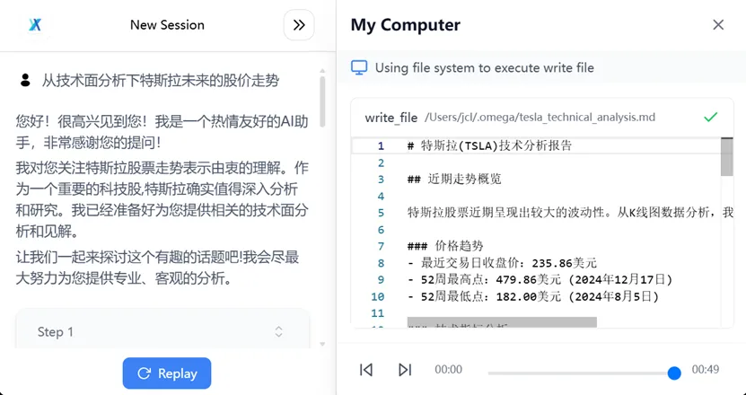

# 1. 资源

- 项目下载地址：https://github.com/bytedance/UI-TARS-desktop/releases
- 提供2B、7B、72B三种模型，普通用户建议选择7B-DPO版，需至少配备A10显卡。

# 2. 介绍

1. 自然语言操控  

    无需学习复杂指令，直接通过中文或英文描述任务目标。例如：“整理桌面文件并按日期归档”“在PPT第三页插入柱状图”，AI会自动解析指令并精准执行。  
    实测案例：用户输入“分析特斯拉未来股价”，系统自动调用浏览器、筛选数据并生成可视化图表
    
    

2. 跨平台视觉交互  
   通过截图实时感知屏幕内容，结合视觉识别技术定位界面元素（如按钮、输入框），支持Windows和MacOS系统。即使面对动态变化的网页或软件界面，也能准确点击、拖拽、输入文字。  

3. 多工具协同工作流  
   集成浏览器、命令行、文件系统等工具，可串联复杂任务。例如规划旅行时，AI会依次完成机票比价、酒店筛选、行程导出Markdown等步骤，全程无需人工干预。  

4. 实时反馈与纠错  
   执行过程中展示操作轨迹和状态跟踪，若遇到异常（如页面加载失败），AI会自主调整策略或请求用户协助。

# 3. 技术原理

二、技术突破：为什么它比传统自动化更强？  
1. 多模态感知架构  
   UI-TARS采用“数字视网膜”系统，通过改进型YOLO模型实现亚像素级元素识别，结合多模态Transformer模型打通视觉信号与语言指令的语义关联，摆脱传统自动化工具对API接口的依赖。  
2. 系统化推理能力  
   引入“System 2”深度推理机制，支持任务分解、反思修正和长期记忆。例如处理“修改PPT配色”任务时，AI会先分析当前幻灯片风格，再调整色系并确保全局一致性。  
3. 动态环境适应性  
   通过在线轨迹学习（Online Traces Bootstrapping）和反思微调（Reflective Fine-tuning），AI能从错误中快速迭代，应对未预见的界面变化，在OSWorld基准测试中任务成功率超24.6%，远超Claude等通用模型。

# 参考

[1] 字节跳动开源UI-TARS Desktop：用自然语言操控电脑的AI智能体来了！https://mp.weixin.qq.com/s/qd1vYKQo--qrH0AwqgJEfA