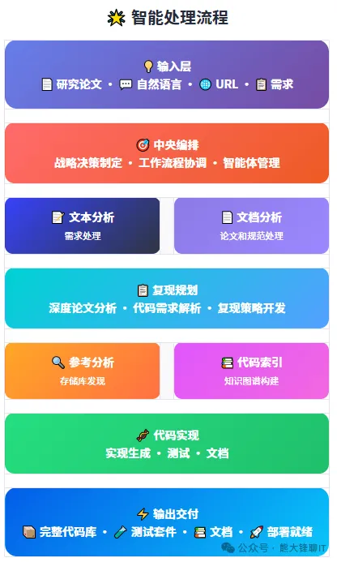

该项目地址：
https://atomgit.com/GitHub_Trending/deepc/DeepCode

Github (13.9k stars): https://github.com/HKUDS/DeepCode
该项目隶属于HKUDS，应该是香港大学Data Intelligence Lab

此项目没有官网，但是有个疑似实验室负责人的个人页面链接：

https://sites.google.com/view/chaoh

项目介绍信息：

DeepCode 是一个AI驱动的开发平台，自动化代码生成和实现任务。我们的多智能体系统处理将需求转换为功能性、结构良好代码的复杂性，让您专注于创新而非实现细节。该项目使用了多智能体架构，由中央编排智能体编排整个工作流程执行并做出战略决策。基于输入复杂性分析协调专门智能体。实现动态任务规划和资源分配算法。

# 参考

[1] 项目分享：DeepCode, HKUDS开源的AI Coding工具，GitHub 13K Star！https://mp.weixin.qq.com/s/Vac_76eOWeHsKf-GplgEeQ