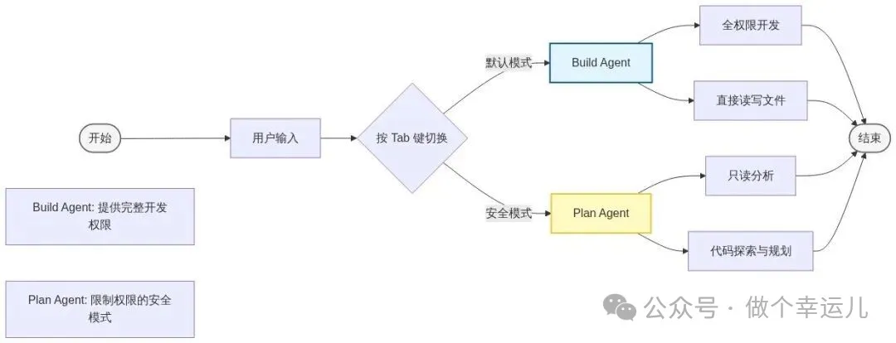

 61.6k Stars

它不仅仅是一个简单的代码补全工具，更是一个完全开源、模型中立且专注于终端体验（TUI）的 AI 编程代理（Agent）

与市面上其他竞品相比，它有几个杀手级特性：

• 100% 开源透明：没有黑箱，你可以完全掌控你的开发工具，甚至自己魔改它的行为。
• 模型中立（Provider-Agnostic）：这是它最大的亮点。虽然官方推荐使用 OpenCode Zen 提供的优化模型，但你完全可以将其与 Claude 3.5 Sonnet、GPT-4o、Google Gemini 甚至本地运行的 DeepSeek/Llama 模型一起使用。这意味着随着模型价格下降和能力提升，你永远可以选择性价比最高的那个，而不会被单一供应商锁定。
• 开箱即用的 LSP 支持：语言服务器协议（LSP）的支持意味着它能真正“理解”你的代码结构，而不仅仅是进行文本预测。
• 客户端/服务器架构：这种设计允许 OpenCode 的大脑（Server）在你的高性能工作站上运行，而你甚至可以通过移动设备远程控制它。
硬核技术拆解：OpenCode 的底层魔法
为了让大家更透彻地理解这款工具，我们深入剖析一下它的技术栈。OpenCode 之所以能提供如此丝滑的体验，离不开以下几个关键技术选型：

# 1. 基于 TypeScript 与 OpenTUI 的渲染引擎
OpenCode 主要基于 Node.js/TypeScript 构建。为了在终端中实现媲美 GUI 的交互体验（如平滑的滚动、即时的按键响应），开发团队并没有直接使用现成的 blessed 或 ink 库，而是自研了一套高性能 TUI 框架——OpenTUI。这使得 OpenCode 拥有极高的渲染帧率和极低的输入延迟。

# 2. LSP（语言服务器协议）的深度集成
与普通的“补全插件”不同，OpenCode 扮演了一个 LSP Client 的角色。当你要求它“重构这个函数”时，它会通过 LSP 询问本地安装的 tsserver (JS/TS)、gopls (Go) 或 pyright (Python)。AI 拿到的上下文不仅是纯文本，还有代码的语法树结构，因此生成的代码准确率远高于纯文本预测。

# 3. 工具链沙箱与权限控制
在 Agent 执行层面，OpenCode 实现了一套严格的工具调用（Tool Use）机制。所有的文件写入（fs.write）和 Shell 命令执行（shell.execute）都被封装在原子化的工具函数中。在 Plan 模式下，系统会强制拦截所有具有副作用的工具调用，从代码层面保证了“只读”安全性。

1. Build Agent（构建模式 - 默认） 这是你的“实干家”伙伴。它拥有完全的访问权限，可以进行开发工作，直接编辑文件。在该模式下，Agent 会被赋予 fs 和 diff 相关工具的调用权限，可以直接将变更应用到你的工作区。

2. Plan Agent（规划模式 - 只读） 这是你的“分析师”伙伴。它默认是只读的，拒绝文件编辑，并且在运行 bash 命令前会询问你的许可。

• 当你接手一个陌生的代码库（Legacy Code），想要先理解结构再动手时，Plan 模式是最佳选择。
• 最佳实践：先用 Plan 模式让它阅读代码并提出修改方案，确认无误后，再按 Tab 切换到 Build 模式执行方案。

# 参考

[1] Claude Code开源版？这款 60k+ Star 的开源 AI 编程 Agent，正在重新定义终端开发！https://mp.weixin.qq.com/s/y_YrG7rJPIsjVqRpRcrzYw