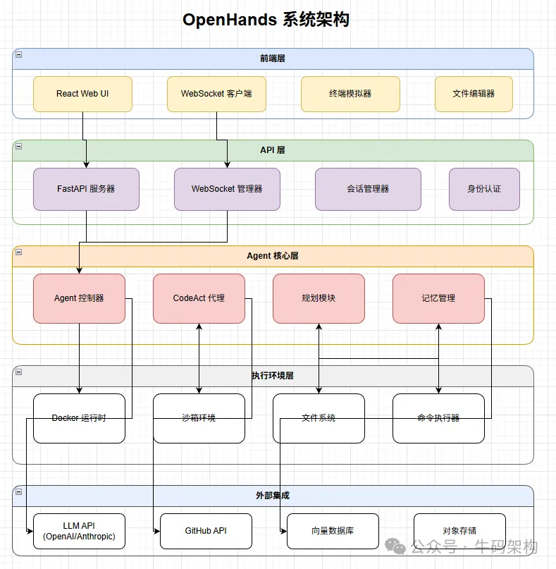

项目名称：OpenHands
GitHub 链接：https://github.com/OpenHands/OpenHands
社区认可度：Star 数突破 66.5k+，AI驱动的开发

🚀技术架构与核心特性
模块化可扩展：分层架构设计，核心功能（智能代理、LLM 集成等）模块化封装，支持按需组合；通过 LLMRegistry 组件灵活对接各类大语言模型。
多环境适配：兼容本地开发（CLI、Local GUI）、云端部署、企业私有化部署，提供 Docker 容器化方案，保障跨环境运行一致性。
生态集成丰富：深度对接 Slack、Jira、Linear 等工具，配套 Chrome 扩展、心智理论模块，覆盖开发 - 协作 - 管理全流程。
开发维护活跃：迭代频繁，近期优化含对话启动修复、Node.js 镜像升级、VS Code 代码补全优化、Kubernetes 部署支持等，保障稳定性与功能领先。
OpenHands V1 引入了一个基于四项设计原则的新架构，这些原则直接解决了 V0 的局限性

# 参考

[1] https://mp.weixin.qq.com/s/GV86YLcZdUSaNqoyEJrGuw