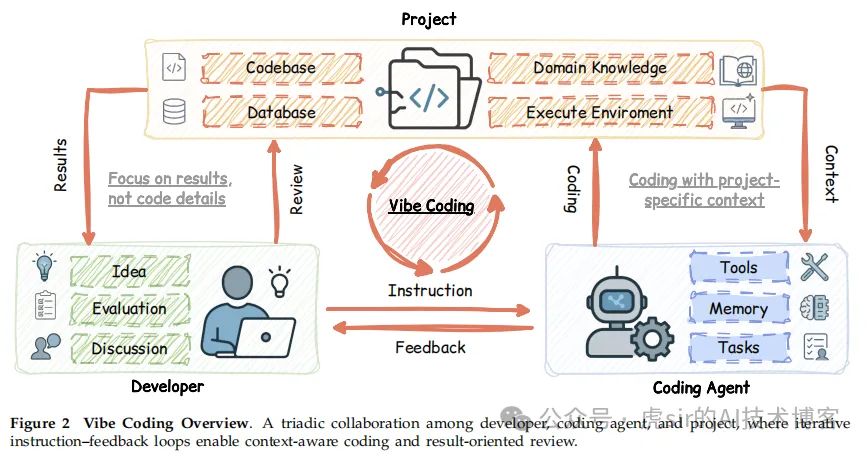
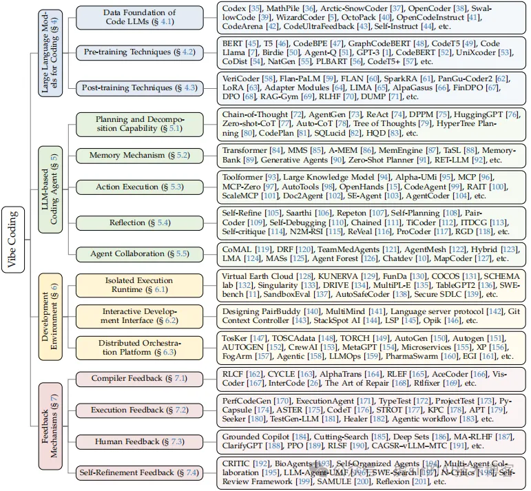

Title:《A Survey of Vibe Coding with Large Language Models》
GitHub 仓库：https://github.com/YuyaoGe/Awesome-Vibe-Coding
1 引言
大型语言模型（LLMs）凭借能流畅理解与生成自然语言的对话系统，极大推动了人工智能的发展 [1,2]。在软件开发领域，语言模型最初的定位是 “辅助工具”—— 开发者通过自然语言提示生成代码片段，但由于准确性有限，整个软件开发周期中仍需大量人工审查与迭代调试 [3-7]。

随着 GPT-4 [8]、Claude Sonnet 4 [9] 等先进架构的出现，语言模型性能实现质的突破，催生了 “编程智能体”（Coding Agents）。这类智能体可通过 shell 命令、文件操作、测试执行等方式与动态环境交互，自主完成编程任务 [10]，在真实编程任务中展现出快速进步。以 SWE-bench（软件开发基准测试）为例 [11]：SWE-agent 通过自定义界面实现 12.5% 的任务解决率 [12]，AutoCodeRover 结合代码搜索与故障定位实现 19.0% 的解决率 [13]，Agentless 达到 27.3%[14]，OpenHands 在 SWE-bench Verified（验证集）上实现 53% 的解决率 [15]，而具备自我改进能力的智能体在该验证集上的性能提升幅度达 17%-53%[16]。

随着 GPT-5 Pro [17]、Claude Sonnet 4.5 [9] 等大型语言模型的发展，基于语言模型的编程智能体能力实现重大突破，由此诞生了 “氛围编程”（Vibe Coding）这一全新范式 [18-21]。在该范式下，开发者无需逐行检查 AI 生成的代码，而是通过 “自然语言需求描述→执行结果观察→反馈调整” 的迭代循环开展开发。编程智能体的能力远超单纯的代码生成 —— 它们能自主配置环境、执行程序、自我诊断错误并更新实现方案。这标志着人类对 AI 的信任度大幅提升，开发模式从 “必须理解代码逻辑” 转向 “以结果为导向的验证”[22-25]。

然而，仅拥有强大的智能体并不足够。任务复杂性暴露了 “非结构化自然语言指令” 的根本局限：这类指令无法传递细微需求与架构约束 [11,26]。实证数据显示，经验丰富的开发者使用集成 Claude 的 Cursor 工具时，任务完成时间反而增加 19%，并未实现预期的效率提升 [27]。有效的人机协作需要系统化的提示工程、上下文工程 [28]、结构化指令 [29,3,30,31]，以及在不同交互类型中平衡智能体的自主权分配 [32,33]。

为填补这一关键空白，本文首次对 “基于大型语言模型的氛围编程” 进行全面、系统的综述。

如图 2 所示，我们将氛围编程定义为 “开发者、软件项目、编程智能体三者间的动态三元关系”，并通过 “约束马尔可夫决策过程”（Constrained Markov Decision Process）[34]，首次将其正式定义为一门工程学科。基于这一理论基础，我们将氛围编程工作流提炼为五种开发模型 —— 无约束自动化模型、迭代对话协作模型、规划驱动模型、测试驱动模型与上下文增强模型，这是对现有实践的首次全面整合。通过该框架，我们实现了三项目标：（1）为理解软件开发中的人机协作建立严谨的理论基础；（2）为开发者提供选择与实施合适开发策略的可操作指南；（3）识别涵盖技术基础设施、安全机制、人为因素的关键挑战与未来方向。本文既是 AI 增强软件工程这一新兴领域的概念基础，也是推进编程智能体系统研究与实践的技术路线图。

全文结构如下：第 2 章综述与氛围编程相关的综述文献及基础技术；第 3 章正式定义氛围编程，并通过约束马尔可夫决策过程建立其理论基础；第 4 章综述面向编程的大型语言模型，涵盖数据基础、预训练技术与后训练方法；第 5 章分析基于语言模型的编程智能体，包括规划能力、记忆机制、动作执行与协作架构；第 6 章探讨关键基础设施组件，包括隔离执行环境、交互式开发界面与分布式编排平台；第 7 章研究反馈机制，涵盖编译器反馈、执行反馈、人类反馈与自我优化；第 8 章提出五种开发模型的分类体系，并分析其特征与应用场景；最后，第 9 章讨论未来影响与开放挑战，包括技术进步、安全考量与以人为中心的设计；第 10 章总结全文。

整体而言，这篇综述不仅是对 “氛围编程” 现有研究的梳理，更构建了一套从 “理论定义” 到 “技术实现” 再到 “实践落地” 的完整体系，为开发者、研究者提供了理解与推进 AI 驱动软件开发的全景指南。

图 1 氛围编程（Vibe Coding）的分类体系
氛围编程的分类体系可划分为四大模块：大型语言模型基础、编程智能体架构、开发环境与反馈机制。每个模块均包含特定技术与框架，这些技术与框架共同推动大型语言模型（LLMs）与智能体系统系统性集成，最终形成具备智能性与协作性的软件开发工作流。

2 相关研究
2.1 相关综述文献
基础大型语言模型（Foundational LLM）
已有多篇综述文献记录了大型语言模型的发展历程，内容涵盖语言模型的架构设计、训练范式与核心能力 [202, 203]。这些研究重点分析了 Transformer 模型的各类变体，尤其关注高效架构设计与长上下文处理能力 [204–206]。另有文献梳理了从 BERT 到 ChatGPT 的基础模型发展脉络，同时探讨了技术机遇与潜在风险 [207]。此外，还有专项综述聚焦评估方法、“模型中心” 与 “数据中心” 双视角下的效率优化，以及文本生成、知识增强预训练语言模型（PLMs）等特定能力 [208]。

上下文学习（In-Context Learning）
在上述架构基础上，研究方向逐渐转向 “无需额外训练即可利用预训练模型” 的技术。提示工程（Prompt Engineering）与上下文学习已成为核心技术，相关分类研究涵盖了丰富的提示方法、应用场景、安全考量，以及在自然语言处理（NLP）各类任务中的性能表现 [209–211]。学界还深入探索了上下文学习的实现机制，推动 “上下文工程” 发展为一门正式学科 [212, 28]。其中，思维链（Chain-of-Thought, CoT）推理技术被证实效果显著，相关分类研究不仅分析了 “Chain-of-X” 系列范式，还探究了长思维链推理与多模态思维链推理 [213–215]。多模态大型语言模型是当前快速发展的前沿领域，已有综述围绕其架构设计、训练方法，以及跨多种数据模态的 “视觉 - 语言” 融合技术展开分析 [216–219]。

后训练技术（Post-Training）
当上下文学习无法满足需求时，后训练技术为模型提供了 “对齐特定需求、增强推理能力” 的路径。已有综述分析了强化学习相关方法，包括近端策略优化（PPO）、Q 学习（Q-Learning）与演员 - 评论员（Actor-Critic）方法，重点探讨了基于人类反馈的强化学习（RLHF）、基于 AI 反馈的强化学习（RLAIF）与直接偏好优化（DPO）[220–224]。另有研究综述了指令微调与有监督微调的方法体系，内容涵盖数据集构建、训练策略，以及 “如何通过数据选择提升模型指令遵循能力”[225]。在模型对齐研究中，学者将对齐方法划分为 “外部对齐” 与 “内部对齐” 两类，同时考虑对抗性因素，还探索了 “无需训练的对齐” 与个性化对齐技术 [226]。值得注意的是，直接偏好优化（DPO）作为无需强化学习的 RLHF 替代方案，其分类研究涵盖数据策略、学习框架与约束机制 [227]。此外，后训练范式相关综述还涉及微调、对齐、推理、效率优化与领域适配，其中低秩适配（LoRA）、适配器（Adapters）等参数高效优化方法，还提供了计算开销的实验对比数据 [228]。

智能体系统（Agent Systems）
工具使用能力与规划能力的集成，使大型语言模型从 “被动生成模型” 转变为 “主动智能体”。基础综述文献构建了智能体系统的核心框架，内容包括智能体构建方法、“感知 - 决策 - 行动” 架构与自主决策能力，同时提供了覆盖推理、代码生成等任务的统一基准分类体系 [229–231]。在多智能体系统领域，研究涵盖智能体角色建模、通信协议设计，以及复杂任务场景下的协作工作流 [232, 233]。针对智能体核心能力的专项综述包括：结合检索增强生成（RAG）与反馈学习的工具使用技术 [234, 235]、包含任务分解与记忆机制的规划方法 [221]、支持推理与工具执行的单智能体 / 多智能体架构，以及长短时记忆分析机制 [236]。评估方法相关综述则覆盖规划能力、工具使用、自我反思与领域专用基准 [237, 238]。智能体的领域应用广泛，包括网页自动化 [239]、生命科学与材料科学领域的科学发现 [240]、支持图形用户界面（GUI）交互的操作系统智能体 [241]，以及具备反馈循环与终身学习能力的自进化智能体 [242]。与本文密切相关的是，近年已有综述专门分析软件开发全生命周期中的编程智能体，涵盖单智能体 / 多智能体架构、规划能力、上下文管理、工具集成与基准测试框架 [243, 244]。

2.2 基础技术背景
代码生成的强化学习（Reinforcement Learning for Code Generation）
将强化学习应用于代码生成，需依赖可执行的反馈信号，该技术已从基础机制发展为复杂训练范式。早期方法将预训练语言模型与深度强化学习结合，利用单元测试反馈与关键采样技术，在竞争性基准测试中实现了优异性能 [245]。基于执行结果的方法则通过近端策略优化（PPO）结合编译器反馈，实现代码的实时优化 [246]。先进的强化学习框架还具备以下特性：采用多粒度单元测试反馈 [247]、将代码生成拆解为 “课程式子任务” 并进行细粒度优化 [248]、使用基于排序的对齐机制 [62]，以及通过 “组相对策略优化” 结合编译器反馈实现竞争性性能 [249]。

自主编程智能体系统（Autonomous Coding Agent Systems）
除有监督生成外，自主智能体可通过专用架构与多智能体协作完成完整软件工程任务。单智能体系统的创新点包括：设计自定义 “智能体 - 计算机” 交互界面以提升基准测试性能 [12]、结合 “结构感知代码搜索” 与 “频谱故障定位” 实现低成本问题修复 [13]，以及证实 “简单分层定位方法” 可优于复杂智能体 [14, 250]。仓库级代码生成技术通过集成编程工具与智能体策略实现性能显著提升 [99, 251]，而 “迭代检索 - 生成” 方法也优化了仓库评估基准的基线性能 [251]。多智能体框架通过在开发流程中分配专用角色提升效率：例如，为 “程序员”“测试设计师”“测试执行者” 分配不同智能体，在降低 Token 消耗的同时实现高通过率 [104]；将标准化操作流程编码为 “流水线范式”，通过角色协作实现接近 100% 的任务完成率 [252]；设计 “对话链架构”，以双智能体通信模式低成本覆盖软件开发全生命周期 [10]。此外，专用框架还可：复现人类编程流程 [127]、验证 “提前提供测试用例可持续提升测试驱动开发效果”[253]，以及分析 “自我修复机制”—— 该机制虽能带来一定性能提升，但受限于自我反馈能力 [110]。

函数调用（Function Calling）
高效的智能体系统需具备工具使用、函数调用与执行基础设施，以实现与外部系统及 API 的交互。函数调用框架可实现以下功能：教会语言模型通过简单 API 实现工具使用的自我监督，且仅需少量演示示例 [93]；利用教师模型生成工具相关的指令数据 [254]；在细粒度任务上结合多任务学习与大规模 API 数据集 [255]。执行与交互环境相关技术包括：为多种编程语言提供安全执行环境的轻量级强化学习框架 [26]；将可执行代码作为统一动作空间，结合专用指令数据集与微调模型，性能优于其他格式 [256]；集成蒙特卡洛树搜索（Monte Carlo Tree Search）与外部反馈，实现审慎的问题求解 [257]。优化与部署领域的进展包括：自动识别可并行函数调用，显著降低延迟并节省成本 [258]；实现边缘设备部署，使轻量模型在本地环境中达到大型模型的性能 [259]；协调专用智能体完成工具选择、执行与校准，提升任务成功率 [150]。此外，检索、评估与基础设施领域的贡献包括：大规模基准测试证实 “从多源数据存储中检索信息可显著提升性能”[260]；将工具使用能力拆解为 API 操作的多维度评估指标 [261]；开发多智能体系统实现代码审查自动化，在关键审查任务中表现优异 [150]；支持通过自然语言或代码自定义对话式智能体 [150]；构建大规模 “指令 - API” 配对数据集，证实开源模型在新 API 调用任务上可优于专有模型 [262]。

有监督微调（Supervised Fine-Tuning）
作为强化学习的替代方案，有监督微调与指令微调已成为代码模型训练的基础方法。指令进化方法通过迭代优化代码指令实现竞争性性能 [5]，而自指令（Self-Instruction）方法则可自主构建指令遵循能力 [44]。全透明的自对齐流程无需专有蒸馏即可完成模型训练 [263]，大规模指令数据集则整合了多种指令生成方法 [41]。专用微调技术可实现以下目标：显著提升代码安全性的 “安全导向生成”[264]、优化代码生成 [265]，以及通过自我调试与迭代优化实现代码编辑、调试与改进（无需额外训练）[110, 105, 266]。代码领域的基础模型还具备以下特性：通过仓库级预训练扩展上下文窗口 [267]、在多语言数据上训练并支持 “补全中间内容”（fill-in-the-middle）目标与个人身份信息（PII）脱敏 [6]、将 GitHub 议题与文档集成到仓库级训练中 [268]，以及通过大规模采样与过滤策略实现竞赛级性能 [269]。

3 氛围编程：编程智能体管理工程
3.1 氛围编程的定义
本文将 “氛围编程” 定义为一种基于大型语言模型的软件工程方法 [18–21, 270]。如图 2 所示，其核心是 “人类开发者、软件项目与编程智能体” 三者间的动态三元关系。在该范式下：

人类角色从 “直接代码编写者” 转变为 “意图表达者、上下文管理者与质量裁决者”；
软件项目不再局限于静态代码仓库，而是扩展为涵盖代码库、数据库与领域知识的多维度信息空间；
编程智能体作为 “智能执行者”，在人类意图与项目约束的双重引导下，完成代码生成、修改与调试任务。
三元关系的形式化定义
我们将氛围编程建模为一个动态交互系统，用三元组 V = ⟨H,P, Aθ ⟩, 表示，其中：

H
（人类开发者）：具备两项核心能力 —— 需求认知能力 Hreq : D → I（将领域需求 
D
 转化为指令 
I
），以及质量判别能力 Heval : O → {0, 1} × F 对输出 
O
 做出 “接受 / 拒绝” 决策，并提供反馈 
F
）；
P
（软件项目）：表示为项目上下文空间 P = ⟨Ccode, Cdata, Cknow⟩

，分别对应代码库、数据库与领域知识；
Aθ

（编程智能体）：以 
θ

 为参数的大型语言模型，执行条件生成函数 

Aθ: I × P × E → O.（输入为指令 I、项目上下文 P 与执行环境 E，输出为结果 O）。

# 参考

[1] 基于大型语言模型的 “氛围编程”（Vibe Coding）研究综述, https://mp.weixin.qq.com/s/R_xh0fAeOj89DwUEtqC65Q