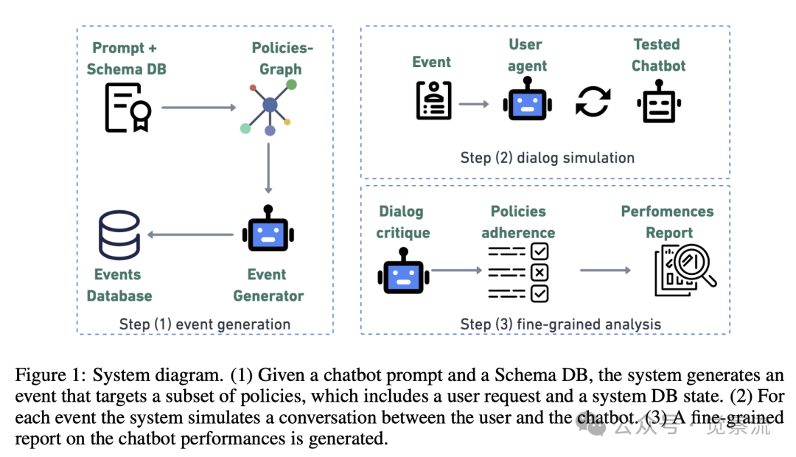
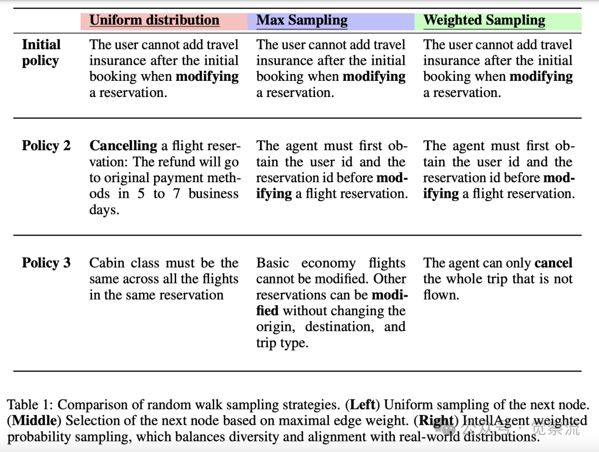
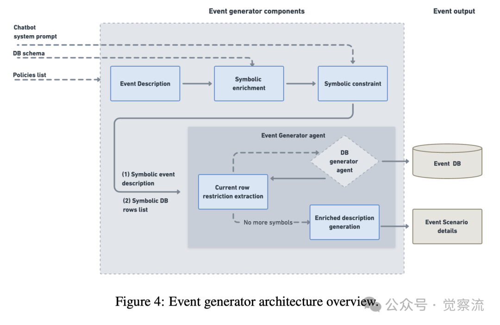
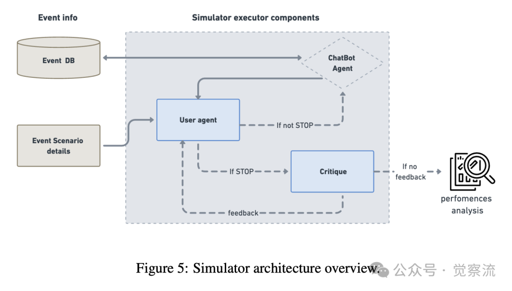
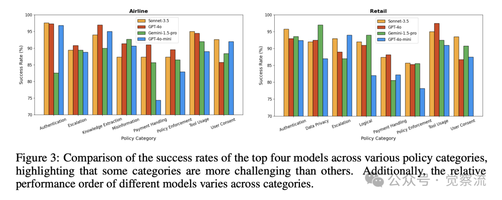
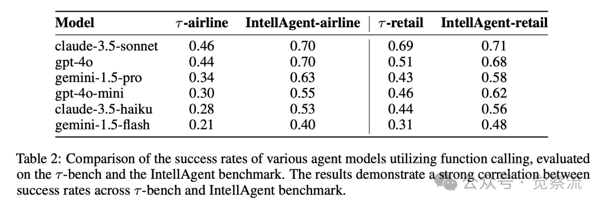
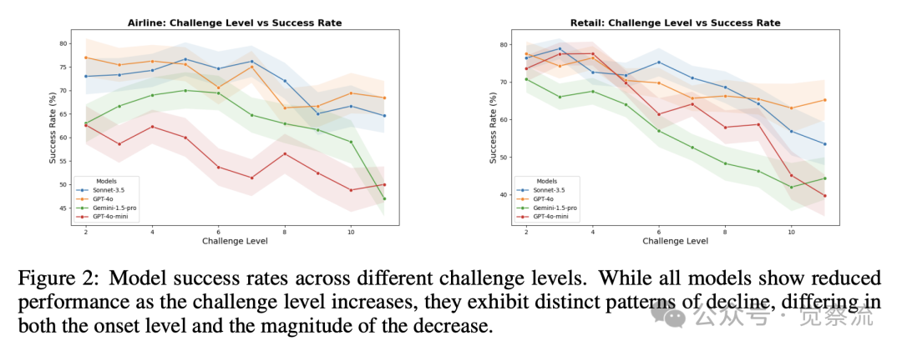

# 1. 资源

- Elad Levi Plurai, Ilan Kadar Plurai. "IntellAgent: A Multi-Agent Framework for Evaluating Conversational AI Systems."
  - https://arxiv.org/pdf/2501.11067
- intellagent github Repo
  - https://github.com/plurai-ai/intellagent

# 2. 为什么需要 IntellAgent？
对话式 AI 系统，比如聊天机器人，已经广泛应用于各种领域，比如客服、教育、医疗等。这些系统需要处理多轮对话，整合特定领域的工具和 API，同时还要严格遵守策略约束。然而，评估这些系统的表现一直是个难题，因为传统的评估方法往往依赖于静态的手动创建的基准测试，这些基准测试不仅难以扩展，也无法反映真实世界中的复杂动态交互。

# 3. IntellAgent 是什么？
IntellAgent 是一个开源的多智能体框架，它通过自动化创建多样化的合成基准测试，全面评估对话式 AI 系统的表现。它结合了策略驱动的图建模、真实的事件生成和互动的用户-智能体模拟，提供细粒度的诊断报告，弥补了传统基准测试的不足。

# 4. IntellAgent 的核心组件
IntellAgent 的核心组件包括策略图（policy graph）、事件生成器（event generator）、对话模拟器（dialog simulator）和对话批评组件（dialog critique）。

1. 策略图（Policy Graph）：
   - 策略图是一个图结构，其中节点代表不同的策略，边的权重表示这些策略在对话中同时出现的可能性。每个节点还有一个权重，表示其复杂性。
   - 通过多次查询大型语言模型（LLM），系统提取策略列表，并为每个策略分配难度等级。然后，对于每对策略，LLM 会分配一个分数，表示它们在对话中同时出现的可能性。
2. 事件生成器（Event Generator）：
   - 事件生成器根据策略图生成事件，每个事件包括一个策略列表、用户请求的描述和初始数据库状态。
   - 事件的复杂度定义为其策略复杂度的总和。事件生成器确保生成的事件复杂度在指定范围内均匀分布，并且策略列表的分布符合真实世界的情况。

   
3. 对话模拟器（Dialog Simulator）：
   - 对话模拟器模拟用户和聊天机器人之间的对话。用户代理根据事件的详细信息与聊天机器人互动，如果聊天机器人成功完成任务或违反了策略，用户代理可以随时终止对话。
4. 对话批评组件（Dialog Critique）：
   - 对话批评组件分析对话，确定聊天机器人是否遵循了策略，并生成详细的报告。如果用户代理的终止原因是错误的，批评组件会提供反馈，对话继续进行。

# 5. IntellAgent 的工作流程
1. 构建策略图：
   - 系统从聊天机器人的提示和数据库模式中提取策略列表，并为每个策略分配难度等级。
   - 对于每对策略，系统查询 LLM，获取它们在对话中同时出现的可能性分数。
2. 生成事件：
   - 系统根据策略图生成事件，每个事件包括一个策略列表、用户请求的描述和初始数据库状态。
   - 事件生成器通过随机游走算法从策略图中采样，确保生成的事件复杂度均匀分布，并且策略列表符合真实世界的情况。
   
3. 模拟对话：
   - 对话模拟器使用事件生成器生成的事件，模拟用户和聊天机器人之间的对话。
   - 用户代理根据事件的详细信息与聊天机器人互动，如果聊天机器人成功完成任务或违反了策略，用户代理可以随时终止对话。
    
4. 生成报告：
   - 对话批评组件分析对话，确定聊天机器人是否遵循了策略，并生成详细的报告。
   - 报告包括聊天机器人在对话中测试的策略子集、未遵循的策略子集以及对话的详细分析。

实验结果
研究人员在 τ-bench 环境中测试了 IntellAgent，使用了航空和零售两个领域的数据。他们生成了 1000 个事件，复杂度从 2 到 11 不等。实验结果显示，IntellAgent 与 τ-bench 的成功率有很强的相关性，尽管 IntellAgent 完全依赖合成数据。

- 模型比较：
  - 不同模型在不同复杂度下的表现也有所不同。例如，Gemini-pro-1.5 在航空环境中显著优于 GPT-4o-mini，但在更高复杂度下，两者的性能趋于一致。
  - 这表明 IntellAgent 能够提供详细的分析，帮助用户选择最适合其需求的模型。

策略比较：
- 不同模型在不同策略类别下的表现也有所不同。例如，所有模型在用户同意策略类别上都面临挑战，而这一类别在 τ-bench 中并未评估。

IntellAgent 提供了详细的分析，帮助用户了解聊天机器人在特定策略上的表现。

IntellAgent 通过自动化生成多样化的策略驱动场景和提供细粒度的诊断，解决了传统评估方法的局限性。它能够捕捉多轮对话、策略遵守和工具集成的复杂性，为对话式 AI 系统的优化提供了宝贵的见解。未来，研究人员计划探索将更多真实世界的情境纳入框架，以进一步提升其性能。

# 参考

[1] IntellAgent：对话式 AI 的评估框架, https://mp.weixin.qq.com/s?__biz=Mzk2NDA0MzcxNw==&mid=2247484618&idx=2&sn=c935f054c8f02f8c3ac1220d0aa3c39f&scene=21&poc_token=HA7bomijsVzDVT1UJdNsvSLU1xVFtiZxc_YBTXgj