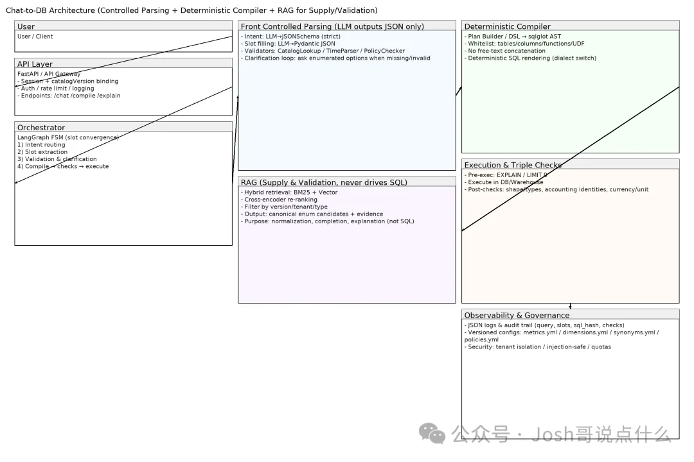
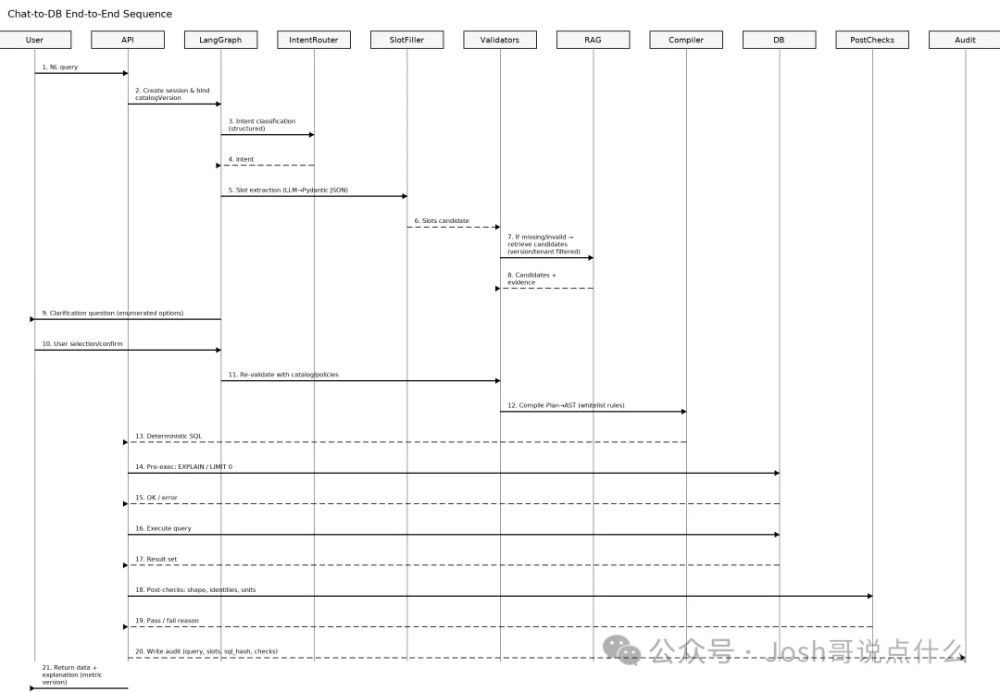
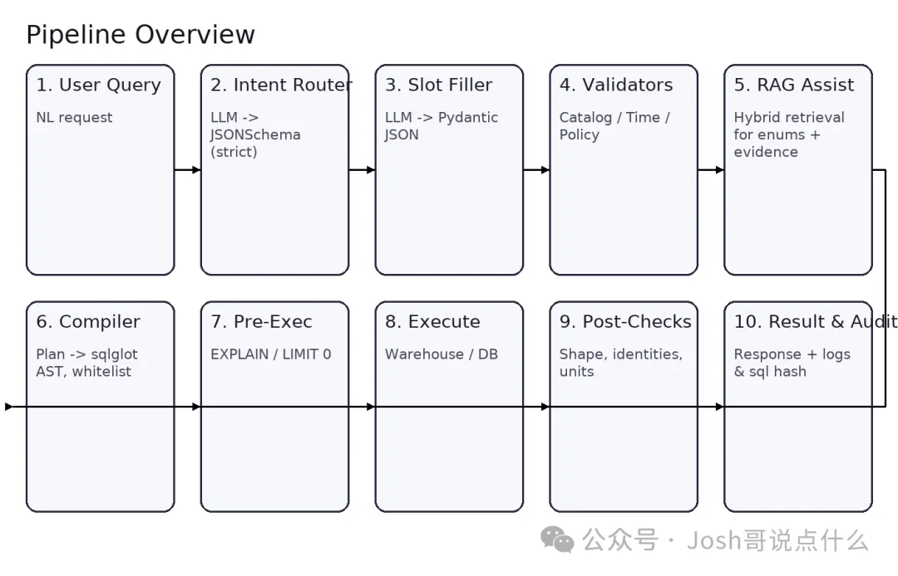

生成式 SQL 时常“看起来对、结果却错”。要追求100% 准确，思路必须从“生成”转向“编译”：让 LLM 只负责受控解析（意图+槽位），由确定性编译器把受控参数转成白名单 SQL/UDF；再用 RAG 做供料与校验（口径/枚举/释义），而不是让 RAG 直接驱动 SQL。本篇给出完整工程方案、架构图与落地清单。

1. 问题痛点
口径/枚举复杂：财务指标口径、组织层级、币种、期间口径等极易产生歧义。

自由生成不确定：直接“RAG→生成 SQL”缺乏确定性，召回/重排/冲突都会放大偏差。

线下回归难：模型升级或提示变化常导致隐性回退。

目标：把自然语言 → 受控参数（JSON） → 确定性 SQL/UDF做成可测试、可回归的工程系统。
2. 总体方案：受控解析 + 确定性编译 + RAG
受控解析（前台）：

用 LangGraph/有限状态机做意图路由 + 槽位收敛；LLM 只输出 JSON（Pydantic/JSONSchema 强约束），未命中枚举就追问澄清。

确定性编译（中台）：

受控参数 → Plan/DSL → sqlglot AST → SQL；仅白名单表/列/UDF，禁止自由字符串拼接。

RAG（辅助）：

只用于枚举归一/补全/口径解释和版本化知识供给；不直接驱动 SQL。

三重校验：静态校验 → 预执行（EXPLAIN/LIMIT 0）→ 后置校验（形状/会计恒等式/单位币种）。

3. 架构设计与关键模块

模块拆解
API 层（FastAPI）：会话与 catalogVersion 绑定、鉴权、限流、审计。

编排（LangGraph）：有限状态收敛——意图→槽位→校验/澄清→编译→校验→执行。

受控解析：

Intent Router：LLM→JSONSchema（严格）；

Slot Filler：LLM→Pydantic JSON；

Validators：CatalogLookup/TimeParser/PolicyChecker。

RAG（供料与校验）：Hybrid 检索 + 重排 + 版本/租户过滤，输出规范枚举候选+证据。

确定性编译器：Plan/DSL→sqlglot AST，白名单列/表/函数/UDF。

执行与三重校验：EXPLAIN/LIMIT0→执行→结果形状/会计恒等式/单位币种。

可观测性/治理：结构化日志、审计轨迹、版本化配置（metrics/dimensions/synonyms/policies）。

4. 端到端执行链路

流程要点：

用户提问 → 建会话并绑定口径版本；

意图与槽位解析（LLM 输出 JSON）；

若槽位缺失/非法 → RAG 供候选+证据 → 向用户枚举澄清；

槽位齐备 → 确定性编译成 SQL/UDF；

EXPLAIN/LIMIT0 预检查、执行；

后置校验（形状/恒等式/单位）；

返回数据并写审计轨迹（query/slots/sql_hash/checks）。

5. 如何把 RAG 用得“有用且安全”
只能做“资料员与审核员”：

词汇归一、枚举补全（org/currency/period/科目）、口径解释、版本治理。

硬规则：

高阈值召回 + 交叉重排，不命中就宁愿澄清；

只返回canonical_key（规范枚举）与证据片段；

编译器只吃枚举，不吃 RAG 原文。

版本化：会话绑定 catalogVersion；文档与枚举一起发布、可回滚。

6. 落地清单与质量保障
参数模型（示例）

Intent：metric_agg | compare_yoy | drilldown | topn | variance | explain_metric

Slots：metric, period, org, currency, group_by, scenario, top_k, filters[]

所有字段 枚举/正则/类型受控（Pydantic/JSONSchema）。

确定性编译

Plan/DSL → sqlglot AST；白名单表/列/UDF；禁止 SELECT *；

Dialect 可切换（Postgres/ClickHouse/Snowflake…）。

三重校验

静态：互斥规则/缺省策略/单位与口径约束；

预执行：EXPLAIN 或 LIMIT0；

后置：列名/类型/行数范围、会计恒等式、币种单位一致。

回归与监控

黄金集：问法→标准 JSON→AST/SQL 指纹→期望结果（或形状）；

线上监控：澄清率、RAG 命中率、SQL 通过率、失败原因分布；

口径版本切换期重点监测冲突率（RAG 候选 vs DB 枚举）。

7. 常见坑与规避
让模型直接写 SQL → 放弃确定性；

RAG 直接驱动 SQL → 召回误差会被放大；

不做版本治理 → 文档与枚举不一致；

不做后置校验 → “看起来正确”的错误结果漏网；

不给澄清出口 → 缺失槽位被“猜测”填充。

8. 总结与下一步
追求 100% 准确 的唯一可行路径：受控解析 + 确定性编译；

RAG 只做供料与校验，别让它直接影响 SQL 渲染；

通过三重校验 + 版本治理 + 黄金集回归，把系统做成可测、可回滚、可运维的工程系统。

下一步：把你的指标/维度/口径与 UDF 签名整理成 metrics.yml / dimensions.yml / synonyms.yml / policies.yml，我可以帮你生成开箱可跑的模板仓库与 CI。

额外配图（流程总览图，适合文内插图）

# 参考

[1] Chat-to-DB 如何做到 100% 准确 SQL：受控解析 + 确定性编译 + RAG 辅助的工程实战, https://mp.weixin.qq.com/s/Tq8FyLgBcAvRw5CarG4L8Q