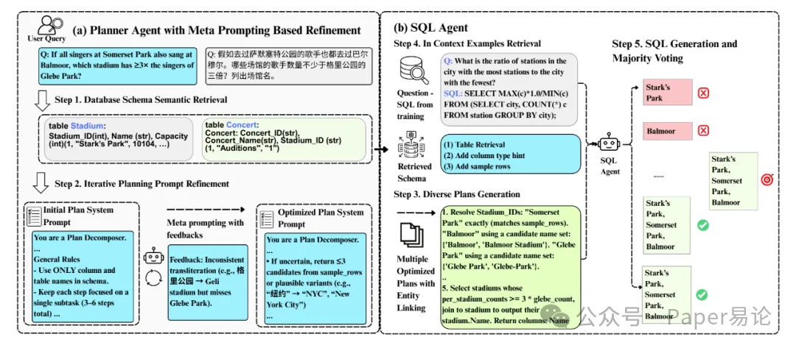
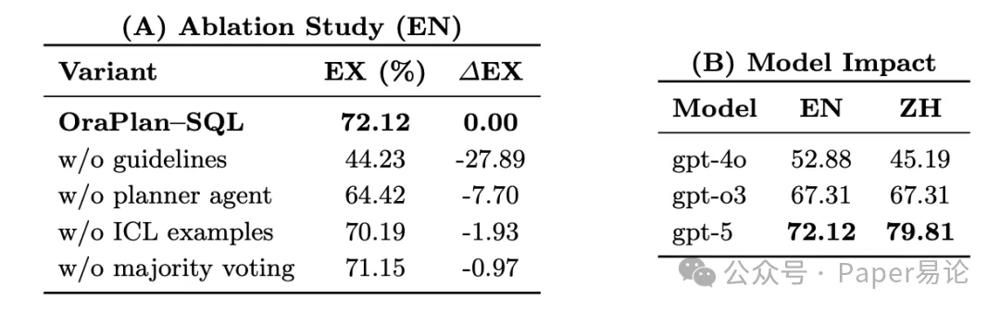

Oracle AI 刚推出的 OraPlan–SQL 直接在 2025 年 Archer NL2SQL 挑战赛上杀疯了！不仅拿了第一，还把第二名远远甩在身后 —— 英文执行准确率（EX）飙到 55.0%，中文更猛，冲到 56.7%，足足比第二名高了 6% 还多！关键是 SQL 有效性（VA）居然保持在 99% 以上，这稳定性谁看了不说一句 “绝”！

之前有些方法搞 “多子 Agent”，每个子 Agent 负责一部分规划，结果协调起来超麻烦，还容易在交接时出岔子。OraPlan–SQL 偏不这么玩，而是用了 “反馈引导元提示” 的骚操作：先找一批没见过的测试题，找出 Planner 搞砸的案例，结合人工标注把这些错误分类，再让大语言模型（LLM）从错误里提炼出 “纠错指南”，最后把指南塞进 Planner 的系统提示里。这样一来，Planner 下次遇到类似问题就不会踩坑，还能举一反三应对新场景，复杂度没增加多少，效果却拉满了！

还有个超实用的小技巧：为了避免 “一错全错”，团队让 Planner 生成多个候选计划，每个计划都让 SQL Agent 转成 SQL，最后跑一遍这些 SQL，按执行结果的 “多数票” 选最终答案。比如一个问句生成 3 个计划，对应的 SQL 有 2 个跑出来结果一样，就选这个结果，相当于加了层 “保险”，可靠性直接 up！

整个框架的流程看这张图就懂了（图 1）：左边是 Planner Agent 的工作流，先通过 “数据库 schema 语义检索” 找出相关的表和字段（比如查演唱会数据时，会把 Concert 表和 Stadium 表的结构、甚至样例数据调出来），再用 “元提示迭代优化计划”，最后生成多个带实体变体的计划（比如 “Balmoor” 会列出 “Balmoor”“Balmoor Stadium” 两种可能）；右边是 SQL Agent，结合检索到的 schema 和训练过的案例，把每个计划转成 SQL，最后用多数投票定结果。举个具体例子，问句是 “假如去过萨默塞特公园的歌手也都去过巴尔穆尔，哪些场馆的歌手数量不少于格里公园的三倍？”，Planner 会先明确要先匹配三个场馆的 ID（还会列出每个场馆的候选名），再算每个场馆的歌手数，最后筛选出符合 “≥3 倍格里公园数量” 的场馆，步骤清晰到像给 SQL Agent 画了张 “导航图”。

光说不练假把式，看数据才够直观！下面这张表（表 1）是 Archer 测试集上的成绩，OraPlan–SQL 用 GPT-5，英文 54.96%、中文 56.67%，第二名 HIT–SCIR 用 GPT-4o，英文才 48.66%、中文 44.08%，其他团队更是被甩开一大截。更绝的是，英文和中文成绩几乎没差距，之前很多模型中文表现会落后，OraPlan–SQL 直接把这个 “跨语言鸿沟” 给填上了！

表 1 Archer NL2SQL 测试集执行准确率（EX，%）：OraPlan–SQL vs 2025 年参赛对手（EN = 英文，ZH = 中文）

为了证明每个模块都不是 “凑数的”，团队还做了 ablation study（消融实验）—— 就是逐个去掉或修改模块，看成绩怎么变，结果超有说服力（表 2）。比如去掉 Planner Agent，直接让 SQL Agent 处理问句和 schema，英文开发集准确率从 72.12% 掉到 64.42%，少了 7.7 个百分点，说明 “中间计划” 真的很重要，能帮模型理清推理逻辑；如果没加元提示提炼的 “纠错指南”，准确率直接暴跌到 44.23%，加了指南才回到 72.12%，中文更是从 49.04% 涨到 79.81%，这足以说明指南是 “制胜关键”！

再看模型选择的影响：用通用的 GPT-4o 表现最差（英文 52.88%、中文 45.19%），换成侧重推理的 GPT-o3，双语都冲到 67.31%，再升级到 GPT-5，英文 72.12%、中文 79.81%，直接起飞！但就算用最普通的 GPT-4o，OraPlan–SQL 在开发集上也比第二名 HIT–SCIR 强（英文 52.88% vs 41.34%，中文 45.19% vs 31.73%），这说明框架本身很能打，不是全靠模型堆出来的。

还有两个细节值得说：给 SQL Agent 加 “上下文案例”（就是塞几个类似的 “问句 - SQL” 对当参考），准确率从 70.19% 涨到 72.12%，虽然涨得不多，但聊胜于无；用 “多计划 + 多数投票”，比单计划的 71.15% 高了 0.97 个百分点，看似少，却能减少 “单个计划出错” 的风险，稳定性更有保障。

表 2 OraPlan–SQL 在 Archer NL2SQL 开发集上的消融实验和模型影响分析：(A) 英文（EN）消融实验，含执行准确率（EX，%）和变化量（∆EX）；(B) 不同模型对英文（EN）和中文（ZH）准确率的影响

最后再唠唠团队在 “中文处理” 上踩过的坑：一开始他们试了 “先把中文问句翻译成英文，再让 Planner 做计划”，结果准确率只有 55.8%；后来改成 “中文问句直接生成英文计划”，准确率一下飙到 79.8%！为啥？因为翻译会丢语境，比如 “格里公园” 译成 “Geli Park”，数据库里根本没有，后续步骤全错；而直接用中文问句让 Planner 生成计划，Planner 能更好理解原文的实体指代，不会因为翻译偏差掉坑。

总的来说，OraPlan–SQL 能夺冠，靠的不是花里胡哨的多 Agent 架构，而是把 “规划” 这件事做深做透 —— 用反馈提炼指南优化 Planner，用实体链接解决双语匹配，用多计划投票保证稳定。这波操作不仅在 Archer 挑战赛上证明了实力，也给复杂场景下的 NL2SQL 提供了新思路，期待后续能看到更多落地场景！

# 参考

[1] 爆肝夺冠！OraPlan–SQL 横扫双语 NL2SQL 挑战赛，这波操作也太秀了吧！https://mp.weixin.qq.com/s/MZX7VzCOMV6X3CUS0Rpkcw