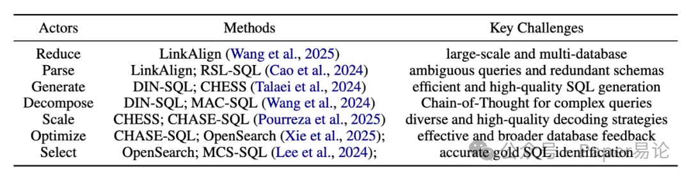
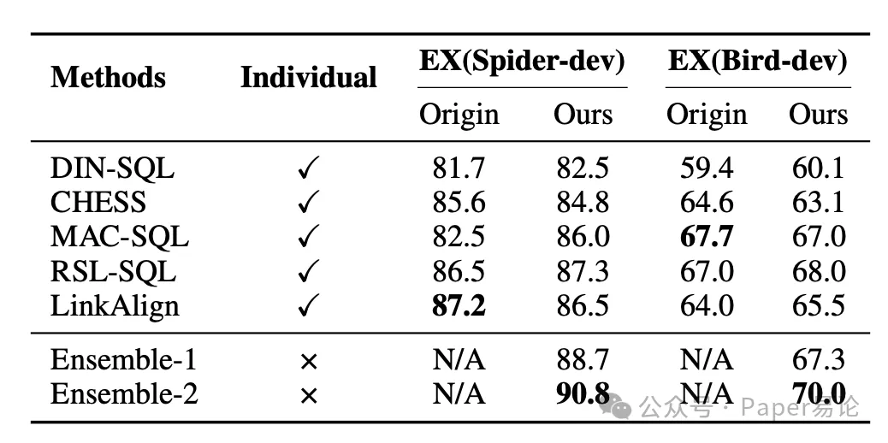
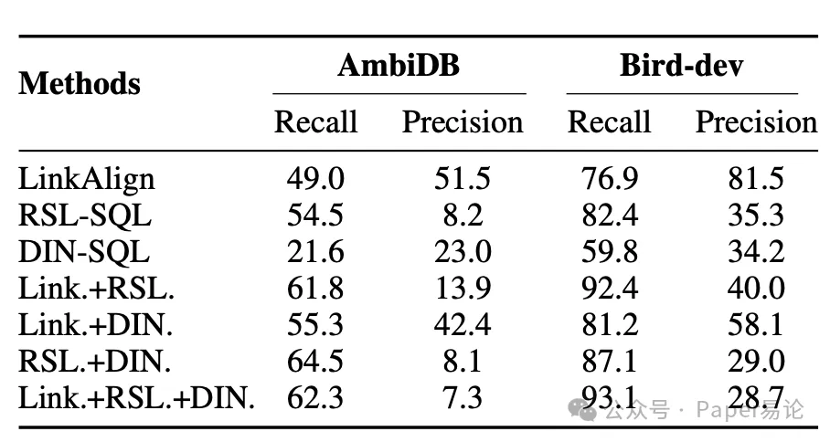
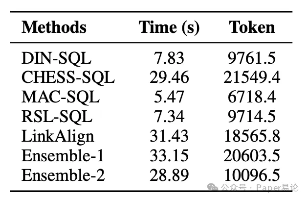

# 1. 资源

- https://github.com/Satissss/Squrve
- https://arxiv.org/pdf/2510.24102

# 2. 原理

先说说为啥之前 Text-to-SQL 落地这么难哈。一方面，现在的方法全是 “各玩各的”，你用你的数据格式，我要我的依赖环境，想把两个模型凑一起用？那得改代码改到秃，跨任务适配更是想都别想；另一方面，真实场景里的查询哪是 “单一难题” 啊，可能又要适配不同领域，又要处理多表关联，单个模型根本扛不住，可没有统一的协作机制，再厉害的模型也只能各自为战。

但 Squrve 一来，直接把这俩难题给拿捏了！它先搞了个 “通用执行范式”，不管啥模型、啥任务，接口和参数配置全给你标标准化，再也不用为了调接口头疼。而且它还把 Text-to-SQL 的核心能力拆成了 7 个 “原子 Actor 组件”，就像乐高积木一样，能随便组合出应对不同场景的 “复杂 Actor”，多个组件一起协作，再复杂的查询也能搞定。给大家看张框架全景图，是不是一眼就懂它咋工作的～

图 1：Squrve 框架概览图。Squrve 在通用执行范式下整合了各类不同方法，并支持面向特定任务的多主体协作，从而打通了学术研究与实际应用系统之间的壁垒。
咱再扒一扒 Squrve 的核心架构，它主要靠四个模块撑起来，每个模块都超实用！

第一个是数据模块，简直是 “格式统一大师”。它把 Spider、Bird 这些主流数据集的字段规范都统一了，不管你是传自己的私有数据，还是用自带的基准数据集，都能自动转成标准格式，后续用起来超丝滑。而且它还解决了大数据库 schema 超出 LLM 上下文窗口的问题 —— 把集中的 schema 拆成列级别的小文件，用 RAG 就能快速找着相关部分，一点不浪费存储。对了，它还存了 200 多个思维链（CoT）示例，遇到复杂查询时，能自动找相似示例拼成完整提示，生成 SQL 的质量直接 up up！要是查询需要外部文档，它还能精准提取概念定义、计算逻辑这些关键信息，绝了～

第二个是 Actor 模块，这可是 Squrve 的 “核心战斗力”。它把 Text-to-SQL 过程拆成了 7 个原子 Actor，每个都有自己的拿手绝活，还对应了之前学术界验证过的方法，咱看表格就知道它们各自负责啥、能解决啥难题～

表 1：Squrve 中各 Actor 所依托的先前方法汇总，以及早期研究中重点关注的对应挑战。

有了这些原子 Actor，还能通过 “Pipeline” 和 “Tree” 两种方式组合成复杂 Actor。Pipeline 就是按顺序串起来，前一个的输出当后一个的输入，一步一步优化结果；Tree 就是把同一个输入分给多个 Actor 并行处理，最后把结果合并，相当于 “集思广益”。比如处理超复杂的多表查询，就可以先用 Decompose Actor 把查询拆成小问题，再用 Generate Actor 生成每个小问题的 SQL，最后用 Select Actor 选最优的，协作起来效率超高～

第三个是任务模块，它就像 “任务管家”，把 Actor、数据和运行环境都串在统一接口下。既有负责 SQL 转换的 Actor 接口，又有加载数据的数据集接口，还有管理执行流程的运行控制器，能同时处理多个任务还不打架，调度效率杠杠的～

第四个是执行模块，堪称 Squrve 的 “大脑”。从系统初始化到最后出评估报告，全靠它统筹：配置管理器负责加载设置、初始化任务容器；执行控制器负责启动、监控任务，还能处理日志和异常；评估单元会算执行准确率这些指标，生成详细报告。有它在，大规模任务也能稳定跑，结果还能复现，太让人放心了～

讲完架构，咱再说说咋用 Squrve，简直是 “小白友好型”！它有个统一接口，几行代码就能跑不同方法，数据加载、执行、评估全自动，输出结果里连预测 SQL、查询输出、评估指标都给你整得明明白白。

要是想跑现成的基线模型，三步就能搞定：先看数据集 —— 自带的基准数据集已经格式统一了，放 “benchmark” 目录里直接用；自己的数据集按文档预处理就行，像 BigQuery 这种要权限的，提前准备好认证信息。然后生成配置，用配置文件、命令行或者代码指定数据集路径、方法名这些就行。最后启动执行，跑完还能自动算执行准确率，甚至可视化分析结果，省心到爆～

要是遇到棘手任务，想自己搭 workflow 也超简单。先选需要的原子 Actor，比如 schema 链接用 DINSQLParser；再用串行或并行的方式组合 —— 用嵌套列表就能表示结构，还能基于简单 workflow 搭更复杂的，灵活度拉满～

光说不练假把式，Squrve 的性能是真的能打！研究团队在 Spider、Bird、AmbiDB 这三个主流基准数据集上做了实验，还用了 Qwen-3 当 LLM 底座，结果超惊艳～

先看现有方法的复现结果，Squrve 把 DIN-SQL、CHESS 这些 SOTA 基线都复现了，性能跟原方法差不多，甚至还更好！比如 DIN-SQL 在 Spider-dev 上，原方法是 81.7% 的执行准确率，Squrve 复现后达到了 82.5%；在 Bird-dev 上也从 59.4% 涨到了 60.1%，这复现能力绝了，为后续对比打下了超可靠的基础～

更厉害的是它的组合模型！研究团队试了不同的 Actor 组合，选出了两个超牛的集成方案 ——Ensemble-1 和 Ensemble-2，性能直接碾压单个模型！咱看表格里的数据，Ensemble-2 在 Spider-dev 上的执行准确率飙到了 90.8%，比最强的单个模型（RSL-SQL 的 87.3%）高了 4 个百分点；在 Bird-dev 上也到了 70.0%，比最强单个模型（RSL-SQL 的 68.0%）高了 2.9 个百分点，这多 Actor 协作的威力也太顶了～

表 2：在 Qwen-3 基础模型上，各单一基线方法与我们提出的变体方法的性能对比。其中 “Origin” 列展示的是运行原始代码仓库所得的结果；“Ours” 列展示的是在 Squrve 框架下复现该方法的性能。“N/A” 表示我们提出的变体方法无原始代码运行结果（即这些变体是基于 Squrve 框架构建的新方案，无对应原始代码可执行）。

研究团队还研究了并行组合 Actor 的效果，发现把互补的 Actor 并行用，能在不降低效率的情况下提升中间步骤的性能，比如 schema 链接的召回率。就像表格里显示的，LinkAlign 和 RSL-SQL 并行用的时候，在 AmbiDB 上的召回率从单个 LinkAlign 的 49.0、单个 RSL-SQL 的 54.5，涨到了 61.8；在 Bird-dev 上也从 76.9、82.4 涨到了 92.4，而且两个 Actor 并行是性价比最高的，再多加 Actor 提升就不明显了，还会增加计算成本，这个发现超实用～
表 3：并行 Actor 性能对比

对了，大家肯定关心速度问题，毕竟组合模型要是跑太慢也不行。研究团队在 Bird-dev 上随机选了 50 个实例测试，结果发现 Squrve 复现的基线模型跑得都很快，就算是集成模型，速度和 token 使用量也很能打！比如 Ensemble-2 跑一次只要 28.89 秒，token 数是 10096.5，比 CHESS、LinkAlign 这些单个模型还快，完全不用担心落地时的效率问题～
表 5：不同方法的运行效率对比

最后再给大家看个实际的启动例子，Squrve 用起来是真的简单！只要一段固定代码，再配个配置文件就行。代码里初始化 Router 加载配置，再用 Engine 执行和评估，几行就搞定。配置文件里写清楚 API 密钥、LLM 参数、数据集来源，还有要跑的任务 —— 比如想对比 DIN-SQL 和 CHESS 在 Spider-dev 上的表现，就定义两个任务，指定好生成器类型，再排好执行顺序，运行后直接出结果，小白也能轻松上手～

# 参考

[1] https://mp.weixin.qq.com/s/36Z05PqR9GOVNHG6uUZ1Vw