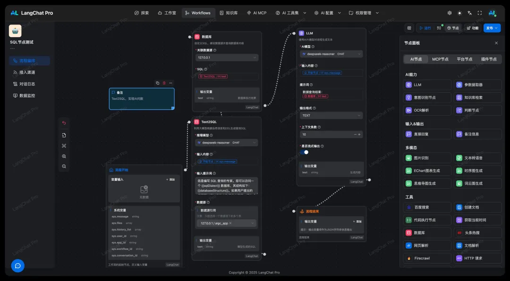

产品官网: http://langchat.cn/

开源版地址: https://github.com/tycoding/langchat (基础功能体验)

产品介绍
LangChat Pro 是基于Java生态构建的企业级AIGC应用开发平台商业版,为企业提供完整的AI大模型集成解决方案。基于Spring Boot 3和Vue 3构建,支持快速构建智能知识库、多模态AI应用和智能工作流,助力企业实现AI驱动的数字化转型。

Text2SQL模块是LangChat Pro商业版的核心功能,通过创新的自定义DDL技术,让AI真正理解业务语义,实现自然语言到精准SQL的智能转换。

注: LangChat开源版提供基础功能体验,Text2SQL等高级功能仅在商业版中提供。

# 参考

[1] https://mp.weixin.qq.com/s/GIQKdajsZJwSC9CwuOqhLg