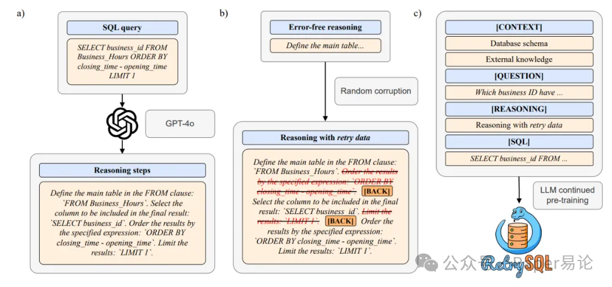
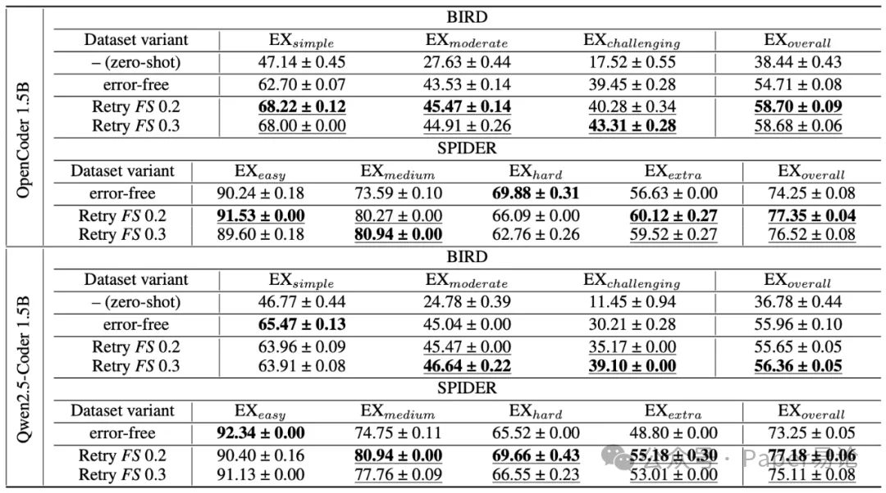
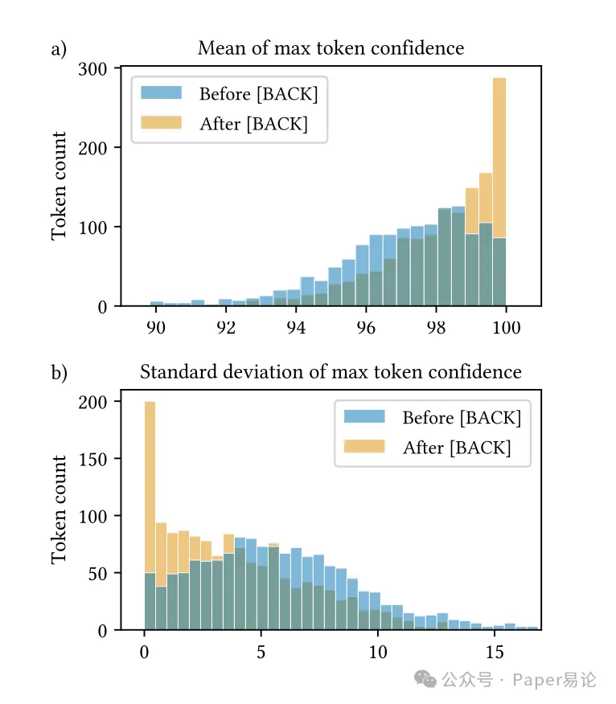
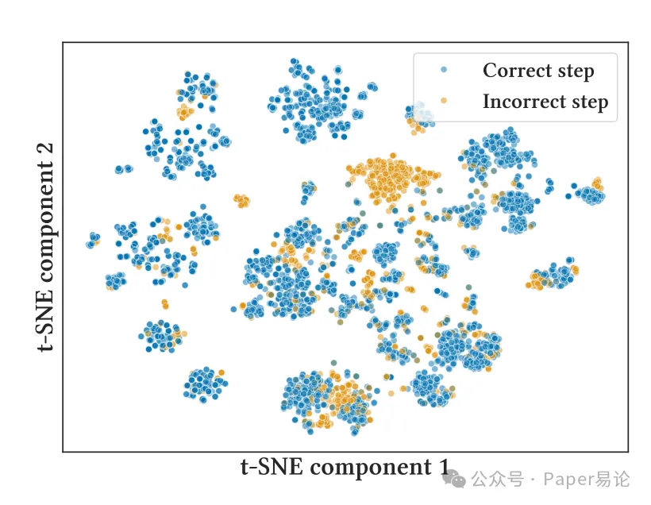

https://arxiv.org/pdf/2507.02529

核心创新：RetrySQL 的底层逻辑与实现路径
RetrySQL 的本质，是通过在训练数据中注入 “错误 - 修正” 的推理链条，让模型在生成 SQL 的过程中主动识别偏差并自我校准，这种训练范式彻底打破了传 Text-to-SQL 统  模型 “一锤子买卖” 的生成模式。其实现过程分为三个环环相扣的步骤，每一步都暗藏着对模型推理机制的深刻洞察。

图 1：RetrySQL 整体流程（a）推理步骤生成：针对训练数据集中的每一条 SQL 查询，我们借助 GPT-4o 生成一系列推理步骤，这些步骤会按照 SQL 语句的执行逻辑，从表的定义、条件的筛选到结果的排序与限制，逐一拆解查询构建的核心环节，为后续模型学习提供清晰的逻辑导向。（b）重试数据制备：对于每一组已生成的推理步骤，我们通过将部分步骤替换为其他无关步骤的方式引入随机扰动，并将这些扰动视为模型可能出现的错误；在每个错误步骤之后，我们会添加特殊的 [BACK] 标记，随后紧跟对应的正确步骤，以此构建 “错误 - 回溯 - 修正” 的完整数据序列，让模型在训练中接触到真实的推理偏差场景。（c）模型持续预训练：我们选取一款开源大语言模型（LLM），使用推理步骤中已注入重试数据的训练样本对其进行持续预训练；经过该过程得到的 RetrySQL 训练模型，能够逐步习得自我纠错能力，而这种能力会直接提升模型从自然语言问题生成正确 SQL 查询的性能，使其在面对模糊或复杂的用户需求时，也能通过内部修正机制降低错误率。

首先是推理步骤生成，针对 BIRD 和 SPIDER 数据集中的每一条 SQL 查询，研究团队利用 GPT-4o 生成了符合 SQL 执行逻辑的分步推理过程，这些步骤如同精准的导航指令，从 FROM 子句的表定义，到 WHERE 子句的筛选条件，再到 GROUP BY、ORDER BY 等后续操作，逐一拆解 SQL 的构建逻辑（如图 1a 所示）。例如对于 “查询 90 年代举办的奥运会数量” 这一问题，推理步骤会明确界定 “FROM games”“WHERE games_year BETWEEN 1990 AND 1999”“SELECT COUNT (games_year)” 等核心操作，这种结构化的推理链条为后续的错误注入提供了坚实基础。

接着是重试数据（retry data）的构建，这是 RetrySQL 最具革命性的环节。研究团队通过四种扰动策略（正向单次 FS、正向反向单次 FBS、正向多次 FM、正向反向多次 FBM）对原始推理步骤进行 “破坏”，在错误步骤后添加特殊的 [BACK] 标记，再紧跟正确步骤，形成 “错误 - 回溯 - 修正” 的完整序列（如图 1b 所示）。当 pretry 参数设为 0.2 或 0.3 时，模型能获得最佳的纠错训练效果 —— 这一数值平衡了错误样本的多样性与有效信号的浓度，既避免了模型被过多错误误导，又确保了自我纠错能力的充分训练。以 FS 策略为例，对于 “SELECT business_id FROM Business_Hours ORDER BY closing_time - opening_time LIMIT 1” 的推理步骤，模型会先错误地将 “选择列” 操作置于 “排序” 之前，随后通过 [BACK] 标记回溯，重新按照正确顺序生成步骤。

最后是模型的持续预训练，研究团队选择了 OpenCoder 1.5B 和 Qwen2.5-Coder 1.5B 这两款小参数量编码模型，用包含重试数据的训练样本进行续训（如图 1c 所示）。训练过程中，模型不仅学习 SQL 的生成规则，更在反复接触 “错误 - 修正” 对的过程中，内化了自我反思的能力 —— 这种能力并非来自复杂的外部模块，而是源于数据本身蕴含的 “纠错逻辑”，就像让模型在练习中不断复盘错题，最终形成条件反射式的修正习惯。

实证之力：RetrySQL 的性能突破与行为验证
在 BIRD 和 SPIDER 两大基准测试中，RetrySQL 展现出了令人惊叹的性能提升，这种提升不仅体现在冰冷的数字上，更反映在模型推理行为的质变中。

表 1：经 RetrySQL 训练后的 OpenCoder 1.5B 与 Qwen2.5-Coder 1.5B 模型的执行准确率（Execution Accuracy） 所有结果均以百分比形式呈现，同时包含基于 5 次多项式束搜索（multinomial beam search）生成结果计算得出的均值与标准差；其中，最优结果以加粗字体标注，而使用重试数据（retry data）训练后性能优于无错误（error-free）训练的结果则以下划线标注。

从量化结果来看，OpenCoder 1.5B 经 RetrySQL 训练后，在 BIRD 数据集上的整体执行准确率（EX）提升了约 4 个百分点，在 SPIDER 数据集上提升 3.1 个百分点；Qwen2.5-Coder 1.5B 的提升则分别为 0.4 个百分点和 3.93 个百分点（如表 1 所示）。更值得关注的是，这种提升在高难度样本上尤为显著 ——OpenCoder 1.5B 在 BIRD 的挑战性样本中，执行准确率从 39.45% 提升至 43.31%，这印证了自我纠错能力对复杂推理任务的关键作用。当这些小模型被整合进完整的 Text-to-SQL 流水线时，其表现更是颠覆认知：RetrySQL 训练后的 OpenCoder 1.5B 在 BIRD 数据集上达到了 51.36% 的整体执行准确率，仅次于 GPT-4o 的 54.99%，远超 GPT-4o-mini 的 32.53%，而前者的参数量仅为后两者的几十分之一甚至百分之一。

图 3：[BACK] 标记前后的 token 置信度分布（a）10 次束搜索（beam search）过程中最大 token 置信度的均值。从图中可观察到，[BACK] 标记之后的 token 置信度均值显著更高，这一现象表明模型在生成错误内容时会呈现出明显的不确定性，而在完成自我纠错后，其对生成内容的置信度会大幅回升，仿佛从迷雾中走出，重新获得了对方向的明确判断。（b）10 次束搜索过程中最大 token 置信度的标准差。数据显示，模型生成错误内容时的预测方差，远大于其完成自我纠错后的预测方差，这意味着模型在犯错阶段，对 token 选择的决策摇摆幅度更大，就像在多个岔路口反复犹豫，而纠错后则能更稳定地聚焦于正确的生成路径。

模型的自我纠错行为并非空穴来风，而是得到了严格的实证验证。通过分析模型生成 token 的置信度分布（如图 3a 所示），研究发现 [BACK] 标记之前的错误步骤对应的最大 softmax 分数显著低于修正后的步骤，这意味着模型在犯错时会表现出明显的不确定性，而修正后则恢复自信，这种置信度的 “V 型反弹” 如同模型的 “自我警觉信号”。同时，错误步骤在束搜索中的置信度方差远高于正确步骤（如图 3b 所示），说明模型在犯错时的决策充满摇摆，而纠错后则形成稳定共识 —— 这两点共同证明，RetrySQL 赋予模型的并非简单的模式匹配，而是真正的自我反思能力。

图 2：OpenCoder 模型内部状态的 t-SNE 投影 在该线性探测任务的嵌入结果中，蓝色点代表与正确推理步骤对应的嵌入向量，橙色点则代表与错误推理步骤对应的嵌入向量；其中橙色点形成的聚类簇表明，OpenCoder 模型能够将大部分错误推理步骤与正确推理步骤区分开来，这一现象凸显出模型内部一种与生俱来却又潜藏未显的、可检测推理过程中错误的能力。

线性探测实验进一步揭示了这一能力的底层来源：未经过 RetrySQL 训练的 OpenCoder 1.5B 模型，其内部状态已经能够区分正确与错误的推理步骤，平衡准确率达到 82%，F1 分数为 71%。t-SNE 可视化结果（如图 2 所示）清晰地展示了模型内部状态的聚类情况，正确与错误步骤的嵌入向量形成了明显的分离簇，这表明 Transformer 架构天生具备识别推理错误的 “潜能”，而 RetrySQL 只是通过巧妙的数据设计，将这种潜能激活并转化为主动纠错的能力。

范式革命：RetrySQL 的行业价值与未来启示
RetrySQL 的意义远不止于提升了几个百分点的准确率，它在 Text-to-SQL 领域掀起了一场关于 “模型训练逻辑” 的革命，为小参数量模型的工业化应用开辟了新路径。

在技术层面，RetrySQL 打破了 “大模型 = 高性能” 的固有认知，证明通过精准的数据设计和训练范式创新，小参数量模型完全可以在特定任务上比肩甚至超越大模型。对于需要快速响应、低成本部署的真实场景而言，这种 “小而精” 的模型具有不可替代的优势 ——1.5B 参数的 RetrySQL 模型不仅训练成本低（单轮训练仅需 4.47 个 GPU 小时），推理速度也远超百亿级参数的大模型，这让 Text-to-SQL 技术能够真正落地到实时查询、嵌入式系统等资源受限的场景中。

在方法论层面，RetrySQL 将 “自我纠错” 从传统的后处理步骤前移至生成过程本身，这种 “边生成边修正” 的模式重构了 Text-to-SQL 的流水线逻辑。传统方法往往依赖多阶段 pipeline，通过专门的纠错模块修正生成的错误 SQL，而 RetrySQL 则让生成模块本身具备纠错能力，这不仅简化了系统架构，更减少了错误传递和累积的风险。同时，RetrySQL 的成功证明了 “ retry data” 的普适性 —— 这种源于小学数学推理任务的训练方法，在 Text-to-SQL 领域同样有效，这为其他需要复杂推理的任务提供了可复用的范式，如同为不同领域的模型训练提供了一把 “通用钥匙”。

当然，RetrySQL 并非完美无缺。其训练数据依赖于人工标注或 GPT-4o 生成的推理步骤，缺乏自动生成海量训练数据的机制；同时，它尚未探索模型规模与纠错能力的缩放关系，对于更大参数量模型的适用性仍需验证。但这些局限恰恰指明了未来的研究方向：结合合成数据生成技术扩大训练样本规模，探索 RetrySQL 与模型缩放定律的契合点，将自我纠错能力与 schema linking 等其他流水线环节深度融合。

RetrySQL 的出现，让我们重新审视 Text-to-SQL 任务的核心矛盾 —— 并非模型参数量的不足，而是缺乏对推理过程的精准引导和错误反馈。它用一种 “以柔克刚” 的方式，通过数据层面的创新解决了技术层面的难题，这种思路为整个自然语言处理领域提供了重要启示：在大模型参数竞赛日益激烈的今天，回归任务本质、挖掘数据价值，或许才是技术突破的真正捷径。

# 参考

[1] RetrySQL: 让 Text-to-SQL 模型学会 “自我纠错” 的颠覆性训练范式, https://mp.weixin.qq.com/s/FmlJ_3DQq1QohT87jOdq4w