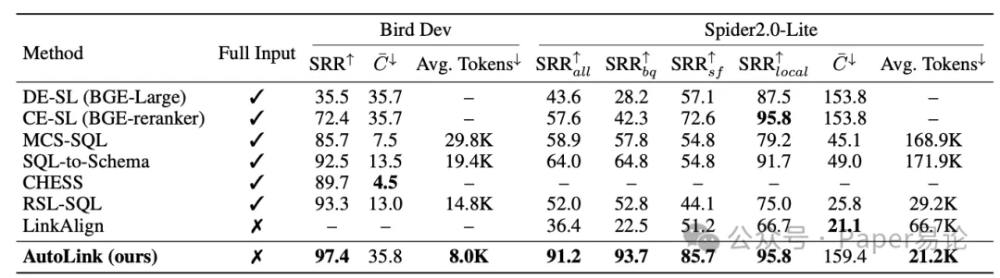
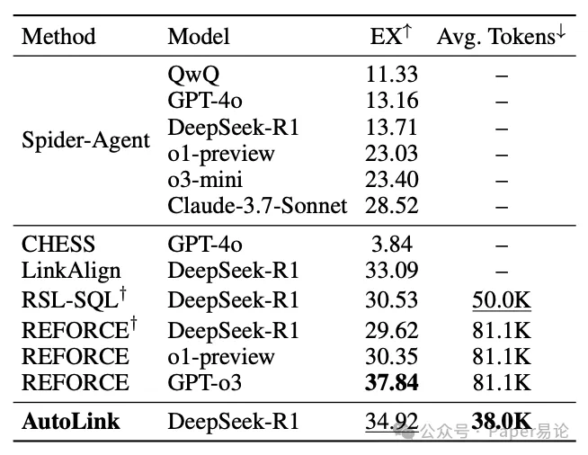
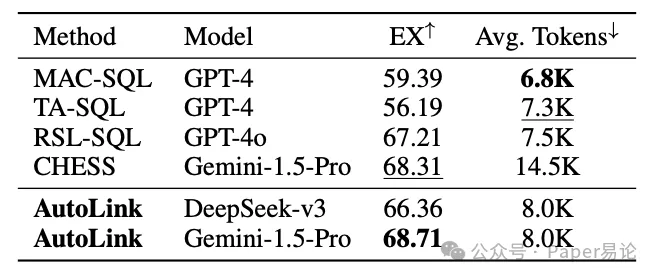
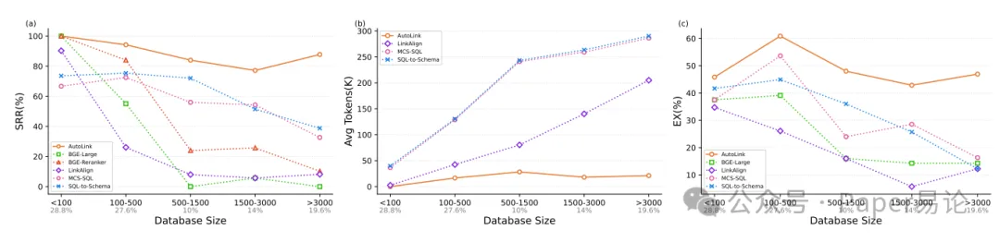
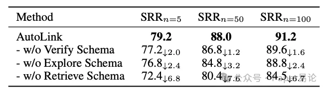
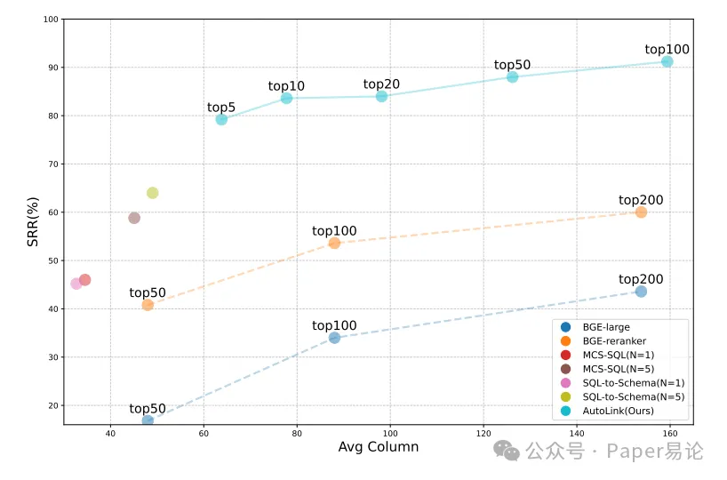

（一）双环境支撑：为智能体打造 “勘探工具箱”
AutoLink 为智能体配备了两个互补的探索环境，这两个环境如同智能体的 “双眼” 与 “双手”，让它既能精准检索语义相关元素，又能直接与数据库交互验证假设：

数据库环境（E_DB）：这是与真实数据库的直接接口，智能体可以通过执行探索性 SQL 查询，获取 schema 元数据、数据样本或执行错误反馈。例如，智能体可以通过模糊查询找到包含 “id” 或 “name” 的列，通过元数据查询确认表的主键与外键关系，或通过执行验证性 SQL 来判断当前 schema 是否完整。该环境的输出被严格结构化：成功查询返回最多 5 行数据（避免数据过载），超时或错误则返回明确的诊断信息，这种设计让智能体的每一次探索都能获得清晰的反馈信号，就像地质勘探时的钻头，每一次下钻都能带回明确的地层信息。

schema 向量存储环境（E_VS）：为了解决语义匹配的效率问题，AutoLink 将所有列的元数据（列名、表名、数据类型、描述等）编码为稠密向量，存储在向量数据库中。当智能体需要寻找相关列时，只需输入自然语言查询，环境就会通过近似最近邻搜索（ANN）返回最相关的候选元素。更巧妙的是，该环境会自动排除已检索过的列，避免冗余，同时将返回结果格式化为人类可读的 M-Schema 风格，包含数据类型、键信息和样本值，让智能体能够快速判断候选元素的相关性。这种设计就像给智能体配备了一台 “语义金属探测器”，能够在海量列中快速锁定潜在目标，而无需逐一排查。

值得一提的是，AutoLink 对分区表的处理堪称点睛之笔 —— 在 BigQuery 等数据仓库中，大量分区表（如 “table_20230101”“table_20230102”）拥有完全相同的列结构，AutoLink 会将这些表的列合并处理，仅存储一次向量，这一优化让向量库的规模大幅缩减，在 Spider-2.0-Lite 数据集中，未合并时列数可能高达 10 万，合并后平均仅 559 列，而构建整个向量库的平均时间仅需 1.4 秒，真正实现了高效与轻量化的统一。

（二）五维动作空间：赋予智能体 “自主决策能力”
如果说双环境是探索工具，那么五维动作空间就是 AutoLink 智能体的 “思维逻辑”，它让智能体能够根据探索反馈，自主选择下一步行动，形成 “探索 - 验证 - 扩展” 的闭环：

@explore schema（探索动作）：智能体通过执行 SQL 查询，探索数据库的结构或数据分布。例如，查询某列的取值范围、搜索包含特定关键词的表名、验证数据格式等。这种动作就像侦探在案发现场的勘查，通过细节观察逐步构建对数据库的认知。

@retrieve schema（检索动作）：与传统检索不同，该动作允许智能体结合已有信息，生成针对性的语义查询。当用户问题模糊时（如 “查询分数”），智能体可以根据已知表名（如 “students”），生成 “exam score, quiz score or final grade” 这样的精准查询，从向量库中召回相关列。这种动作突破了简单的问题重写局限，让语义检索更具目的性，就像在图书馆中不仅能根据书名找书，还能根据内容梗概精准定位所需文献。

@verify schema（验证动作）：智能体基于当前已链接的 schema，构建一个完整的 SQL 查询来回答用户问题，其目的并非获取最终结果，而是通过执行错误来判断 schema 是否完整。例如，若执行返回 “column 'is_arrest' does not exist”，智能体就会明确知道需要补充该列，这种反馈比任何间接推理都更直接，就像工程师通过试运行来发现设备的潜在缺陷。

@add schema（扩展动作）：当智能体通过探索或检索发现相关 schema 元素后，会通过该动作将其添加到 S_linked 中，实现 schema 的动态扩展。动作要求以 “表名。列名” 的格式指定元素，确保准确性，而系统会自动补充完整的元数据，让 S_linked 始终保持结构化。

@stop action（终止动作）：当智能体判断 S_linked 已包含所有必要元素，或达到最大交互轮次（默认 10 轮）时，会触发该动作终止探索。这种设计避免了无意义的循环，保证了探索效率。

这五个动作并非孤立存在，而是形成了有机的协作：@explore 与 @retrieve 负责发现新元素，@verify 负责验证完整性，@add 负责固化成果，@stop 负责控制流程。在每一轮交互中，智能体都会根据历史反馈生成推理轨迹和动作组合，例如 “@retrieve schema ('arrest status column') ; @add schema ('incidents_2016.is_arrest')”，这种组合既保证了 schema 的扩展，又通过检索获得了新的反馈，让探索过程层层递进。

（三）迭代探索流程：从初始种子到完整 schema 的生长过程
AutoLink 的探索流程始于一个 “种子 schema”，再通过多轮交互逐步生长为完整的相关子集，具体可分为三个阶段：

初始 schema 生成：智能体首先利用用户问题从 E_VS 中检索 top-n 个相关列（n 可设为 50 或 100），形成初始 S_linked^(0)。这一阶段的目标是获取一个广泛但相关的初始种子，为后续探索奠定基础，就像播种时撒下足够多的种子，确保后续有足够的生长空间。

多轮交互探索：初始上下文 H0 由指令提示、用户问题、所有表名和初始 schema 组成，智能体基于 H0 生成推理和动作，环境执行后返回观察结果，更新上下文 Ht+1。这一过程循环进行，直到智能体触发 @stop 动作。在实验中，即便数据库列数超过 3000，智能体也能在平均 5.79 轮内完成探索，展现出极高的效率。

SQL 生成：基于最终的 S_linked，AutoLink 采用自一致性采样生成多个 SQL 候选，经过迭代语法修正和基于执行结果的多数投票，得到最终 SQL。这一阶段虽然不是 AutoLink 的核心创新，但通过与 schema 链接的紧密配合，实现了端到端的性能优化 —— 毕竟，再精准的 schema 链接，最终也要通过 SQL 生成的结果来验证价值。

三、实验验证：在工业级数据集中的碾压式表现
评价一个 Text-to-SQL 方案的价值，不能只看实验室数据集的光鲜数据，更要看它在工业级场景中的抗压力。AutoLink 在 Bird-Dev 和 Spider-2.0-Lite 两个权威数据集上的表现，彻底打破了 “大规模数据库下召回率与效率不可兼得” 的魔咒。

（一）schema 链接性能：刷新 state-of-the-art
如表 1 所示，在 Bird-Dev 数据集上，AutoLink 实现了 97.4% 的严格召回率（SRR），远超 CHESS（89.7%）和 RSL-SQL（93.3%）；在更具挑战性的 Spider-2.0-Lite 数据集上，AutoLink 的 SRR 达到 91.2%，比排名第二的 SQL-to-Schema（64.0%）高出 27.2 个百分点。更值得注意的是，AutoLink 在不同 SQL 方言上的表现同样稳定：BigQuery 方言的 SRR 为 93.7%，SQLite 方言为 85.7%，Snowflake 方言为 95.8%，这种跨方言的鲁棒性在工业场景中至关重要，因为真实数据库往往采用多样化的 SQL 方言。

表 1：Bird Dev 和 Spider 2.0-Lite 上的 schema 链接性能对比。注：SRR_all 表示整体严格召回率，SRR_bq、SRR_sf、SRR_local 分别表示 BigQuery、Snowflake、SQLite 方言的严格召回率；C 表示 S_linked 中的平均列数；Full Input 表示是否提供全量 schema。

在 token 消耗方面，AutoLink 的优势更为明显：在 Bird-Dev 上平均仅需 8.0K tokens，远低于 MCS-SQL（29.8K）和 SQL-to-Schema（19.4K）；在 Spider-2.0-Lite 上，AutoLink 的平均 token 消耗为 21.2K，仅为 SQL-to-Schema（171.9K）的 12.3%。这种低 token 消耗并非以牺牲召回率为代价，而是源于迭代探索的高效性 ——AutoLink 只将真正相关的 schema 元素纳入上下文，避免了全量 schema 带来的冗余。

（二）SQL 生成性能：兼顾精度与效率
schema 链接的最终价值要通过 SQL 执行精度（EX）来体现。如表 2 所示，在 Spider-2.0-Lite 数据集上，AutoLink 采用 DeepSeek-R1 模型实现了 34.92% 的 EX，仅次于 ReFoRCE（GPT-o3 版本，37.84%），但 ReFoRCE 平均需要 81.1K tokens，而 AutoLink 仅需 38.0K，不足前者的一半。在 Bird-Dev 数据集上（表 3），AutoLink 采用 Gemini-1.5-Pro 模型实现了 68.71% 的 EX，超过 CHESS（68.31%）和 RSL-SQL（67.21%），成为该数据集上的 top 级方案。

表 2：Spider 2.0-Lite 数据集上的 SQL 执行精度对比。注：† 表示独立复现结果；Avg. Tokens 表示生成 SQL 的平均 token 消耗。

表 3：Bird Dev 数据集上的 SQL 执行精度对比。

更重要的是，AutoLink 展现出了极强的 scalability。如图 2 所示，当数据库列数超过 3000 时，所有基线模型的 SRR 均跌破 40%，而 AutoLink 仍能维持近 90% 的高召回率；在 token 消耗方面，随着数据库规模增大，其他模型的 token 消耗呈指数级增长，而 AutoLink 始终保持平稳；对应的 SQL 执行精度也同样稳健，在大型数据库上远超基线模型。这种 scalability 正是工业级应用最看重的特质 —— 真实世界的数据库规模永远在增长，一个只能处理小规模数据的方案，终究只是纸上谈兵。

图 2：Spider 2.0-Lite 上不同数据库规模的性能对比。(a) 严格召回率（越高越好）；(b) 平均 token 消耗（越低越好）；(c) 执行精度（越高越好）。每个区间下方的百分比表示该规模区间内的数据库占比。

（三）消融实验：揭示核心模块的价值
为了验证各模块的必要性，AutoLink 进行了严格的消融实验（表 4）。结果显示，移除任何一个核心动作都会导致 SRR 下降：移除 @retrieve schema 后，SRR 最大下降 16.8 个百分点，说明语义检索是精准发现缺失 schema 元素的关键；移除 @explore schema 后，SRR 下降 12.4 个百分点，证明数据库探索对解决歧义、明确结构至关重要；移除 @verify schema 后，SRR 下降 1.6 个百分点，虽然影响相对较小，但仍能看出验证动作对确保 schema 完整性的作用。这些结果表明，AutoLink 的高性能并非源于单一模块的突破，而是各模块协同作用的结果，就像一台精密的仪器，每个零件都不可或缺。

表 4：不同初始候选数 n 下各核心动作的消融实验结果（Spider 2.0-Lite 数据集）。注：括号内为与 AutoLink 相比的 SRR 下降值。

四、超越技术：重新定义 Text-to-SQL 的工业级落地逻辑
在 Text-to-SQL 领域摸爬滚打二十年，我深知技术方案的成功不仅取决于算法的精妙，更取决于是否契合工业场景的真实需求。AutoLink 的价值远不止于刷新几个 benchmark 指标，它更提供了一种全新的工业级 Text-to-SQL 落地思路：

从 “被动匹配” 到 “主动探索”：传统 schema 链接是让模型在给定的 schema 中进行被动匹配，而 AutoLink 让模型主动探索未知 schema，这种转变让系统能够适应更复杂、更动态的工业数据库 —— 真实世界的数据库永远在迭代，表和列会不断新增，被动匹配的方案需要持续更新训练数据，而主动探索的 AutoLink 则能自适应这种变化。

从 “算力堆砌” 到 “智能协同”：过去，很多方案试图通过增大模型参数、增加解码轮次来提升性能，但这只会导致成本激增，如图 5 所示，MCS-SQL 和 SQL-to-Schema 增加解码轮次后，SRR 很快进入平台期，而 token 消耗却线性增长。AutoLink 则通过智能体与双环境的协同，用更少的算力实现了更高的性能，这种 “四两拨千斤” 的设计，才是工业级应用的核心诉求。

从 “实验室优化” 到 “工程化落地”：AutoLink 的每一个设计都考虑了工程化可行性 —— 向量库构建耗时短、token 消耗低、支持多 SQL 方言、对分区表友好，这些特性让它能够直接部署到真实的工业系统中，而不是停留在实验室的论文里。

图 4：不同方法的召回列数与严格召回率权衡对比。AutoLink 在相同召回列数下实现了更高的 SRR。

AutoLink 不是对现有技术的颠覆，而是对 Text-to-SQL 核心逻辑的回归 —— 它让系统像人类一样思考和探索，在复杂的工业数据库中找到最有效的路径。在大模型上下文窗口仍有物理限制、工业数据库规模持续增长的今天，AutoLink 提供了一种可行的解决方案，它证明了：Text-to-SQL 的未来，不在于让模型 “记住” 更多 schema，而在于让模型 “学会” 如何自主探索 schema。

作为一个在这个领域深耕二十年的独行者，我见过太多昙花一现的方案，它们或许能在某个数据集上取得惊艳的成绩，但终究因为脱离工业实际而被淘汰。而 AutoLink 让我看到了 Text-to-SQL 真正落地的希望 —— 它不仅在技术上实现了突破，更在理念上指明了方向：当我们不再执着于让模型 “无所不知”，而是教会模型 “如何学习”，Text-to-SQL 才能真正走进千家万户，成为连接普通用户与结构化数据的桥梁。

# 参考

[1] AutoLink：工业级 Text-to-SQL 的 schema自主探索革命 —— 重新定义大模型时代的 schema链接范式, https://mp.weixin.qq.com/s/S9PR9as7KLjkz6BfCSWYgg