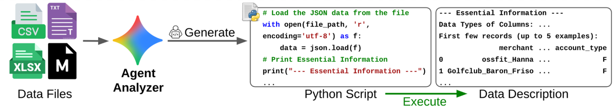
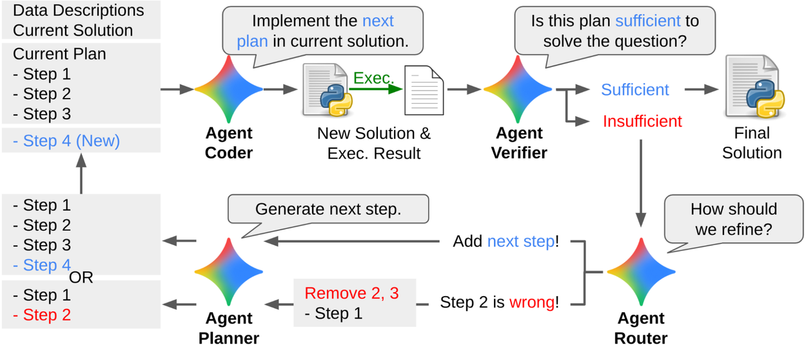
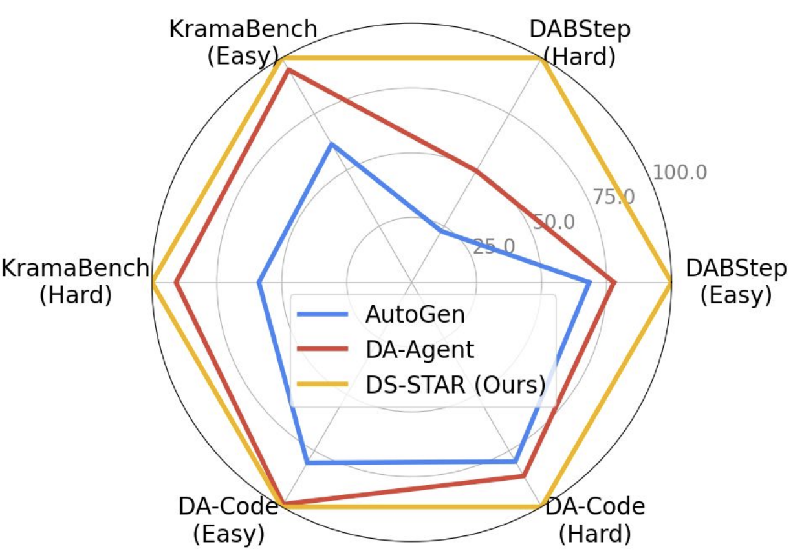
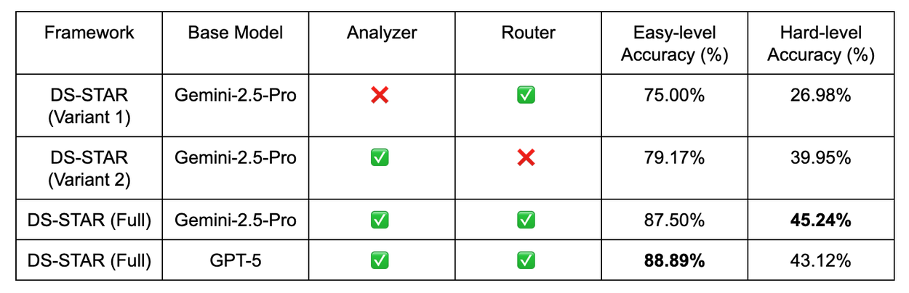
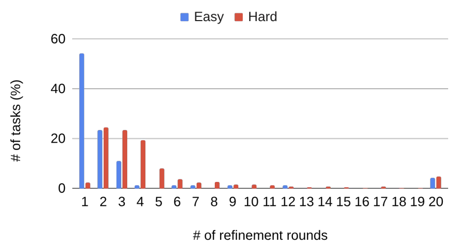

# 1. 资源

- Github (0 stars): https://github.com/Shamdon/ds-star
- DS-STAR: Data Science Agent via Iterative Planning and Verification
  - https://arxiv.org/abs/2509.21825
  - 2025.9.26
- 博客：https://research.google/blog/ds-star-a-state-of-the-art-versatile-data-science-agent/?ref=aiposthub.com

# 2. 原理

为了简化这一复杂的工作流程，最新研究他专注于利用现成的大型语言模型（LLMs）创建自主数据科学代理。这些代理的目标是将自然语言问题转换为可执行的代码，用于特定任务。但尽管如此，这也很重要进展当前的数据科学代理存在若干限制其实际应用。一个主要问题是它们高度依赖结构良好的数据，比如关系型数据库中的CSV文件。这种有限的关注忽视了多样且异构数据格式，如JSON、非结构化文本和标记文件，这些在现实应用中很常见。另一个挑战是数据科学问题这些内容是开放式的，缺乏真实的标签，这使得核实代理人推理是否正确变得困难。

DS-STAR 框架主要分为两个阶段。首先，它会自动检查目录中的所有文件，并生成其结构和内容的文本摘要。这一总结成为解决当前任务的重要背景来源。

DS-STAR 创建了一个 Python 脚本，通过提取关键信息来分析多样化的数据文件。

其次，DS-STAR 采用了规划、实施和验证的主循环。规划代理首先创建一个高层计划，然后由编码代理将其转换成代码脚本。随后，验证代理评估代码在解决问题中的有效性。验证代理是一个基于大型语言模型的评审员，被提示判断当前计划是否足够。如果法官认为计划不充分，DS-STAR 会通过修改或添加步骤（由路由器代理确定）来细化方案，然后重复这个循环。重要的是，DS-STAR 采用了一种模仿专家分析师使用工具的方法，比如谷歌colab按顺序制定计划，在继续前审查中间结果。这个迭代循环会持续，直到方案被认为满意或达到最大轮数（10轮），此时最终代码作为解答才交付。

DS-STAR 的工作流程是一个迭代循环。它从执行一个简单的计划开始，并使用验证代理来检查是否足够。如果计划不充分，路由代理会通过添加步骤或纠正错误来引导优化，避免循环重复。该过程持续进行，直到验证者批准计划或达到最大轮数。

评估
为评估DS-STAR的有效性，我们将其性能与现有最先进的方法进行了比较（自动生成,DA-特工）使用一套备受认可的数据科学基准，DABStep,克拉玛长椅和DA-Code.这些基准测试评估了在使用多种数据源和格式的复杂任务中的性能，如数据整理、机器学习和可视化。

结果显示，DS-STAR在所有测试场景中均显著优于AutoGen和DA-Agent。与最佳替代方案相比，DS-STAR 在 DABStep 上将准确率从41.0%提升到45.2%，在 KramaBench 上提升到39.8%到44.7%，在DA-Code上将37.0%提升到38.5%。值得注意的是，DS-STAR还获得了公共排行榜截至2025年9月18日，DABStep基准测试。无论是简单任务（答案都在单一文件中）还是困难任务（需要多个文件），DS-STAR 始终超越竞争的基线，展示了其处理多个异构数据源的优越能力。

这张图表展示了DABStep、KramaBench和DA-Code基准测试中简单（单文件）和困难（多文件）任务的归一化准确率（%）。DS-STAR 持续优于竞争对手的基线，在需要处理多个异构数据文件的艰难任务中展现出特别强的优势。

DS-STAR 的深入分析
接着，我们进行了消融研究，以验证DS-STAR各个组件的有效性，并分析精炼轮数的影响，特别是通过测量生成足够计划所需的迭代次数。

数据文件分析器：该代理对于高性能至关重要。在没有其生成的描述（变体1）的情况下，DS-STAR 在 DABStep 基准测试中复杂任务的准确率骤降至 26.98%，凸显了丰富数据上下文对于有效规划和实施的重要性。

路由器：路由器代理判断是否需要新步骤或修正错误步骤的能力至关重要。当我们移除它（变体2）时，DS-STAR只连续添加新步骤，导致简单和困难任务的表现都变差。这表明，纠正计划中的错误比不断添加可能有缺陷的步骤更有效。

跨大型语言模型的通用性：我们还通过以下方式测试了DS-STAR的适应性GPT-5作为基础型号。这在DABStep基准测试中取得了有希望的结果，表明该框架具有普遍性。有趣的是，配备GPT-5的DS-STAR在简单任务上表现更好，而双子座-2.5-Pro版本在困难任务中表现更好。

DS-STAR在DABStep基准测试上的消融研究结果，评估了单个代理的有效性和LLM兼容性。

精炼过程分析：下图显示，困难任务自然需要更多迭代。在DABStep基准测试中，困难任务平均需5.6轮完成，而简单任务仅需3.0轮。此外，超过一半的简单任务在单轮内完成。

对DABStep基准测试的精炼轮次分析显示，困难任务需要更多的迭代。困难任务平均需5.6轮，而简单任务为3.0轮，仅第一轮就完成了超过50%的简单任务。

结论
在这项工作中，我们引入了DS-STAR，一种能够自主解决数据科学问题的新代理。该框架由两项核心创新定义：对多种文件格式的自动分析，以及采用基于LLM的新型验证系统的迭代顺序规划流程。DS-STAR 在 DABStep、KramaBench 和 DA-Code 基准测试上建立了新的先进技术，表现优于最佳替代方案。通过自动化复杂的数据科学任务，DS-STAR有望让个人数据科学对个人和组织更为易及，推动多个领域的创新。