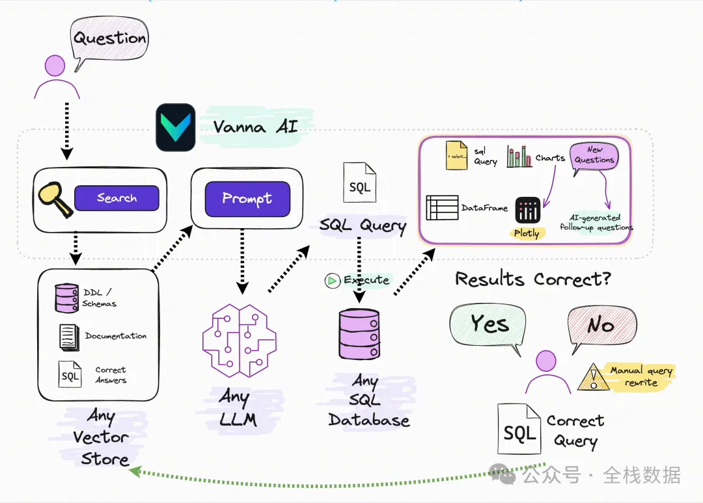

# 1. 资源

GitHub: https://github.com/vanna-ai/vanna （Star 8.4K+，MIT 协议）


官方文档: https://vanna.ai/docs/


中文社区: GitHub Discussions / 微信开源群（搜索“Vanna AI”）



```text
[用户输入] 
    ↓
[自然语言理解层] ←→ [LLM 接口抽象]
    ↓
[SQL 生成与优化层] ←→ [训练知识库（向量数据库）]
    ↓
[执行与可视化层] ←→ [数据库连接器 + Plotly/Matplotlib]
```

# 参考

[1] https://mp.weixin.qq.com/s/KHsMvMfNSBR1qeOEzxqFhg