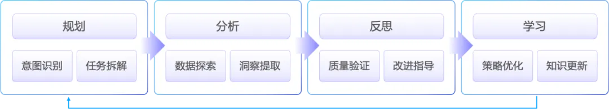
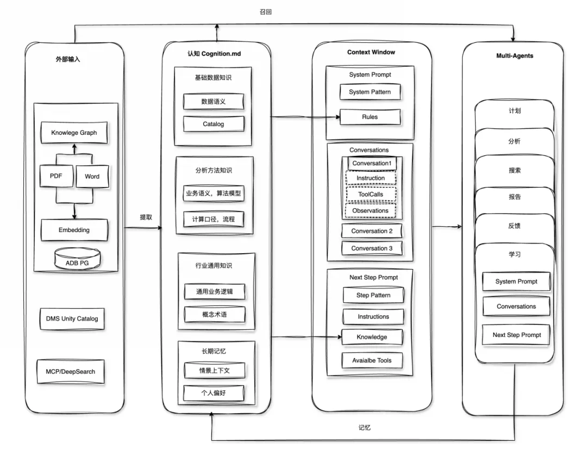
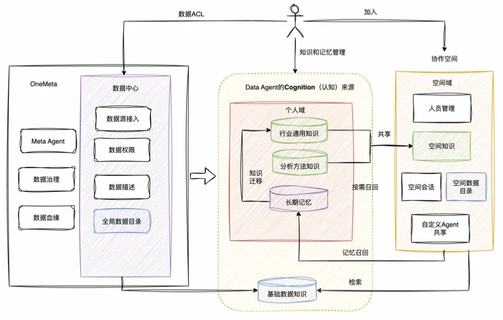

# 0. 资源
1. 产品文档—> https://help.aliyun.com/zh/dms/data-agent-for-analytics

2. 产品详情页—> https://www.aliyun.com/product/dms/data-agent

# 1. 原理
接下来重点介绍 Data Agent 针对以上的问题是如何优化的，以及如何让LLM像分析师一样思考与行动，包含以下几个方面：

深度语义理解

上下文管理

幻觉抑制

工具的使用

## 1.1 深度语义理解

首先需要理解用户想要什么，当用户说"分析一下销售表现"时，作为数据分析的智能助手， Data Agent需要考虑提问者的角色背景、所处的业务场景、以及历史对话记录中学习的用户偏好，计算口径等，需要记忆沉淀能力。

其次是语义理解，语义理解的复杂性体现在同一个词在不同行业、不同公司甚至不同部门都有不同含义。"活跃用户"在电商场景下可能指30天内有购买行为的用户，在社交产品中可能指7天内有登录行为的用户，在SaaS产品中可能指当月有核心功能使用的付费用户。Data Agent必须维护这些领域特定的语义映射，并在对话中动态选择正确的解释。

数据的元数据（Catalog）决定Data Agent的数据理解， 比如多表关联查询，或者某个字段的分布特征，如果一开始 Data Agent不理解或者未完全理解，直接导致后续分析逻辑错误，我们把数据理解作为独立模块，便于在用户录入和分析过程中可以复用。

计算口径的澄清是语义理解的另一个关键维度。企业数据分析中最常见的问题之一就是：同样的指标名称，不同团队计算出的结果不一样，这往往源于对计算口径的理解差异。是否包含退货、是否剔除测试订单、是用下单时间还是支付时间、汇率是用实时还是月末等等。

我们把以上的内容抽象为知识和记忆。

知识与记忆形成了人对事物的认知，AI Agent中的知识和记忆是什么呢？在AI  Agent 系统中，“知识”通常指Agent可获取的领域事实、规则或静态信息，如预先收集的文档、知识库或训练数据中的隐式知识；而“记忆”指Agent在交互过程中动态记录的上下文信息和经验，如用户历史对话、偏好或之前决策。知识和记忆如同光谱的两端，二者在某种程度上可以相互转化。 

## 1.2 上下文管理

Context Engineering 是当下比较流行的AI Agent开发的工程实践， 针对每一次给到LLM的上下文进行动态的设计，构建，和优化，上下文内容除了系统提示词、角色和目标描述、用户需求外，还有对话历史，外部知识，工具调用等。 简单来说，上下文工程决定了模型知道什么，何时知道以及何种方式知道， 最终目的是LLM在约束的搜索空间下， 可以更好的理解、推理和决策。

如下图，Data Agent 的上下文管理实际上是一个完整的智能认知系统的构建，核心流程如下：从规划，分析，反思到学习，构建一个完整的智能认知系统。 

进一步展开，如下图， 从右往左看：

- Data Agent通过Multi-Agents协作，每个Agent具备独立的上下文管理能力，有助于进一步缩小模型的搜索空间， 通过协作完成复杂的任务。
- Context Windows内容是动态的，也就是大家常看到的上下文管理能力， 比如长度控制，KVCache优化， 按需从长期记忆层寻找相关规则和知识内容。 
- 我们称为Cognition，有点拟人化意思。 包含前文描述的三层知识（基础数据知识，分析方法支持和行业通用知识），同时包含Agent的长期记忆，  作为 Data Agent的认知基座，为每次分析提供认知支撑。 
- 最左边是外部输入层，具备多源知识融合能力， 主要负责将文档、数据库、实时搜索等异构数据源统一处理，通过知识图谱和向量化技术实现语义级的知识存储和检索。

## 1.3 幻觉

那如何解决这个问题呢，一种方式是通过提示词工程（PE）手段进行优化，比如COT，Step by Step等，这些PE优化手段的主要作用是：提升推理过程的透明度、引导LLM结构化思考、暴露潜在错误，它们本身不能直接大幅降低前面描述的LLM固有幻觉。在Agent应用场景中，这些方法的作用是让错误更容易被发现，并为后续的验证或工具调用创造条件。另外也可以使用Self-Consistency 方式，采样多个推理路径并投票，能在一定程度上减少随机错误的发生。Self-Consistency 假设正确的答案往往对应多条合理的推理路径，从统计上是优于单一路径上的结果。

另外就是借助工具，比如计算器。 2023年6月GPT-4首次引入Function Calling，而Calculator是最早的示例之一。 

观察今天的大语言模型，主要在内容创作，Math和Coding能力方面，这很大原因是这些知识都是人类对世界的抽象语言，并且已经数字化，这正是LLM的学习来源。 对于Agent来说，使用LLM 来Coding，实际在创造工具，感知真实世界，解决更复杂的问题，可能是通往AGI的必经之路。各大厂商都在不断增强LLM的Codding能力。

Data Agent 综合了以上的优化思路，尤其是以 Code-based Reasoning 为核心策略， LLM负责理解问题并生成可执行代码，比如SQL，Python 以及其他的DSL，作为中间的逻辑表示， 将最终答案生成的责任转移给代码执行引擎，使输出可执行、可解释、可复现。将产生幻觉的风险从“自然语言层面的直接幻觉”转化为“逻辑层面的代码正确性风险”，后者可通过工程化手段（代码检查、测试、验证）进行更有效的系统性管理，从而从大幅减少LLM 在最终数值和事实断言上的编造问题。

其次Data Agent使得LLM像一个数据分析师那样思考：理解问题，数据获取，数据验证，逻辑建模，可视化，结论生成等。除了通过编写SQL或者借助Pandas，Numpy这类数据分析常用的库以外，Data Agent也会和数据分析一样，通过数据可视化进行直觉验证，毕竟一图胜千言，借助VL模型可以比较容易地洞察数据趋势和异常点。 Verify机制也是Data Agent最重要的部分，不仅可以对可视化效果进行审查，最重要的是对最终的分析结果进行上下文验证，进一步降低幻觉。另外在数据分析层次上，比如DIKW模型的内化，有助于 Data Agent更加的专业化的分析。

# 参考

[1] 如何构建企业级数据智能体：Data Agent 开发实践, https://mp.weixin.qq.com/s/8mitLQuX01SbgfjAVsMOnQ