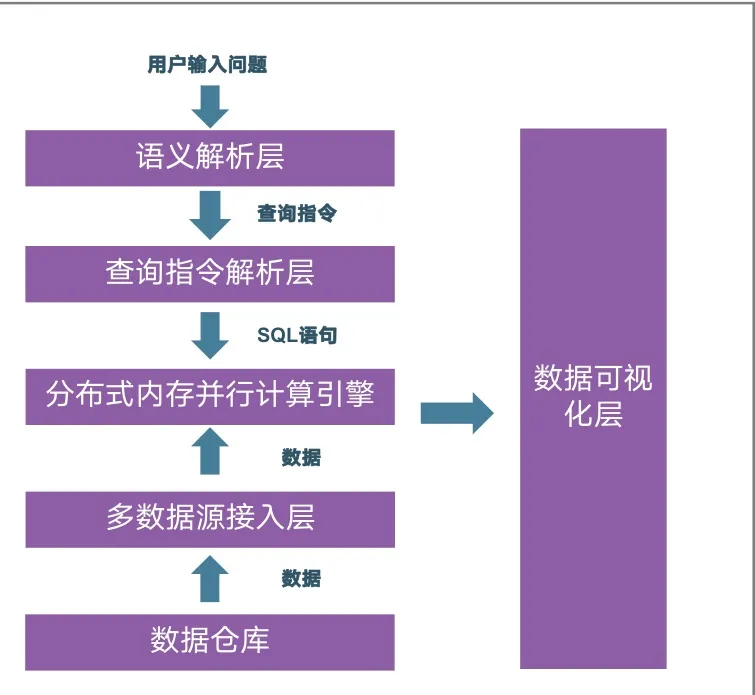

# 实用工具：运营指标体系设计
有效的决策始于正确的衡量。构建一套全面的、可衡量的运营指标体系至关重要。这套体系应覆盖业务的关键环节，并能清晰地反映运营健康度。

- 指标分层：通常采用“北极星指标-一级指标-二级指标”的金字塔结构。例如，电商平台的北极星指标可能是“GMV”，一级指标分解为“用户数 * 付费率 * 客单价”，二级指标则进一步细化到“日活用户”、“新用户注册转化率”等。
- 指标定义：明确每个指标的计算口径、数据来源和更新频率，确保全员对指标的理解一致。
- 公式化创建：利用分析工具内置的公式引擎，可以灵活创建自定义指标，如“销售完成率”、“库存周转率”等。现代分析工具支持丰富的聚合、转换、逻辑判断等函数，能够满足复杂的业务计算需求。

# 实用工具：决策树优化工具
在复杂的运营场景中，影响最终结果的因素众多。例如，影响用户流失的因素可能包括产品价格、客户服务响应时长、用户活跃度等。决策树是一种经典的机器学习模型，它能帮助我们从众多因素中识别出关键的决策节点，从而优化策略。

现代BI平台集成的“智能洞察”或“归因分析”功能，正是这类工具的智能化体现。用户无需手动建模，只需提出问题，如“为什么11月的销售额下降了？”，系统便能自动分析所有相关维度（如产品、区域、渠道、促销活动等），并以类似决策树的逻辑，找出导致销售额下降的主要贡献因素。

- 自动探索：系统自动在数百万甚至数亿的维度组合中进行探索，发现数据中的异常、趋势和相关性。
- 归因分析：当指标发生异动时，自动计算各维度变化的贡献度，快速定位根本原因。
- 预测性分析：更进一步，通过机器学习算法（如高斯之瞳），可以训练库存预测、销量预测等模型，从“描述问题”走向“预测未来”，指导采购、生产等环节。

# 参考

[1] 数字化运营体系：如何构建从数据到决策的智能闭环？https://mp.weixin.qq.com/s/KfPFIqDCTCcV_YgHlRsYGA