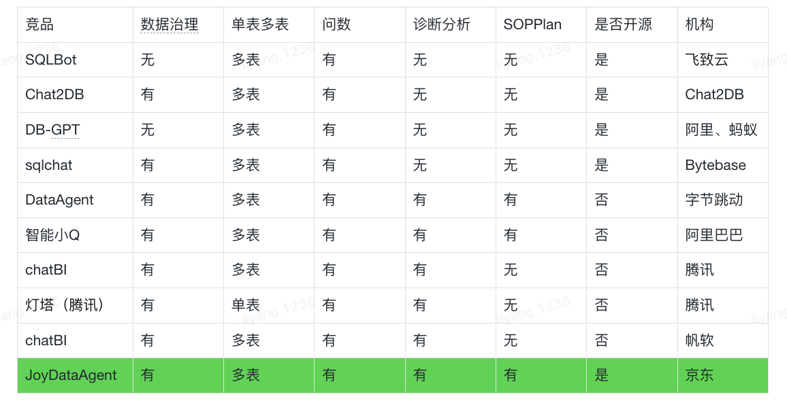
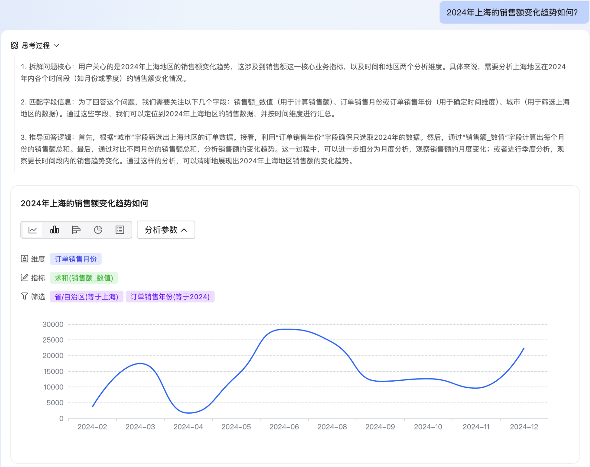
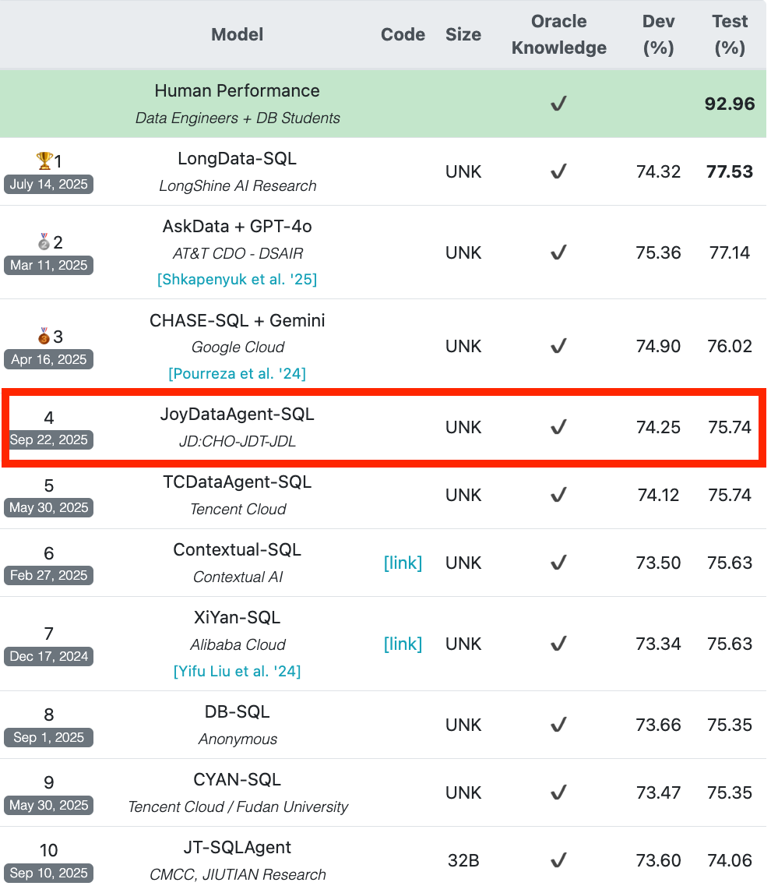
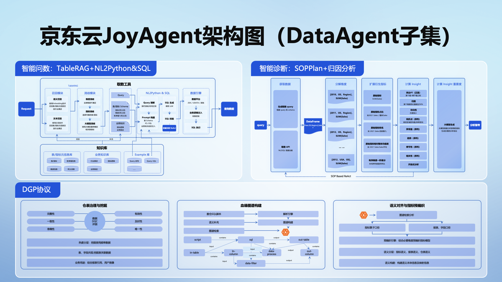

- Github (11k stars)：https://github.com/jd-opensource/joyagent-jdgenie

当前Data Agent相关竞品，有些不支持数据治理、有些不支持诊断分析、有些不开源。因此，我们从端到端开箱即用的角度，我们开源了JoyDataAgent其包含了数据治理DGP协议&工具、智能问数、诊断分析和工作建议。特别对于诊断分析和工作建议，这类问题往往没有固定答案也无法通过例行报告自动呈现，正需要JoyDataAgent提供的“新角度”与aha moment来激发思考。 对于JoyDataAgent是一个通用的智能问数的框架和产品，对于用户的场景，只需将表按照DGP协议进行治理后，即可直接进行问数和诊断分析。为了验证JoyDataAgent的通用性，在Birdsql公开榜单test集准确率75.74%排名第4（共84支提交队伍），目前得分领先于字节跳动DataAgent、IBM等竞争对手。

竞品功能分析

案例展示

效果先进性：Birdsql榜单

Test集效果 75.74%, Dev集效果74.25%

本开源项目基于JoyAgent-JDGenie产品开源了整体的产品界面、智能体的多种核心模式（react模式、plan and executor模式等）、 多个子智能体（report agent、search agent等）以及多智能体间交互协议。同时在此基础上进一步开源了数据分析智能体，主要包括数据治理DGP协议&工具、智能问数、诊断分析和工作建议。

DGP协议
数据治理与挖掘（已完成）

表设计、字段设计、字段值设计5原则，提供相关的SDK以确保数据的准确、唯一、完整、一致、有效。
表设计原则：明细表和指标表不要混合、增量表和全量表不要混合。
字段设计原则：字段避免混淆、时点指标和时期指标语义要说明。
字段值设计原则：枚举值语义说明。
数据血缘治理（进行中）

采集数仓脚本进行SQLAST解析识别出字段、表、加工算子的血缘关系来构建图谱。
结合上语义上的补充构成丰富的知识图谱，以供RAG召回使用。
语义对齐和指标数据预编织（进行中）

语义上的归一对于数据质量很重要，语义构建需要分类，维度含义的统一，以及解决多处定义的冲突。
基于高质量语义与图谱知识的结合，从指标算子口径和语义口径上进行表要的模型预编织，用于在指标数据召回阶段精准约束SQL。
TableRAG和智能问数
TableRAG：两阶段动态选表选字段。
TableRAG：细粒度查询拆解，将复杂问题拆解为更小、更容易处理的语义单元，实现对表格行列值高效检索召回。
智能问数：自适应支持不同类型表的问数能力，明细表VS指标表，增量表VS全量表等。
智能问数：具备智能问数能力并结合图表的可视化展示。
诊断分析
多种归因分析工具：包括趋势、周期、异常、相关性、因果等归因方法。
SOPPlan：除了通用的诊断分析功能，此外还支持用户预定义分析流程。基于用户预定义分析流程，升级Plan&Solve模式为SOPPlan模式。
特别对于诊断分析和工作建议，这类问题往往没有固定答案也无法通过例行报告自动呈现，正需要JoyDataAgent提供的“新角度”与aha moment来激发思考。