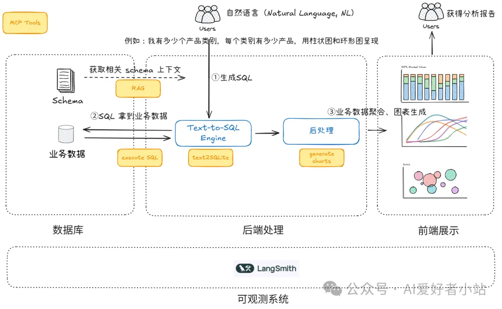

https://github.com/Tunnello/ChatBI/tree/v1.0

橙色框代表了我们开发的 MCP tools，流程如下，下面用一个场景为例说明：

Agent router 解析问题，决定要调用 RAG，获取与问题相关的数据库表 Schema
Agent router 下一步调用 tools，根据 Schema 生成 SQL
Agent router 下一步调用 tools，执行 SQL
Agent router 下一步调用 tools，生成各种图，整个流程上下文（Contex）是共享的

# 参考

[1] https://mp.weixin.qq.com/s/a-QF3XJeo1RLBX4yknxLyQ