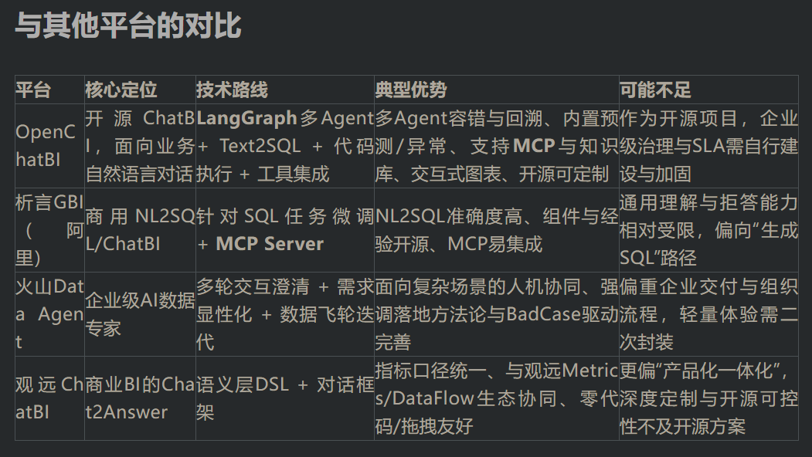

Github (402 stars): https://github.com/zhongyu09/openchatbi

产品定位与核心能力

OpenChatBI是一款开源、由大语言模型驱动的聊天式智能BI，建立在LangGraph与LangChain生态之上，通过自然语言完成数据查询、分析与可视化。它支持自动Text2SQL、数据目录管理、交互式图表（Plotly）、代码执行、持久化记忆与多Agent工作流，并提供Gradio/Streamlit示例UI。系统可对接Presto/Trino/MySQL等数据库，内置时间序列预测与异常检测工具，支持MCP工具与知识库集成，面向运营、财务、管理层等非技术角色提供低门槛的数据消费体验。

典型工作流与能力亮点

自然语言理解：识别业务意图、时间、指标与维度，自动澄清歧义，形成可验证的分析计划。

选表与Text2SQL：结合目录知识与上下文，生成可执行的SQL，并提供解释与校验路径。

执行与容错：执行SQL与Python分析代码，失败可回溯与重试，保障流程稳定。

可视化与洞察：调用Plotly生成折线、柱状、饼图、漏斗、桑基等交互图表，并给出要点解读。

预测与异常：内置时间序列预测与异常检测工具，支持对未来销量、流量等指标进行预测与波动识别。

记忆与协作：基于LangGraph检查点的会话记忆与用户特征记忆，支持多轮追问与知识库增强问答。

开源信息

技术栈：LangGraph、LangChain、FastAPI、Gradio/Streamlit

模型与数据源：Azure OpenAI/Anthropic/OpenAI；Presto/Trino/MySQL

运行方式：提供示例UI，支持本地或容器化部署，便于二次开发与私有化落地。

# 参考

[1] 【开源】告别SQL与拖拽：这个系统用一句话完成查询、分析与可视化，运营、财务、管理层都能用，让数据洞察像聊天一样简单, https://mp.weixin.qq.com/s/cu8BBYxM03Ke16Tnt1YIoQ