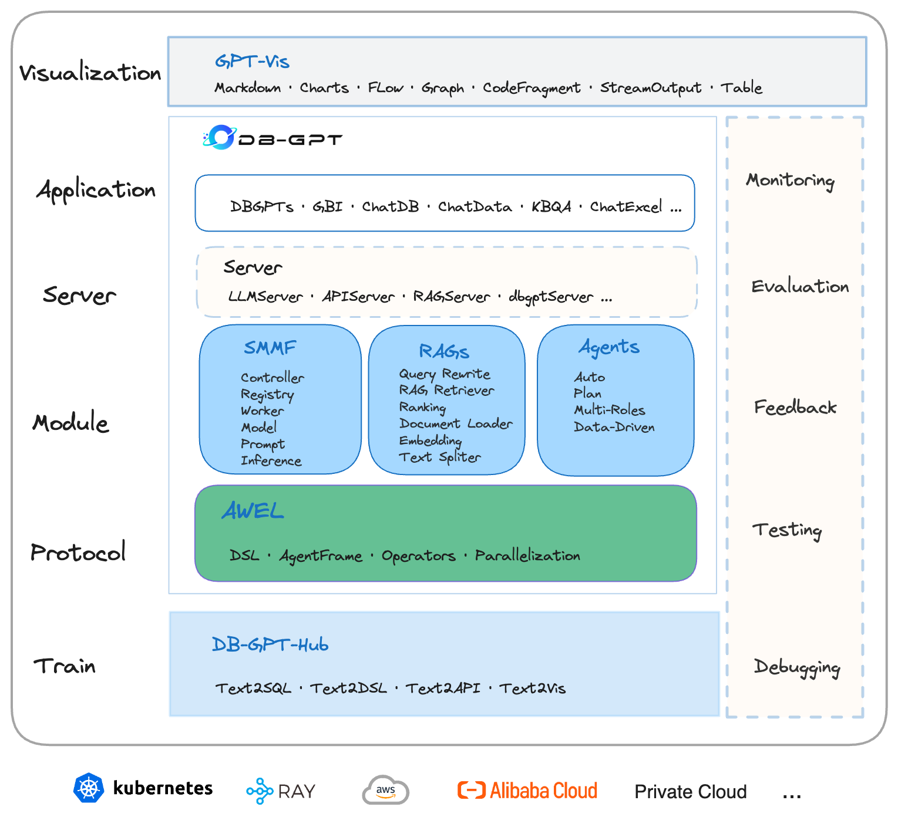

# 1. DB-GPT
- Github (17.6k stars):  https://github.com/eosphoros-ai/DB-GPT

- 

# 2. TaskWeaver

- Github (6k stars): https://github.com/microsoft/TaskWeaver
- 微软出品

TaskWeaver 是一个代码优先的代理框架，用于无缝规划和执行数据分析任务。 这个创新框架通过代码片段解释用户请求并有效地协调各种 以函数形式以有状态方式执行数据分析任务的插件。

与许多仅在文本中跟踪与 LLM 聊天历史的代理框架不同，TaskWeaver 保留聊天历史记录和代码执行历史记录，包括内存中数据。此功能增强了代理框架的表现力，使其成为处理高维表格数据等复杂数据结构的理想选择。

# 3. data-agent

- Github (18 stars): https://github.com/antonguzun/data-agent

数据代理
Data Agent 是一款人工智能驱动的工具，可使用您的数据源自动分析业务假设。

特征
🤖 自动化数据分析
💬 自然语言查询
📊 多数据源支持
🔄 上下文理解
📈 业务洞察生成
🔒 确保您的数据安全并由您控制