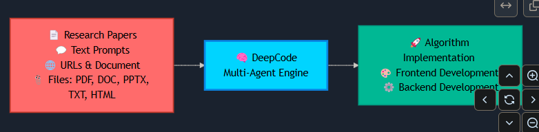

- Github (8.9k stars): https://github.com/HKUDS/DeepCode

🎉 [2025-10] 🎉 [2025-10-28] DeepCode 在 PaperBench 上实现 SOTA！

DeepCode 在所有类别中为 OpenAI 的 PaperBench Code-Dev 设定了新的基准：

- 🏆 超越人类专家：75.9% （DeepCode） vs 顶级机器学习博士 72.4% （+3.5%）。
- 🥇 优于 SOTA 商典代理：84.8% （DeepCode） 与领先的商法典代理 （+26.1%） （Cursor、Claude Code 和 Codex）。
- 🔬 推进科学编码：73.5% （DeepCode） vs PaperCoder 51.1% （+22.4%）。
- 🚀 击败 LLM 代理：73.5% （DeepCode） 与最佳 LLM 框架 43.3% （+30.2%）。

📊 系统概述
DeepCode 是一个人工智能驱动的开发平台，可自动执行代码生成和实现任务。我们的多代理系统可以处理将需求转换为功能性、结构良好的代码的复杂性，使您能够专注于创新而不是实施细节。

🎯 技术能力：

🧬 从研究到生产的管道
多模态文档分析引擎，从学术论文中提取算法逻辑和数学模型。生成具有适当数据结构的优化实现，同时保留计算复杂性特征。

🪄 自然语言代码合成
：使用在精选代码存储库上训练的微调语言模型生成上下文感知代码。保持模块之间的架构一致性，同时支持多种编程语言和框架。

⚡ 自动化原型引擎
智能脚手架系统生成完整的应用程序结构，包括数据库模式、API 端点和前端组件。使用依赖关系分析来确保从初始生成开始的架构可扩展。

💎 质量保证自动化
将静态分析与自动单元测试生成和文档综合集成在一起。采用 AST 分析来确保代码正确性，并采用基于属性的测试来实现全面覆盖。

🔮 CodeRAG 集成系统
将语义向量嵌入与基于图形的依赖关系分析相结合的高级检索增强生成。从大规模代码语料库中自动发现最佳库和实现模式。

---

🔧 核心技术

🧠 智能编排代理：协调工作流程阶段并分析需求的中央决策系统。采用动态规划算法，根据不断变化的项目复杂性实时调整执行策略。为每个实施步骤动态选择最佳处理策略。

💾 高效内存机制：先进的上下文工程系统，高效管理大规模代码上下文。实现具有智能压缩的分层内存结构，以处理复杂的代码库。该组件支持即时检索实现模式，并在扩展开发会话中保持语义一致性。

🔍 高级 CodeRAG 系统：全局代码理解引擎，可分析存储库之间复杂的相互依赖关系。执行跨代码库关系映射，从整体角度理解架构模式。该模块利用依赖关系图和语义分析在实施过程中提供全局感知的代码建议。

---

🤖 DeepCode 的多代理架构：

🎯 中央编排代理：编排整个工作流程执行并做出战略决策。根据输入复杂性分析协调专业代理。实施动态任务规划和资源分配算法。

📝 意图理解代理：对用户需求进行深度语义分析，以解码复杂的意图。通过高级 NLP 处理提取功能规范和技术约束。通过结构化任务分解将模棱两可的人类描述转换为精确、可作的开发规范。

📄 文档解析代理：处理复杂的技术文档和研究论文，具有先进的解析功能。使用文档理解模型提取算法和方法。通过智能内容分析将学术概念转化为实际的实施规范。

🏗️ 代码规划代理：执行架构设计和技术堆栈优化。适应性发展路线图的动态规划。通过自动设计模式选择强制执行编码标准并生成模块化结构。

🔍 代码引用挖掘代理：通过智能搜索算法发现相关存储库和框架。分析代码库的兼容性和集成潜力。根据相似性指标和自动依赖关系分析提供建议。

📚 代码索引代理：构建已发现代码库的全面知识图谱。维护代码组件之间的语义关系。实现智能检索和交叉引用功能。

🧬 代码生成代理：将收集到的信息合成为可执行的代码实现。创建功能接口并集成发现的组件。生成全面的测试套件和文档以提高可重复性。

