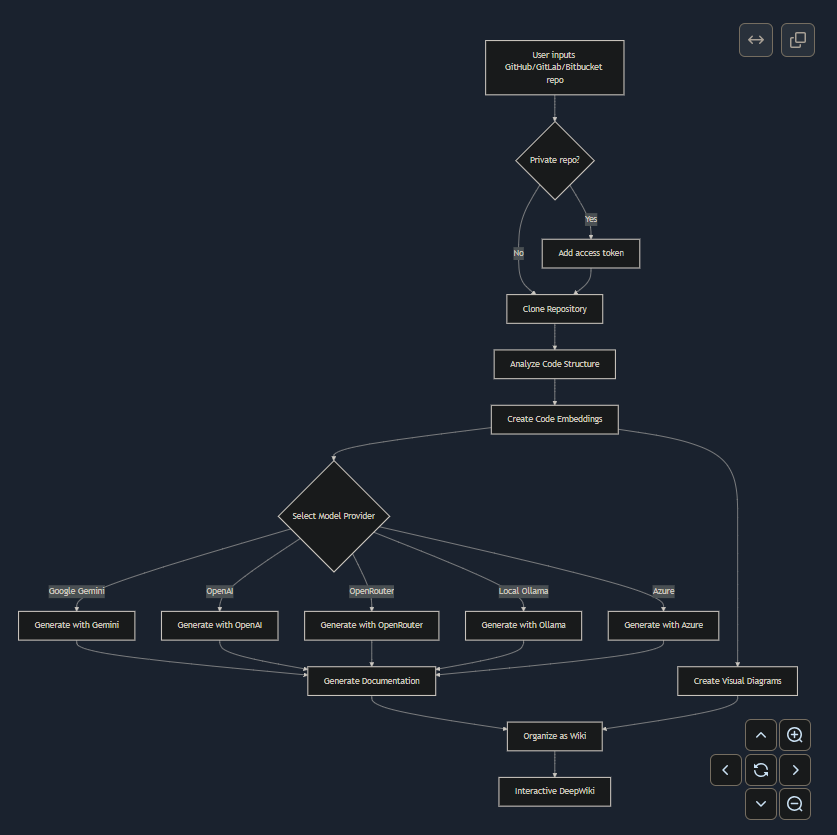

- Github (11.7k stars): https://github.com/AsyncFuncAI/deepwiki-open
- Open Source DeepWiki: AI-Powered Wiki Generator for GitHub/Gitlab/Bitbucket Repositories. Join the discord:

DeepWiki 是我自己对 DeepWiki 的实现尝试，自动为任何 GitHub、GitLab 或 BitBucket 存储库创建漂亮的交互式 wiki！只需输入一个存储库名称，DeepWiki 就会：

- 分析代码结构
- 生成全面的文档
- 创建可视化图表来解释一切的工作原理
- 将所有内容组织到一个易于浏览的 wiki 中

 特征
- 即时文档：在几秒钟内将任何 GitHub、GitLab 或 BitBucket 存储库转换为 wiki
- 私有存储库支持：使用个人访问令牌安全地访问私有存储库
- 智能分析：人工智能驱动的代码结构和关系理解
- 精美的图表：自动美人鱼图，可可视化架构和数据流
- 轻松导航：简单、直观的界面来探索 wiki
- 提问功能：使用 RAG 驱动的 AI 与您的存储库聊天以获得准确的答案
- DeepResearch：彻底调查复杂主题的多轮研究过程
- 多个模型提供商：支持 Google Gemini、OpenAI、OpenRouter 和本地 Ollama 模型
- 灵活的嵌入：在 OpenAI、Google AI 或本地 Ollama 嵌入之间进行选择以获得最佳性能

