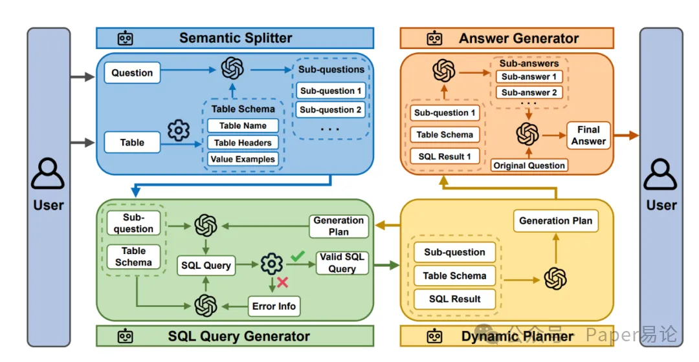
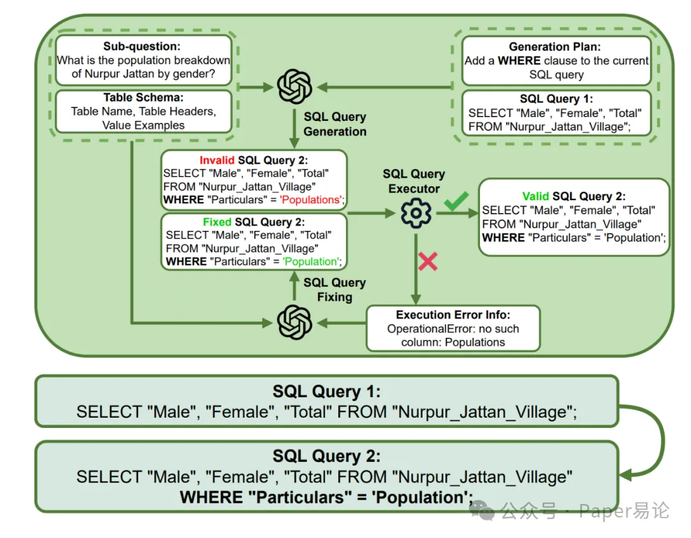
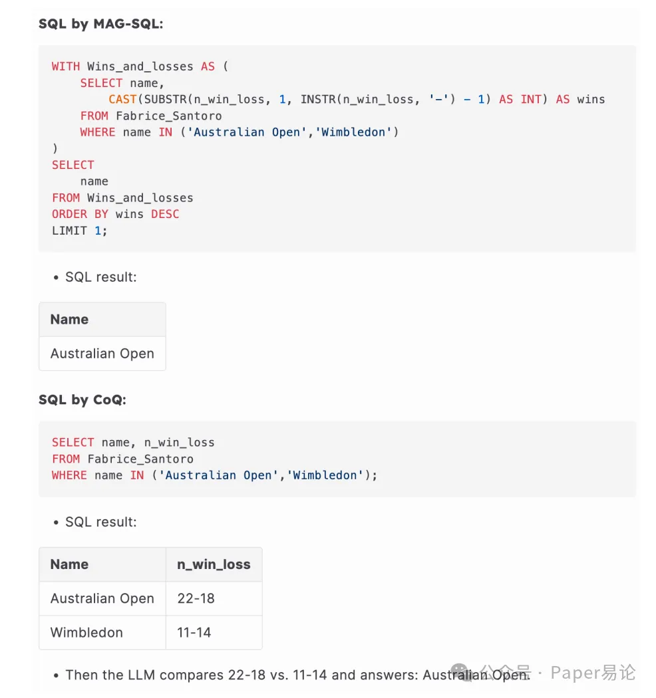
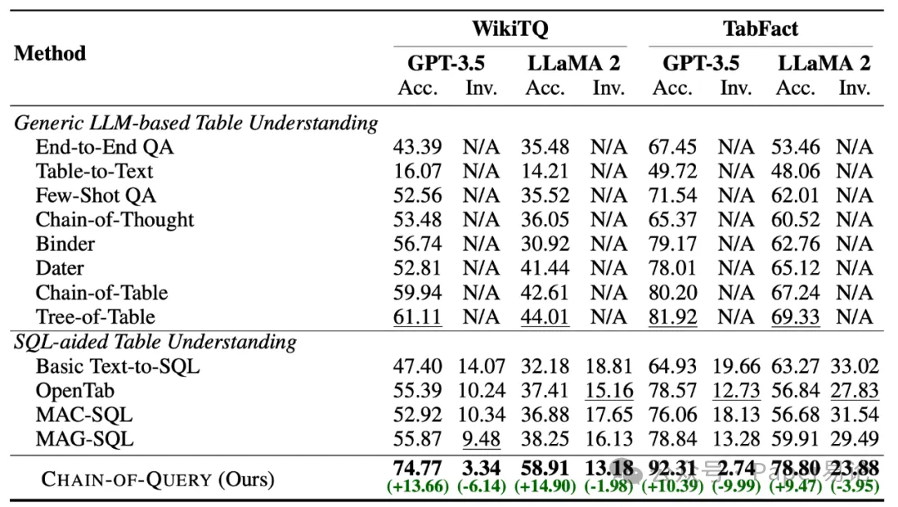
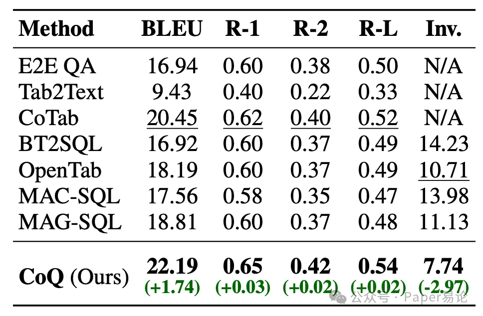
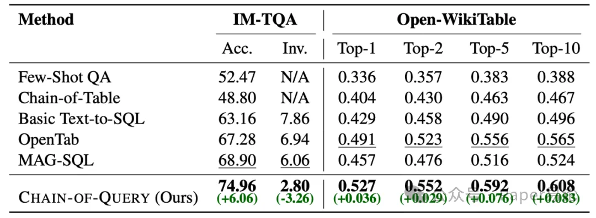
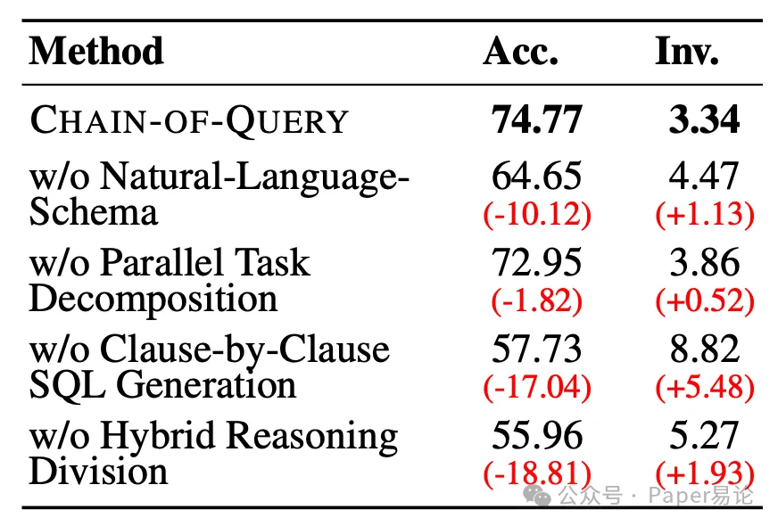
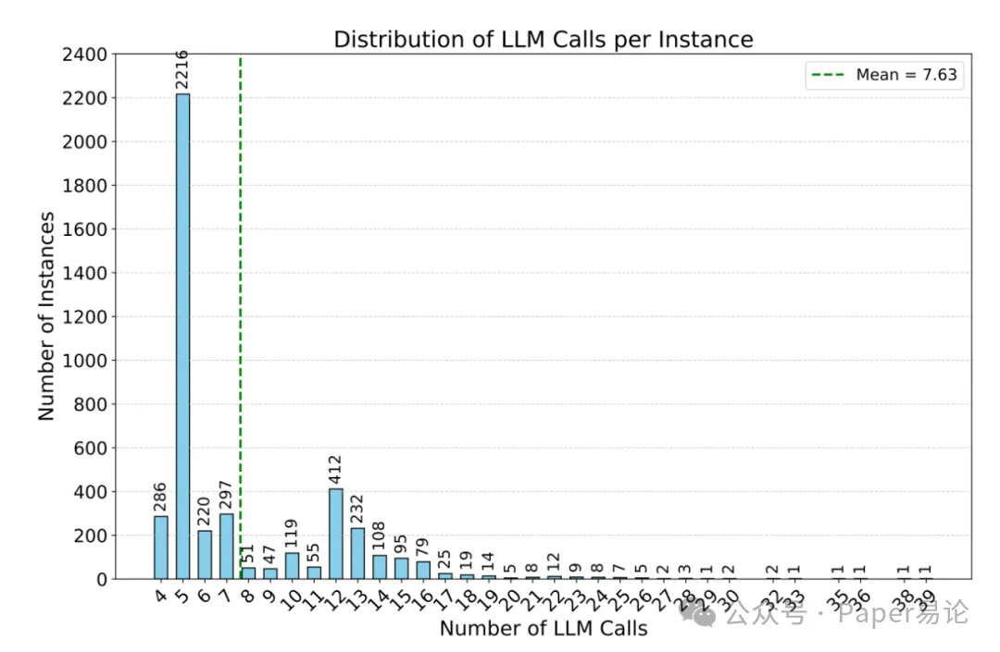
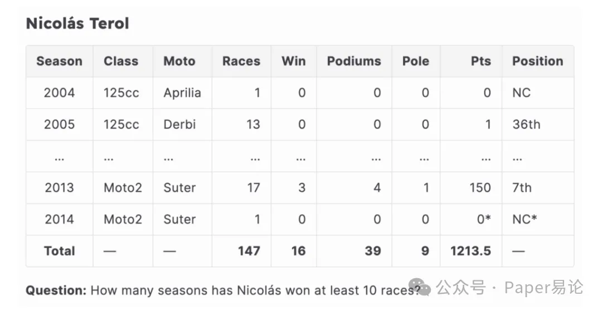
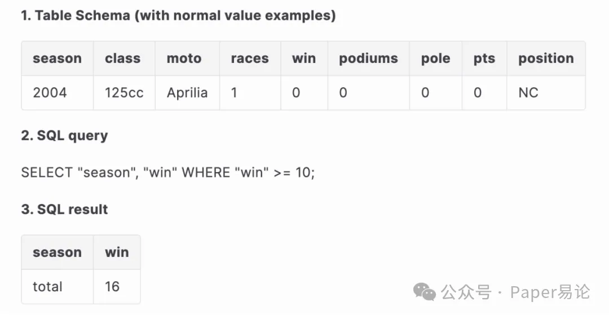

# 1. 资源

https://github.com/SongyuanSui/ChainofQuery

# 2. 原理

家人们，咱们聊点实在的 —— 大语言模型（LLMs）处理文本是一把好手，可一碰到表格数据就容易 “卡壳”。不是读不懂行列间的层级关系，就是生成的 SQL 频频报错，多步推理更是难上加难。但最近 Rice 大学、三星电子和华纳兄弟联合研发的 CHAIN-OF-QUERY（简称 CoQ）框架，直接针对性解决了这些问题，实测在 5 个权威表格数据集上，不仅准确率比现有最好方法高 13% 以上，无效 SQL 率还砍半，关键代码已经开源，不管是做研究还是落地应用都能用得上。

CoQ 的思路很直接：既然单一方法有局限，那就用多 Agent 协作，把表格理解拆成几个专项任务，每个 Agent 负责一块，各司其职又互相配合。先看整体框架，从语义拆分到 SQL 生成，再到动态规划和答案合成，四个环节环环相扣，逻辑特别清晰。

图 1：CHAIN-OF-QUERY 框架整体流程
第一个核心设计是 “用自然语言给表格‘减负’”。CoQ 不把杂乱的原始表格丢给 LLM，而是提炼出表格的核心信息：表格名（用关键词概括用途）、表头（列名 + 数据类型，比如 “Male：男性人口，数字类型”）、示例行（选几行有代表性的数据，用 “|” 分隔便于 LLM 理解）。举个例子，一个记录村庄人口的表格，会描述成 “表格名：Nurpur_Jattan_Village，表头包括 Particulars（类别）、Male（男性人口，数字）、Female（女性人口，数字）、Total（总人口，数字），示例行：Particulars=Population 时，Male=XXX，Female=XXX，Total=XXX”。这样 LLM 不用纠结表格格式，直接聚焦语义，生成 SQL 的准确率自然就上来了。

《从零构建大模型》像一把钥匙，带你亲手推开AI时代最厚重的大门。作者以清晰笔触，先拆解Transformer每一道数学缝隙，再递给你代码砖瓦，从数据清洗、分布式训练到对齐优化，步步为营。你将目睹参数规模从百万到十亿的跃迁，感受GPU夜跑的轰鸣，也能在终端里看见自己的模型首次写出一首诗。读完，你不仅收获可运行的代码与预训练权重，更拥有继续向通用智能进发的底气与视角。

第二个关键操作是 “逐句生成 SQL，错了能回滚”。复杂的表格问题需要多从句、甚至嵌套的 SQL，一次性写对难度极高。CoQ 采用 “搭积木” 的方式：先生成基础的 SELECT-FROM 查询（确定要选哪些列），再根据需求逐句添加 WHERE（筛选行）、GROUP BY（分组）等从句，每加一句就用 SQL 执行器验证一次。要是新从句导致报错，比如把 “Population” 拼成 “Populations”，系统会自动回滚到上一个能用的 SQL 版本，还会让 LLM 修正错误，完全避免误差扩散。

图 2：SQL 查询生成器及逐句生成策略演示
第三个亮点是 “SQL 和 LLM 分工推理，不抢活干”。CoQ 把机械性的工作（比如筛选数据、计算数值）交给 SQL，把需要逻辑判断的工作（比如对比数据、推断结论）交给 LLM，SQL 结果只作为中间数据，不直接当最终答案。举个实际案例，问 “Fabrice Santoro 在哪个大满贯赛事中胜负记录更好？”，传统方法会让 SQL 直接解析 “22–18”“11–14” 这类字符串，提取胜场数再对比，SQL 写得又复杂又脆弱，稍微换个格式就报错；而 CoQ 让 SQL 只提取出这两个胜负记录，再让 LLM 对比 “22 胜 18 负” 和 “11 胜 14 负”，轻松得出 “澳网表现更好” 的结论，既简单又稳定。

图 3：MAG-SQL 与 CHAIN-OF-QUERY 处理结构化推理的对比
还有个实用设计是 “并行拆分复杂问题”。遇到需要对比多个表格区域的问题，比如 “村庄的房屋总数和人口总数分别是多少？”，CoQ 会拆成两个独立子问题，分别生成简单 SQL 查询，避免用 AND 硬凑不兼容的条件，导致逻辑混乱或空输出，处理效率和准确性都更高。

接下来看实打实的实验结果。研究者用 GPT-3.5、LLaMA 2、DeepSeek-V3、GPT-4.1 四个模型，在 WikiTQ（表格问答）、TabFact（表格事实验证）、FeTaQA（自由文本回答）、IM-TQA（不规则表格）、Open-WikiTable（多表格）五个数据集上做了测试，CoQ 全程碾压所有基线模型。

在 WikiTQ 数据集上，用 GPT-3.5 时，CoQ 的准确率从之前最好的 61.11% 涨到 74.77%，提升了 13.66 个百分点，无效 SQL 率从 9.48% 降到 3.34%；用 LLaMA 2 时，准确率提升 14.9 个百分点，无效 SQL 率也降了近 2 个百分点。

表 1：WikiTQ 和 TabFact 数据集上的主要结果

在 TabFact 数据集（验证表格事实）上，CoQ 用 GPT-3.5 的准确率达到 92.31%，比第二名高 10.39 个百分点，无效 SQL 率从 13.28% 降到 2.74%，优势特别明显。

针对需要自由文本回答的 FeTaQA 数据集，CoQ 的表现同样突出：BLEU 分数（衡量回答与标准答案的相似度）达到 22.19，比第二名高 1.74；ROUGE-R1、R2、RL（衡量文本重合度）分别达到 0.65、0.42、0.54，都是第一，无效 SQL 率只有 7.74%，比第二名低 2.97 个百分点。

表 2：GPT-3.5 在 FeTaQA 数据集上的结果

更关键的是，CoQ 在真实世界的 “messy 表格” 上也能打。IM-TQA 数据集里全是转置、嵌套的不规则表格，CoQ 的准确率达到 74.96%，比第二名高 6.06 个百分点，无效 SQL 率低至 2.80%；Open-WikiTable 是多表格场景，CoQ 的 Top-1 准确率达到 0.527，Top-10 准确率 0.608，都比现有方法高 3 个百分点以上。
表 3：IM-TQA 和 Open-WikiTable 数据集结果

为了验证每个设计的必要性，研究者还做了消融实验：去掉自然语言 schema，准确率降 10.12%；去掉逐句 SQL 生成，准确率降 17.04%，无效 SQL 率飙到 8.82%；去掉混合推理分工，准确率降 18.81%，是降幅最大的 —— 这说明 CoQ 的每个模块都不是 “花架子”，而是真能提升性能。
表 4：WikiTQ 数据集上的消融实验结果

除了准确率，CoQ 的效率也很亮眼。平均每个问题只需要 7.63 次 LLM 调用，57% 的问题 5 次调用就能搞定，比很多多 Agent 模型（最多要 100 次调用）省太多资源。就算换成 GPT-4.1 这种更强的模型，CoQ 依然能再涨 9% 的准确率，无效 SQL 率低到 1.54%，属于 “强强联合” 的效果。

图 8：WikiTQ 数据集上每个实例的 LLM 调用次数分布
在实际应用中，CoQ 处理特殊情况也很灵活。比如遇到 “New York” 和 “new york*” 这种字符串变体，会用模糊匹配（LIKE、IN）确保匹配；碰到表格里的 “Total” 汇总行，会通过自然语言 schema 提供的示例行，让 LLM 区分正常数据和汇总数据，不会误算。

图 4：包含特殊 “Total” 行的表格示例

# 参考

[1] CoQ 框架：用 SQL + 多 Agent 破解 LLM 表格理解难题，5 大数据集准确率超 SOTA 13%+，代码开源, https://mp.weixin.qq.com/s/dnUtwva6dECTbjFxvhrhqQ