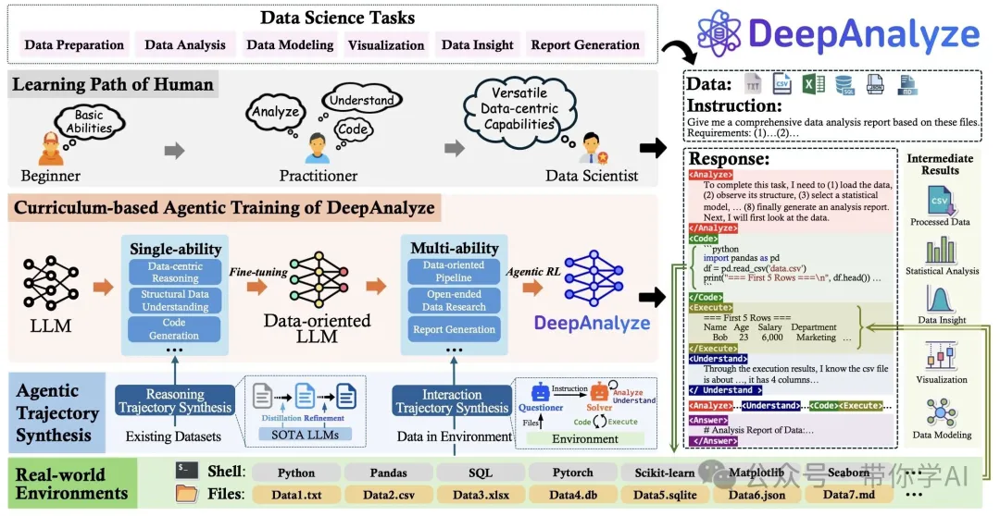

https://arxiv.org/pdf/2510.16872

https://github.com/ruc-datalab/DeepAnalyze

https://huggingface.co/RUC-DataLab/DeepAnalyze-8B

DeepAnalyze 是首个面向自主数据科学的智能体型大语言模型。它能够在无人干预的情况下，自动完成各类以数据为中心的任务，支持完整数据科学流程：可全自动执行数据准备、分析、建模、可视化、报告生成等所有数据科学任务。 开放式数据研究：可针对多种类型的数据源进行深入研究，包括结构化数据（数据库、CSV、Excel）、半结构化数据（JSON、XML、YAML）以及非结构化数据（TXT、Markdown），最终生成具备专业分析师水准的研究报告。完全开源：DeepAnalyze 的模型、代码、训练数据及演示全都开源，用户可以自由部署或扩展，打造属于自己的智能数据分析助手。

DeepAnalyze 实现了整个数据科学流程的全自动化，无论是特定的数据任务还是开放式的数据研究，都能提供“一体化”的智能解决方案。为实现这一目标，提出了两项关键技术：

基于课程的智能体训练（Curriculum-based agentic training）：通过循序渐进的“由易到难”训练机制，引导大语言模型（LLM）从掌握单一能力，逐步发展为具备在真实环境中执行复杂任务的综合能力。

数据驱动的轨迹合成（Data-grounded trajectory synthesis）：自动生成高质量的推理与交互轨迹，为模型在庞大的解空间中提供有效的学习与决策指导。

# 参考

[1] 数据与舆情双引擎：DeepAnalyze + BettaFish, https://mp.weixin.qq.com/s/hn3IU4IMXoNeaQxOlDdS0A