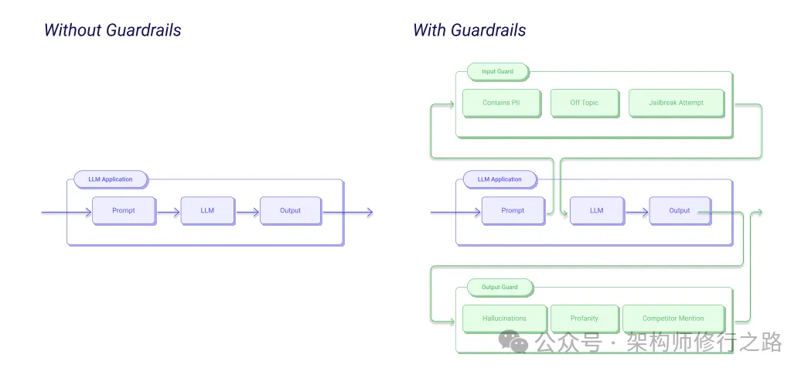

开源地址：https://github.com/guardrails-ai/guardrails

它是一个专门为LLM应用构建可靠性的Python框架，核心功能有两个：一是在应用中运行输入/输出护栏来检测、量化和缓解各种风险类型，二是帮助从LLM生成结构化数据。内置了Guardrails Hub验证器库，涵盖毒性语言检测、竞品提及检查、PII信息过滤、正则匹配等几十种预建验证器，可以像搭积木一样组合使用

预建验证器库丰富，Guardrails Hub提供了几十种现成验证器，毒性检测、竞品检查、正则匹配、代码安全扫描等开箱即用，不用自己造轮子
•
输入输出双重防护，可以在LLM调用前验证用户输入，调用后验证模型输出，双向拦截风险，我用它防止用户注入恶意提示词效果很好
•
组合验证灵活，多个验证器可以组合成Guard，一次性检查多种风险，比如同时检测毒性和敏感信息，失败策略可自定义
•
结构化输出生成，通过Pydantic模型定义输出格式，Guardrails自动让LLM按照结构返回数据，支持函数调用和提示词优化两种方式
•
独立服务部署，可以用guardrails start启动Flask服务，通过REST API交互，简化开发和部署流程
•
性能基准测试，官方刚推出Guardrails Index，对比了24种护栏在6个常见类别的性能和延迟，选型有数据支撑
实际应用场景
我在客服聊天机器人里用Guardrails做了毒性和竞品检测，用户骂脏话系统直接拒绝回复，提到竞品名称也能及时拦截，投诉率降了80%

金融领域的AI应答系统，用它过滤敏感信息，防止模型输出客户隐私或内部数据，合规审查一次通过

数据分析助手要求输出JSON格式，用Guardrails的结构化输出功能，错误格式从30%降到接近0，后端解析省心多了

# 参考

[1] 5.9K Star！大模型界的杜蕾丝Guardrails：给AI套上保险，防幻觉防毒性一站搞定！https://mp.weixin.qq.com/s/grXMo0UcPp9kKoXhyBCWGw