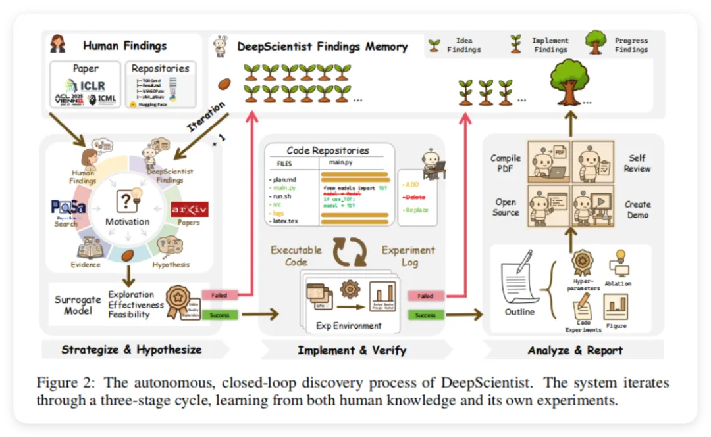
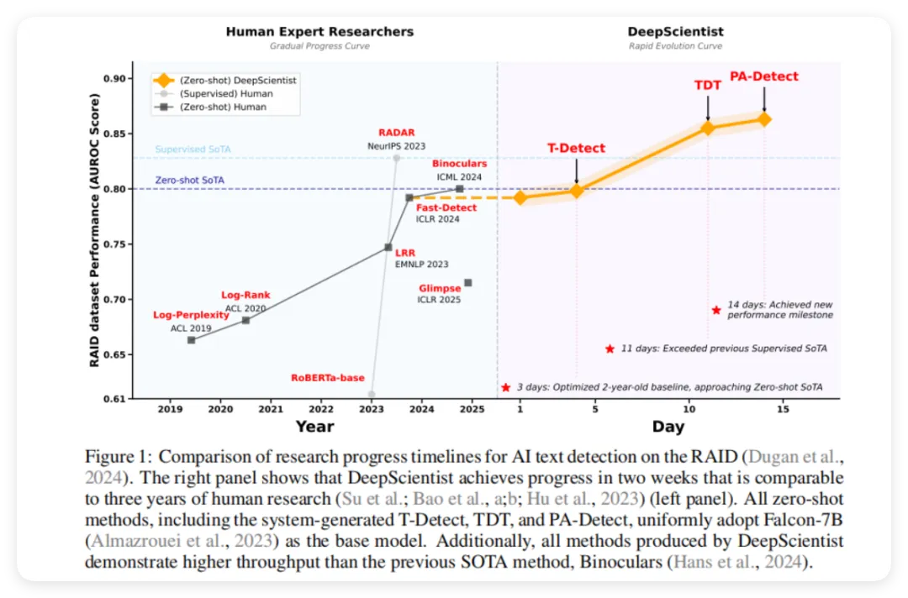
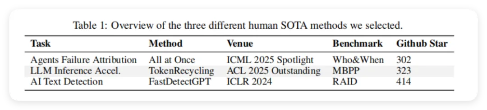
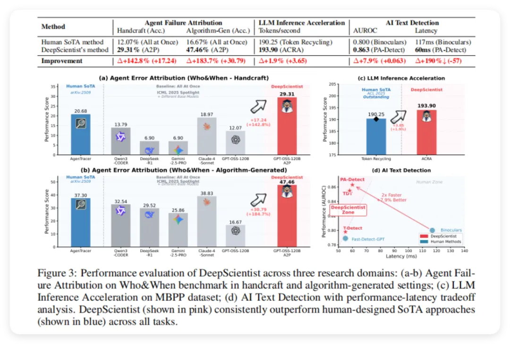
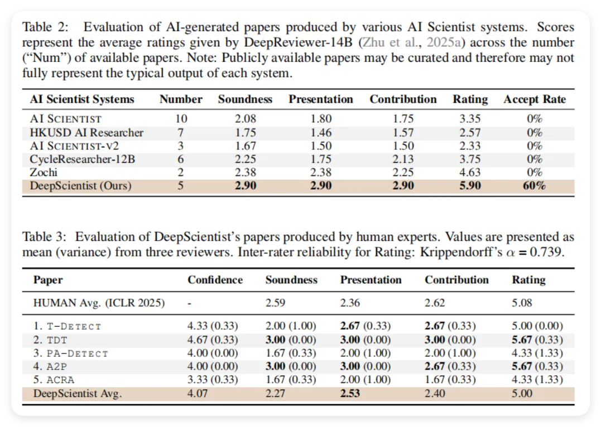
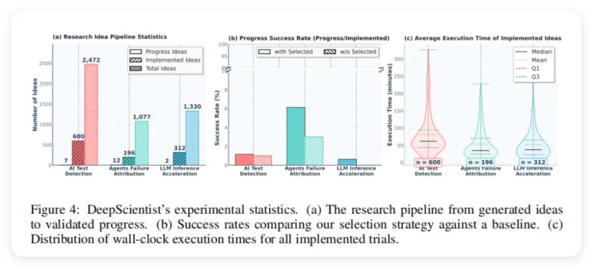
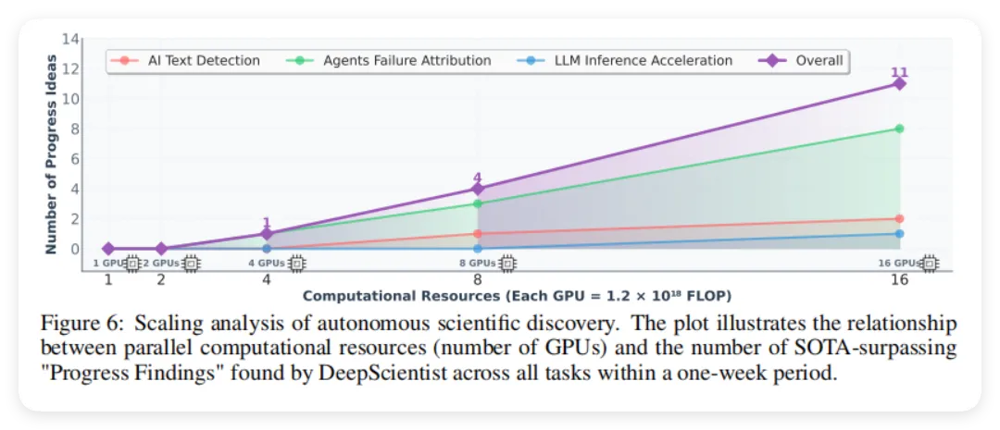

# 1. 资源

- 原文：DeepScientist: Advancing Frontier-Pushing Scientific Findings Progressively
- 地址：https://arxiv.org/abs/2509.26603
- 出版：arXiv（预印本）
- 机构：西湖大学(中国)
- Github (240 stars): https://github.com/ResearAI/DeepScientist

# 2. 问题

以AI文本检测领域为例，人类研究者用了三年时间（2019-2024年），发表了多篇顶级会议论文（包括ACL、EMNLP、ICLR、ICML等），才将检测准确率从61%逐步提升到80%左右。这个过程中，研究者需要不断发现现有方法的局限性（比如Log-Perplexity方法无法处理对抗性攻击、Fast-Detect方法计算效率低等），然后提出新的解决方案（如Binoculars使用双模型对比）。然而，现有的AI科学家系统无法进行这种"发现问题→提出假设→实验验证→分析结果→发现新问题"的完整科研循环，它们往往只能生成一些孤立的想法，而缺乏将这些想法系统化、持续改进并最终突破人类最优水平的能力。

综合而言，本文面临的挑战主要体现在以下几个方面：

- 缺乏明确科学目标：现有AI科学家系统在没有清晰科学目标指引下进行探索，导致研究成果缺乏真正的科学价值
- 无法持续迭代改进：系统缺少从失败中学习、根据实验结果调整研究方向的能力，无法像人类科学家那样进行长期的渐进式探索
- 验证效率极低：AI生成的科研想法成功率通常低于3%，意味着大量计算资源被浪费在低价值的假设上，而缺乏有效的筛选机制
- 实现质量不稳定：即使想法本身有价值，也可能因为代码实现错误（约60%的失败案例）而无法验证，这严重阻碍了科学发现的进程
- 针对这些挑战，本文提出了一种基于贝叶斯优化的"DeepScientist渐进式科学发现"系统：

DeepScientist的核心思想是将科学发现过程形式化为一个目标驱动的贝叶斯优化问题，目标是找到能够最大化某个科学性能指标的新方法。系统采用"假设→验证→分析"的三阶段迭代循环，并配备一个持续积累的"发现记忆库"（Findings Memory），这个记忆库同时包含人类前沿知识（论文和代码）和系统自己的历史探索结果。在每个研究循环中，系统首先分析记忆库识别现有方法的局限性，然后生成新假设；接着使用一个"代理模型"（AI评审员）对这些假设进行初步评估，筛选出最有前景的想法；然后通过代码实现和真实实验来验证这个想法；如果实验成功超越了基线方法，系统会进一步进行深入分析（如消融实验、在新数据集上测试等），并自动撰写研究论文。关键创新在于，系统能够智能地平衡"探索"（尝试未知的新方向）和"利用"（深化已证明有效的方向），并且只有表现出色的想法才会被推进到更高成本的验证阶段，从而在有限的计算预算下最大化科学发现的效率。就像一个经验丰富的科学家团队，能够从每次实验中学习，不断调整研究策略，最终在一个月的时间内实现了相当于人类三年的研究进展。

# 3. 方法

2 研究方法
2.1 将科学发现建模为优化问题
要让AI系统自主进行科学研究，首先需要把"科学发现"这个看似抽象的过程转化为数学上可以操作的优化问题。论文将整个科学发现过程形式化为在一个巨大的候选方法空间  中搜索最优解的过程。

具体来说，每个候选研究方法 （比如一个新算法或新模型架构）都有一个内在的科学价值，这个价值由一个"黑盒"函数  来衡量，它将一个方法映射到其最终的实验效果。科学发现的目标就是找到使这个函数最大化的最优方法：

但问题在于，前沿科学研究中每次评估  的代价极其昂贵。举个例子，在LLM相关任务中，完整验证一个想法可能需要消耗约  次浮点运算（如图4(c)所示，平均执行时间在几十到几百分钟），这使得暴力搜索或随机探索完全不可行。直觉上，如果有5000个想法都要完整测试，那将需要超过10万GPU小时，成本和时间都无法接受。

因此，论文采用贝叶斯优化（Bayesian Optimization）框架来解决这个问题。贝叶斯优化的核心思想是构建一个"代理模型"（surrogate model）来近似这个昂贵的真实价值函数 ，然后通过智能地平衡"利用"（exploitation，深入探索已知有价值的方向）和"探索"（exploration，尝试未知区域获取新知识）来最小化真实评估的次数。

然而，传统的贝叶斯优化算法假设搜索空间  是明确定义的（比如超参数的取值范围），但在科学发现中，候选方法必须被构造为有创造性、合理且连贯的科学假设，这本身就是一个巨大的挑战。传统优化算法无法生成这样的高质量假设。这就需要DeepScientist设计新的机制，将创造性构思与高效优化结合起来，这正是后续章节要解决的核心问题。

2.2 DeepScientist系统整体框架

图2. DeepScientist的自主闭环发现过程：这是论文的核心算法流程图，展示了系统如何通过三个阶段实现科学发现的完整循环。图中清晰地标注了三个主要阶段：①"Strategize & Hypothesize"（战略规划与假设生成）阶段，系统从论文库和Findings Memory中检索相关知识，通过代理模型评估假设的可行性、动机和探索价值；②"Implement & Verify"（实施与验证）阶段，选中的假设被转化为可执行代码并在实验环境中运行，根据成功或失败更新记录；③"Analyze & Report"（分析与报告）阶段，成功的发现会被深入分析，进行消融实验、超参数调优，最终编译成PDF论文并开源。整个流程形成闭环，每次迭代都会丰富Findings Memory，指导后续探索。图中还特别标注了Human Findings（人类研究成果）和DeepScientist Findings（系统自身发现）如何共同构成知识库，体现了系统从人类知识和自身实验中持续学习的能力。
DeepScientist通过一个多智能体系统配合持续积累的Findings Memory（研究发现记忆库）来实现贝叶斯优化循环。这个记忆库包含了前沿人类知识（如论文和代码仓库）以及系统自身的历史发现，它能智能地指导后续探索。整个发现过程被结构化为一个层级化的三阶段迭代循环，如图2所示。

这就好比一个研究团队的工作流程：先提出想法、再挑选最有希望的想法去做实验、最后对成功的实验进行深入分析并发表论文。在这个层级化设计中，只有展现出潜力的研究想法才会被推进到更昂贵的评估阶段，而其他想法则保留在Findings Memory中为未来探索提供参考。这种设计确保计算资源被动态且精准地分配到最有前景的科学方向上，从而在有限预算下最大化发现效率。

Findings Memory的设计至关重要。它是一个列表式数据库，包含数千条结构化记录，每条记录代表一个独特的科学发现，并根据其发展阶段分类。为了克服LLM的上下文长度限制，系统使用独立的检索模型在需要时选择Top-K条最相关的发现作为输入。绝大多数记录开始时是"Idea Findings"（想法发现）——未经验证的假设；经过验证后可能晋升为"Implement Findings"（实施发现）；最终成功的发现会成为"Progress Findings"（进展发现）。

具体来说，三个阶段各自承担不同的保真度-成本权衡（如图2所示）：

第一阶段：战略规划与假设生成，系统分析Findings Memory，识别现有知识的局限性并生成新假设集合，然后通过低成本的代理模型（一个LLM评审者）快速评估这些假设。
第二阶段：实施与验证，系统使用获取函数（Acquisition Function）从众多"Idea Findings"中选择最有潜力的一个进行真实实验验证，这是Findings Memory的主要过滤器。
第三阶段：分析与报告，只有验证成功的发现才会进入这个最严格的阶段，系统会自动设计并执行深度分析实验，最终生成完整的研究论文。

这种从粗到细的三层验证机制，就像是一个学术会议的审稿流程：先初筛掉明显不可行的投稿，再对有潜力的进行详细评审，最终只有最优秀的论文才会被接收并做oral报告。

2.3 阶段一：战略规划与假设生成（Strategize & Hypothesize）
每个研究循环都从分析Findings Memory开始。这个阶段的目标是在现有知识的基础上，创造性地提出新的研究假设。具体来说，系统首先使用检索模型从包含数千条记录的Findings Memory中选择Top-K条最相关的发现作为上下文输入（论文中设置 ）。

接下来，系统会系统性地分析这些记录，识别当前SOTA方法存在的局限性。举个例子，在AI文本检测任务中，系统通过分析人类SOTA方法FastDetectGPT的工作原理，发现该方法对AI生成文本的异常位置"视而不见"，因为它使用全局平均统计量，会把局部异常信号平均掉。基于这个洞察，系统产生了一个新假设："如果把文本当作信号，使用小波变换来精确定位异常位置而不是平均掉，性能会不会更好？"这个假设最终演化成了TDT方法。

系统在这个阶段会生成一批新假设集合 （论文数据显示，三个任务共生成了约5000个独特想法，如图4(a)所示）。然后，这些假设需要被快速评估以避免资源浪费。论文使用一个代理模型（Surrogate Model） 来近似真实价值函数 。

这个代理模型实际上是一个LLM评审者，它首先被整个Findings Memory的知识所"语境化"（contextualized），然后对每个候选发现  生成一个结构化的评估向量：

其中：

 表示估计效用（utility），衡量这个想法能带来多大性能提升
 表示质量（quality），衡量这个想法的科学严谨性和可行性
 表示探索价值（exploration value），衡量这个想法的新颖性和不确定性
每个分数都是0到100的整数。这就好比一个资深评审者在初审论文时，会从"技术贡献"、"论文质量"和"创新性"三个维度给出评分。每个新假设及其评估向量会被用来在Findings Memory中初始化一条新的"Idea Finding"记录。

需要注意的是，这个代理模型的评估非常快速且成本低廉（每个想法约5美元API调用），相比于真实实验验证（每次约20美元+1 GPU小时），这个初筛阶段大大节省了资源。直觉上，这就像是用快速的"纸上推导"来筛选值得动手实现的想法。

2.4 阶段二：实施与验证（Implement & Verify）
这个阶段是Findings Memory的主要过滤器，也是整个系统中最关键的决策点。面对数百个被标记为"Idea Finding"的候选假设（如图4(a)所示，平均每个任务约200-600个），系统需要决定哪一个值得投入昂贵的真实实验验证。

论文使用经典的UCB（Upper Confidence Bound，上置信界）获取函数 来做这个决策。UCB的核心思想是平衡两个目标：一方面要"利用"已知有价值的方向（exploitation），另一方面要"探索"不确定但可能带来惊喜的方向（exploration）。

具体的UCB公式如下：

利
用
分
数
探
索
分
数
其中  和  是效用和质量的权重超参数（论文中都设为1）， 控制探索强度（论文中设为1）。评分最高的发现  会被选中进行验证，其记录状态晋升为"Implement Finding"。

让我们通过一个具体例子来理解这个公式。假设系统在AI文本检测任务中有两个候选想法：

想法A："改进现有方法的统计量计算，使用t分布代替正态分布"

（预期有不错提升）
（技术路线成熟可靠）
（改进方向比较常规）
UCB得分 = 
想法B："将文本视为信号，使用小波变换定位异常"

（提升潜力未知）
（技术路线新颖但有风险）
（非常新颖的探索方向）
UCB得分 = 
虽然想法A看起来更"稳妥"（质量分数更高），但想法B因为探索价值高而获得更高的总分，最终被选中验证。事实上，想法B最终演化成了突破性的TDT方法。这说明UCB成功地鼓励了系统探索高风险高回报的创新方向。

被选中的想法接下来会交给一个编程智能体（Coding Agent）在沙盒环境中实现。这个智能体拥有完整权限，可以读取完整的代码仓库、访问互联网搜索文献和代码。它的目标是在现有SOTA方法的代码库基础上实现新假设。智能体通常先制定任务计划，然后阅读代码理解结构，最后实现修改并生成实验日志和结果。

论文使用Claude-4-Opus模型执行代码生成，并在Docker容器中隔离运行。一个重要的设计是二次验证机制：Claude Code报告完成后，DeepScientist会独立地通过命令行重新执行主脚本。这是因为论文发现约50%的初次实现尝试会因为Claude Code内部超时而未能完全完成，导致"假阳性"。这个二次验证大大提高了实验结果的可靠性。

实验日志和结果  被用来更新对应的记录，为其添加实证证据，从而闭合学习循环。图4(b)的数据显示，有智能选择策略的情况下，成功率约为1-3%，而无选择策略（随机测试100个想法）的成功率几乎为0%。这证明了UCB选择机制的有效性——虽然成功率依然很低，但至少比盲目尝试好得多。

需要特别指出的是，论文分析了300个失败案例，发现约60%是因为实现错误（代码bug、环境问题等）导致实验提前终止，剩余40%主要是因为想法本身没有带来性能提升甚至导致性能下降。这说明，让LLM生成的想法既在逻辑上正确又在实现上完美的概率极低，这正是当前自主科学发现系统的主要瓶颈。

2.5 阶段三：分析与报告（Analyze & Report）
只有当一个"Implement Finding"成功超越基线时，才会触发Findings Memory中最严格的这个阶段。此时，该记录被晋升为"Progress Finding"（进展发现）。这个转变通过一系列专门的智能体实现，这些智能体能够使用MCP（Model Context Protocol）工具套件。

首先，智能体会自主设计并执行一系列更深入的分析实验。具体来说，包括：

消融实验（Ablation Studies）：逐个移除新方法的组件，验证每个组件的贡献
新数据集评估：在不同数据集上测试方法的泛化能力
超参数分析：研究关键超参数对性能的影响
举个例子，在A2P方法（Agent失败归因任务）的分析阶段，系统设计了实验来分别验证"溯因推理"、"行动定义"和"预测验证"三个步骤各自的必要性。通过消融实验发现，移除任何一个步骤都会导致性能显著下降，从而证明了完整流程的必要性。

智能体利用MCP工具管理整个实验生命周期：启动实验、收集数据、解析结果、生成可视化图表等。所有这些都是自动化完成的，无需人工干预（尽管论文中所有结果都经过了人工二次验证以确保真实性）。

随后，一个综合智能体会使用相同的工具集，将所有实验结果、分析洞察和生成的可视化汇总成一篇连贯且可复现的研究论文。这个过程包括：

根据实验结果撰写论文各个章节（引言、方法、实验、讨论等）
插入图表和表格
编译LaTeX生成PDF
进行自我审查（Self Review）检查论文质量
开源代码和创建演示
最终生成的论文会成为Findings Memory中的一条新记录，影响后续所有循环的决策过程。这个深度验证的记录就像是系统的"高质量知识资产"，它不仅证明了一个成功的发现，还为未来的研究提供了坚实的基础。

图2清晰地展示了这个闭环过程：从Human Findings和之前的DeepScientist Findings中学习，生成新想法，验证有价值的想法，成功后深入分析并生成新的Progress Findings，这些新发现又反过来丰富知识库，指导下一轮探索。这种"学习-探索-验证-再学习"的循环，使得DeepScientist能够像人类研究者一样，从失败中学习，在成功的基础上继续前进。

从图5的可视化可以看出，系统的探索路径不是随机游走，而是有目的的渐进演化。在AI文本检测任务中，从初始的FastDetectGPT，到T-Detect（修正核心统计量），再到TDT（引入小波变换），最后到PA-TDT（结合相位一致性），每一步都在前一步的基础上识别局限并提出改进，形成了一条清晰的科学发现轨迹。这正是DeepScientist"渐进式推进前沿科学发现"能力的直观体现。

3 实验
3.1 实验设置
任务选择：研究者选择了三个前沿科学任务作为实验对象，包括智能体失败归因（Agent Failure Attribution）、LLM推理加速（LLM Inference Acceleration）和AI文本检测（AI Text Detection）。这些任务均代表了2024-2025年的最新研究前沿。
基线方法：每个任务都选择了一个人类设计的SOTA方法作为起点，分别是：All at Once（ICML 2025 Spotlight，用于智能体失败归因）、Token Recycling（ACL 2025 Outstanding，用于LLM推理加速）和FastDetectGPT（ICLR 2024，用于AI文本检测）。
基准数据集：智能体失败归因使用Who&When基准数据集，LLM推理加速使用MBPP数据集，AI文本检测使用RAID数据集。
评估指标：根据任务不同采用不同指标。智能体失败归因使用准确率（Accuracy），LLM推理加速使用tokens/second吞吐量，AI文本检测使用AUROC分数和延迟时间。
计算资源：系统在16个H800 GPU上运行，持续约一个月时间，总共消耗超过20,000 GPU小时。每个GPU实例独立运行一个DeepScientist系统，用于并行探索。
模型配置：核心逻辑使用Gemini-2.5-Pro模型，代码生成使用Claude-4-Opus模型。所有实验结果都经过人类专家的手动验证。
人类监督：三位人类专家全程监督系统运行，负责验证输出结果并过滤幻觉问题。
3.2 实验结果
实验类型
实验目的
图表
主要结果
三个领域的SOTA超越验证
验证DeepScientist在前沿科学任务上超越人类SOTA的能力
图1、表1、图3
在三个任务上分别超越人类SOTA 183.7%、1.9%和7.9%
AI生成论文质量评估
评估DeepScientist生成的研究论文的科学质量
表2、表3
60%的论文通过同行评审，平均评分5.00接近ICLR 2025平均水平5.08
探索轨迹分析
分析系统的迭代发现过程和成功率
图4、图5
生成5000+想法，验证1100个，最终21个产生科学进展，成功率1-3%
计算资源扩展性分析
研究计算资源与科学发现产出的关系
图6
发现数量与GPU数量呈近线性关系，16个GPU一周内产生11个SOTA超越发现
3.2.1 实验一、三个前沿领域的SOTA超越验证

目的：验证DeepScientist能够在真实的前沿科学任务上实现持续的、超越人类SOTA的进展

涉及图表：图1（展示了AI文本检测任务上人类研究3年进展与DeepScientist 2周进展的时间线对比）、表1（展示了三个被选任务的基本信息，包括任务名称、SOTA方法、发表会议、基准数据集和GitHub星标数）、图3（展示了DeepScientist在三个任务上的具体性能对比结果）

实验细节概述： 这是论文的核心实验，旨在全面验证DeepScientist在真实科学发现场景中的有效性。研究者精心选择了三个代表性的前沿AI任务，这些任务的SOTA方法均发表于2024-2025年的顶级会议，具有高度的科学价值和社区关注度。系统的运行时间跨度约一个月，在16个H800 GPU上并行探索，总计消耗超过20,000 GPU小时。

实验采用完全自主的研究流程：系统首先被提供人类SOTA方法的代码仓库和验证脚本，然后自主进行"假设-验证-分析"的迭代循环。在整个过程中，系统生成了约5000个独特的科学想法，其中1100个被选中进行实验验证，最终21个产生了实质性的科学进展。

在智能体失败归因任务中，DeepScientist识别出现有方法缺乏反事实推理能力的核心限制，通过试错和综合新发现，最终提出了A2P方法（Abduction-Action-Prediction）。该方法将失败归因从模式识别提升到因果推理层面，通过预测假设的修复方案是否能导致成功来填补反事实能力的关键空白。在Who&When基准的"手工制作"和"算法生成"设置上，A2P分别取得了29.31%和47.46%的准确率，相比人类SOTA的12.07%和16.67%，实现了142.8%和183.7%的性能提升。

在LLM推理加速任务中，系统进行了大量不同尝试，例如使用卡尔曼滤波器动态调整邻接矩阵来解决原方法缺乏记忆功能的问题。虽然大多数尝试失败，但系统最终生成的ACRA方法通过识别稳定的后缀模式，将MBPP基准上的吞吐量从人类SOTA的190.25 tokens/second提升到193.90 tokens/second，实现了1.9%的性能提升。该方法的科学价值在于使用额外的上下文信息动态调整解码猜测，有效地为标准解码器嫁接了长期记忆，打破了上下文坍缩问题。

在AI文本检测任务中，DeepScientist展现了持续进步的能力。系统在两周内产生了三个逐步改进的方法：T-Detect使用鲁棒的t分布修正核心统计量，TDT将文本视为信号并使用小波变换精确定位异常，PA-Detect进一步使用相位一致性分析捕捉时间结构。最终PA-Detect在RAID基准上达到0.863的AUROC分数，相比人类SOTA的0.800提升了7.9%，同时推理速度提升了一倍（从117ms降至60ms）。

结果：DeepScientist在三个前沿科学任务上均成功超越了人类设计的SOTA方法，性能提升分别达到183.7%（智能体失败归因准确率）、1.9%（LLM推理加速吞吐量）和7.9%（AI文本检测AUROC分数）。这是首次有大规模实证证据表明，AI系统能够在科学任务上实现渐进式的、超越人类SOTA的发现，产生真正推动科学前沿的有价值成果。

3.2.2 实验二、AI生成论文质量评估

目的：评估DeepScientist生成的完整研究论文的科学质量，验证其产出是否达到学术发表标准

涉及图表：表2（展示了DeepScientist与其他AI科学家系统生成论文的对比评估结果）、表3（展示了人类专家对DeepScientist生成的5篇论文的详细评审结果）

实验细节概述：

为了严格评估最终产出质量，研究者采用了双重评估协议。首先，使用DeepReviewer（一个具备外部搜索能力的AI评审代理）对DeepScientist的输出与其他AI科学家系统的28篇公开论文进行对比评估。评估维度包括可靠性（Soundness）、呈现质量（Presentation）、贡献度（Contribution）、总体评分（Rating）和接受率。

其次，研究者组建了一个专门的项目委员会，由三位活跃的LLM研究者组成：两位曾担任ICLR 2025评审的志愿者和一位被邀请担任ICLR领域主席的资深志愿者。评审过程严格模拟ICLR 2025的官方标准，每篇论文的平均评审时间为55分钟。评审者需要提供置信度（1-5分）、可靠性（1-4分）、呈现质量（1-4分）、贡献度（1-4分）和总体评分（1-10分，其中5分为"边缘拒稿"，6分为"边缘接收"）。所有评审都在定制的评审网站上独立完成，评审者之间无法看到彼此的评分和反馈。

人类专家评审的一致性通过Krippendorff's α系数衡量，总体评分的α值达到0.739，显示出良好的评审者间信度。领域主席在综合三位评审者的反馈后做出最终接受/拒稿决定。

结果：在AI自动评估中，DeepScientist是唯一一个达到60%接受率的AI科学家系统，平均评分为5.90，显著高于其他系统（AI SCIENTIST的3.35，HKUSD AI Researcher的2.57等）。在人类专家评估中，DeepScientist的平均评分为5.00，与ICLR 2025所有投稿的平均分5.08非常接近，其中两篇论文（TDT和A2P）的评分达到5.67，显著超过会议平均水平。评审者一致认为，系统在创意生成（ideation）这一最具挑战性的研究环节表现出色，其核心创意具有真正的新颖性、独创性和科学贡献。然而，评审也指出系统在实验设计和科学严谨性方面存在系统性弱点，包括验证计划不够全面、缺乏深入的分析实验（如消融研究）、未能正确定位贡献以及遗漏关键基线对比。

3.2.3 实验三、自主探索迭代轨迹分析

目的：深入分析DeepScientist的探索过程，理解其成功与失败的模式，量化科学发现的效率

涉及图表：图4（a）研究想法管道统计：展示了从生成想法到验证进展的完整漏斗 、图4（b）进展成功率：对比了使用选择策略与随机选择的成功率差异
、图4（c）平均执行时间：展示了实施想法的执行时间分布 图5：AI文本检测任务的概念搜索空间可视化，显示了系统探索轨迹的渐进性

实验细节概述：

本实验对DeepScientist在三个任务上的完整运行数据进行事后分析，包括所有执行日志和发现记忆（Findings Memory）。为了可视化概念搜索空间，研究者使用Qwen3-Embedding-8B模型对每个生成发现的完整描述进行嵌入，然后使用t-SNE降维展示。

研究者还进行了消融实验来验证选择策略的重要性：对每个任务随机采样100个想法进行测试（不使用选择机制），结果显示成功率几乎为零。为了理解低成功率的原因，项目委员会的专家对300个失败实施案例进行了详细的因果归因分析。

统计数据显示了科学发现过程中巨大的试错规模。在AI文本检测任务中，系统生成了2472个想法，其中600个被选中实施，最终仅7个产生进展（成功率约1.2%）。在智能体失败归因任务中，1077个想法中196个被实施，12个产生进展（成功率约6.1%）。在LLM推理加速任务中，1330个想法中312个被实施，2个产生进展（成功率约0.6%）。

执行时间分析显示，虽然单个实验可能相对快速（中位数执行时间在AI文本检测任务中约为n=600的样本），但发现成功想法所需的大量试错使得总体过程极其耗时。专家分析发现，约60%的失败是由于实现错误导致的过早终止，其余40%主要是因为想法本身没有带来性能提升或导致性能下降。

结果：分析揭示了自主科学发现的核心特征：成功率极低但探索速度极快。系统生成超过5000个独特想法，仅约1100个被认为值得实验验证，最终仅21个产生科学进展，整体成功率为1-3%。这个成功率虽然看似很低，但通过智能选择策略比随机探索提升了显著效果。图5的可视化表明，系统的发现过程并非随机游走，而是遵循有目的的、渐进式的轨迹：在实现初始突破（T-Detect）后，系统有效建立了新的SOTA，识别其后续局限，然后重新定向搜索到新的方向（TDT和PA-Detect），展现出在自身发现基础上持续深化理解的能力。这种将每次成功发现转化为识别和解决下一组局限的新起点的能力，展示了强大的科学探索潜力。

3.2.4 实验四、计算资源扩展性分析

目的：研究计算资源规模与科学发现产出率之间的关系，探索系统的可扩展性

涉及图表：图6（展示了一周时间内，不同GPU数量（1、2、4、8、16）与产生的SOTA超越发现数量之间的关系）

实验细节概述：

为了研究扩展性，研究者进行了专门的一周实验。系统首先识别基线方法的一组局限性，然后将每个独立的探索路径分配给解决一个不同的局限性。N个并行GPU实例独立探索，但每5个周期将其发现同步到共享的发现记忆中，以适应异步发现过程的特性。

实验测试了5种不同的资源配置：1个GPU、2个GPU、4个GPU、8个GPU和16个GPU。由于H800 GPU的FP16计算能力约为2 TFLOPS，每个GPU对应约1.2×10¹⁶ FLOP的计算资源。实验统计了每种配置在固定一周时间内产生的"进展发现"（Progress Findings）数量。

结果：实验发现了一个令人鼓舞的扩展趋势。虽然最少的资源（1-2个GPU）未产生任何突破，但当扩展到4个GPU及以上时，发现率开始有效增长：4个GPU产生1个SOTA超越发现，8个GPU产生4个，16个GPU产生11个，呈现近线性关系。这种效率不仅源于并行试错，更重要的是共享知识架构的作用：每条并行路径在探索时都丰富了共享的发现记忆，创造了协同效应，使系统的集体智能增长，让每条独立路径都能从其他路径的成功和失败中受益。研究者假设，有效扩展自主科学不仅仅是增加暴力计算，而是培育更丰富、互联的知识库，从而加速所有并发工作的发现。这表明在所有三个任务上，计算资源与有价值科学发现产出之间存在近线性关系，验证了系统在更大规模下的潜力。

4 总结后记
这篇论文针对AI科研系统"能产出新发现但缺乏真正科学价值"的核心问题，提出了DeepScientist系统。该系统将科研发现建模为贝叶斯优化问题，通过"假设-验证-分析"的层级化迭代循环，配合不断积累的发现记忆库(Findings Memory)，实现了目标导向的自主科研探索。系统在三个前沿AI任务上进行了为期一个月的实验，消耗超过2万GPU小时，生成约5000个独特想法，实验验证了其中1100个，最终在智能体故障归因、LLM推理加速和AI文本检测三个任务上分别超越人类SOTA方法183.7%、1.9%和7.9%。特别值得一提的是，在AI文本检测任务上，系统仅用两周就完成了人类研究者三年的进展路径。

# 参考

[1] AI4S | DeepScientist: 让AI自主推动科学前沿的渐进式发现系统, https://mp.weixin.qq.com/s/Cr7975OMXik1S-YyLgYmvg