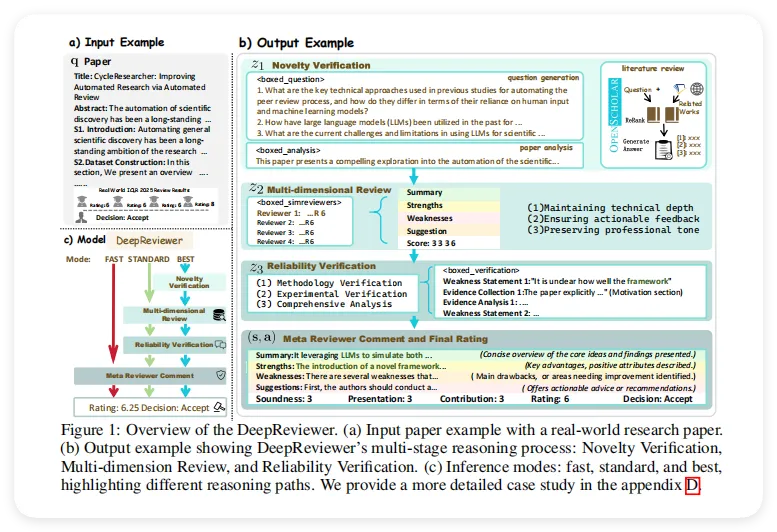
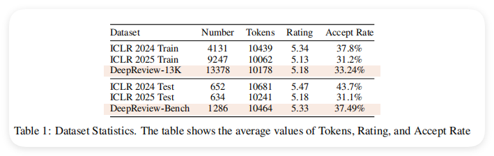
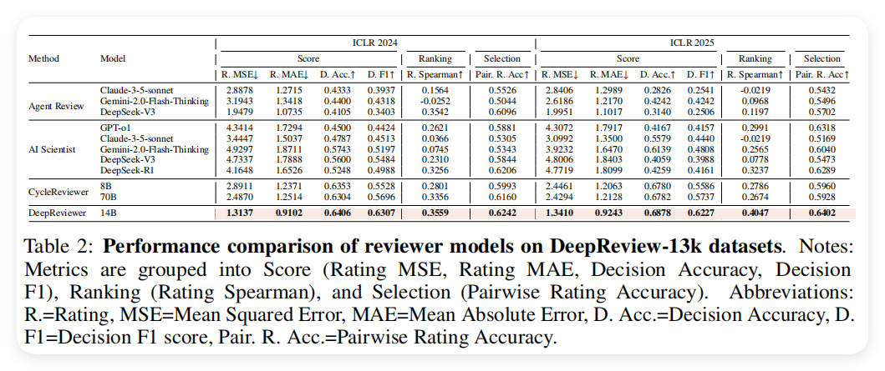

# 1. 资源

原文：DeepReview: Improving LLM-based Paper Review with Human-like Deep Thinking Process
地址：https://arxiv.org/abs/2503.08569
出版：arXiv（预印本）
机构：西湖大学（中国）、浙江大学（中国）

# 2. 原理

DeepReview的核心思想是让AI像资深的论文评审专家一样，分阶段、有步骤地进行深度思考和系统评估。整个框架分为三个关键阶段：**第一阶段是"新颖性验证"，AI首先会提出几个关键研究问题（比如"这项研究填补了什么研究空白？""方法有何创新？"），然后系统地查找和分析相关文献，通过对比已有工作来判断论文的创新性，就像人类评审员在评审前会先做文献调研一样；第二阶段是"多维度评审"，AI会从多个评审员的角度来审视论文，综合分析论文的优点、缺点，并结合作者的回复（如果有的话）提出具体的、可操作的改进建议；第三阶段是"可靠性验证"**，这是最关键的防御机制——AI会系统地检查自己提出的每一条评审意见，在论文原文中寻找支持证据，评估批评的合理性，并过滤掉那些缺乏证据支撑的观点。这个三阶段框架完全不需要额外训练就能集成到现有系统中，而且通过严格的证据验证机制，天然具有抵抗提示词攻击的能力。研究团队还创建了包含13,378个样本的DeepReview-13K数据集（包含完整的推理过程标注），并基于此训练了DeepReviewer-14B模型，该模型提供快速、标准、最佳三种模式，让用户可以根据需求在效率和质量之间灵活选择。

图1. DeepReviewer系统概览图:这是论文的核心框架图,展示了DeepReviewer的完整工作流程。图中分为三个主要部分:(a)输入示例部分展示了一篇真实的研究论文作为输入;(b)输出示例展示了DeepReviewer的多阶段推理过程,包括新颖性验证(Novelty Verification)、多维度评审(Multi-dimensional Review)和可靠性验证(Reliability Verification);(c)推理模式部分展示了三种不同的推理路径——Fast(快速模式)、Standard(标准模式)和Best(最佳模式),它们在推理深度和输出质量上有所不同。整个流程清晰地展现了DeepReviewer如何通过结构化的深度思考过程来生成高质量的论文评审。图中还展示了与真实ICLR 2025评审结果的对比,验证了系统的有效性。(约280字)

2.1 数据集构建
论文首先构建了DeepReview-13K训练数据集,这是一个包含完整推理链标注的高质量评审数据集。具体来说,论文从OpenReview平台和arXiv仓库收集了2024-2025年两个ICLR会议周期的18,976篇论文提交。对于每篇论文,论文使用MinerU工具将PDF转换为可解析的Markdown格式,当arXiv上有LATEX源代码时优先使用。论文为每篇论文组装了一个评审集合R,包含三个关键组成部分:(1)文本评估内容(优点Strengths、缺点Weaknesses和问题Questions);(2)答辩阶段的互动讨论;(3)标准化评分,包括总体评分(1-10分)和细粒度评估的Soundness(方法可靠性)、Presentation(呈现质量)和Contribution(贡献度)(1-4分)。此外,论文还收集了元评审文本和最终评分及接受决定。经过数据清洗和质量控制后,最终的DeepReview-13K数据集包含13,378个有效样本,如表1所示,平均Token数为10,178,平均评分5.18,接受率33.24%。

举个例子,对于一篇关于"CycleResearcher"的论文,数据集不仅包含了最终的评审意见,还包含了评审员从阅读论文、查找相关文献、分析方法创新性到最终形成评审意见的完整思考过程。这种细粒度的标注使得模型能够学习到评审的推理链,而不仅仅是最终结果。

为了评估性能,论文从数据集中随机抽取10%(1.2K样本)创建了DeepReview-Bench测试基准。评估框架包括定量评分任务(评分预测、论文质量排序、成对论文选择)和定性评审生成任务。直觉上,这就好比培养一个学生,不仅要教他正确答案,还要教他思考过程,这样他才能真正掌握知识并应用到新问题上。

2.2 任务形式化定义
论文将论文评审任务进行了严格的数学建模。给定一篇输入论文 ,目标是生成一个评审对 ,其中  代表定性评估文本(元评审),   代表定量评分。论文将推理过程表示为:

其中 , ,  分别代表三个中间推理阶段。论文将评审评分生成形式化为对序列推理链的边际化:

图片
这里显式建模了推理步骤之间的序列依赖关系, 表示所有可能的中间状态序列。

具体来说,这个公式的含义是:最终的评分  不是直接从论文  得出的,而是通过三个推理阶段逐步推导出来的。每个阶段  的生成都依赖于之前所有阶段的结果 $z_{<t}$ 和原始论文="" $q$。这就好比解一道复杂的数学题,需要分步骤推导,每一步都基于前面的结果,最终才能得到答案。这种结构化方法旨在增强评估过程的可靠性,避免"一步到位"可能带来的不稳定性和不可解释性。<="" p="">

2.3 新颖性验证()
新颖性验证是DeepReview框架的第一个关键阶段,目的是评估研究的原创性。论文设计了一个包含三个关键组件的验证框架:问题生成、论文分析和文献检索。

首先,在问题生成阶段,论文使用Qwen-2.5-72B-Instruct模型基于输入论文生成三个关键研究问题,重点关注研究空白、创新方向和方法论突破,以捕获领域特定特征。举个例子,对于一篇关于自动化科研的论文,系统可能生成这样的问题:"以前的研究中使用了哪些关键技术方法来自动化同行评审过程?它们在依赖人工输入和机器学习模型方面有何不同?"

接下来,为确保全面理解论文内容,论文使用Gemini-2.0-Flash-thinking模型进行系统化的论文分析,采用专门设计的系统提示(如图6所示)对研究动机、核心思想、技术方法和实验设计进行分析。这个阶段就好比一个评审员在正式评审前先仔细通读论文,理解作者的研究思路。

然后是文献检索和对比阶段,这是新颖性验证的核心。论文基于OpenScholar系统来处理这些研究问题。具体流程是:使用Qwen-2.5-3B-Instruct模型通过少样本学习将问题转化为搜索关键词,通过Semantic Scholar API检索大约60篇相关论文。随后,ReRank模型对检索到的论文重新排序并选择最相关的前10篇论文,其内部的QA模型生成包含引用文献的综合报告作为新颖性分析 。

直觉上,这个过程模拟了专家评审员的工作流程:先提出关键问题,然后查找相关文献,最后对比分析得出关于研究新颖性的结论。这种系统化的方法确保了评审不是凭空臆断,而是有充分文献支持的。

2.4 多维度评审()
多维度评审阶段的目标是从多个评审员的视角综合评估论文,并将作者的答辩意见转化为建设性的改进建议。论文设计了一个评审重构流程来实现这一目标。

具体来说,论文使用Qwen-2.5-72B-Instruct开发了一个评审重构管道,分析评审集合  中的每条评审及其对应的作者回应。这个过程会从答辩中捕获实验结果、理论证明和实现细节,将批评转化为具体的技术建议。重构过程  遵循三个原则:(1)保持技术深度;(2)确保可操作的反馈;(3)保持专业语气和原始引用。

举个例子,假设某个评审员指出"论文缺乏对不同领域的泛化性分析",作者在答辩中回应"我们选择机器学习领域主要是因为有丰富的训练数据,未来可以通过与出版商合作获取其他领域数据"。那么重构后的建议可能是:"论文应该在局限性部分明确讨论跨领域泛化的挑战,并提出具体的扩展计划,例如与Nature等期刊合作获取生物学领域的训练数据,并咨询领域专家调整评估标准。"

这就好比将一场学术辩论中的交锋转化为建设性的改进方案。原始评审可能只是指出问题,但通过分析作者的回应和补充实验,系统能够提出更具体、更有操作性的建议。这种方法不仅保留了评审的批判性,还融入了作者的解释和额外证据,使最终的评审意见更加全面和公正。

2.5 可靠性验证()
可靠性验证是DeepReview框架的第三个关键阶段,目的是通过系统化的证据分析确保评估的准确性。论文采用Gemini-2-Flash-thinking进行四阶段验证链:方法论验证、实验验证和综合分析。

在方法论验证阶段,系统会检查评审中关于论文方法的每一条评论,要求从论文中找到支持证据。举个例子,如果评审指出"论文未充分探讨框架的潜在误用可能性",系统会在论文中搜索相关的伦理考虑部分,提取出论文实际采取的措施(如Fast-DetectGPT检测系统、使用政策等),然后评估这条批评是否有效以及置信度如何。

实验验证阶段则关注实验设计和结果的评论。例如,如果评审质疑"为什么12B模型比72B和123B模型表现更好",系统会查找论文中的实验数据表格,分析可能的解释(如过拟合、训练数据分布等),并评估这个问题的有效性。

最后的综合分析阶段,论文使用Qwen整合原始元评审、评审员评论和验证结果,生成新的元评审。这个过程识别关键弱点,同时提供基于证据的分析和建设性建议。

具体来说,每条评审意见都需要:(1)支持证据:直接从论文中引用相关内容;(2)置信度评级:高/中/低;(3)影响评估:这条意见对论文整体质量评价的影响程度。这就好比法庭上的举证过程,每一项指控都需要确凿的证据支持,而不能仅凭主观臆断。

通过这种系统化的验证机制,DeepReview确保了生成的评审不是随意的批评,而是有充分证据支持、逻辑严密的专业评估。这大大提高了评审的可信度和对作者的指导价值。

2.6 模型训练与推理策略

表1. 数据集统计信息:展示了DeepReview-13K及相关数据集的统计数据,包括样本数量、平均Token数、平均评分和接受率。ICLR 2024训练集有4131个样本,ICLR 2025训练集有9247个样本,DeepReview-13K合计13378个样本,平均Token数约为10178,平均评分5.18,接受率33.24%。测试集DeepReview-Bench包含1286个样本。
论文基于Phi-4 14B模型,使用DeepReview-13K数据集进行训练。训练过程在8张H100 80G GPU上进行,使用DeepSpeed + ZeRO3进行优化。论文将上下文窗口扩展到256K(使用LongRoPE技术),训练时使用40K上下文窗口进行全参数微调。模型训练了23,500步,批量大小为16,学习率为5e-6。

论文设计了三种推理模式,通过推理路径裁剪实现测试时的效率调整(如图1(c)所示):

Fast模式直接生成最终评估结果和综合分析报告,跳过中间推理步骤,最小化计算成本。这种模式适合需要快速反馈的场景。

Standard模式执行核心评估步骤,包括  和 ,在保持高效率的同时确保评估质量,适用于常规研究评估。

Best模式实现完整的推理链,包含新颖性验证、多维度评估、可靠性验证和综合分析生成。在推理时,对于新颖性验证,论文采用与训练阶段相同的方法,使用Semantic Scholar API和OpenScholar确保通过全面的文献检索和分析准确评估研究新颖性。

这就好比汽车的不同驾驶模式:经济模式(Fast)省油但性能有限,运动模式(Best)性能最佳但耗油,标准模式(Standard)则在两者之间取得平衡。三种模式共享同一个模型架构,仅在执行的评估步骤上有所不同,通过输入指令控制。

值得注意的是,即使是Fast模式,由于模型在训练时学习了完整的推理链,它仍然能够隐式地进行一定程度的结构化思考,因此性能仍然优于未经结构化训练的基线模型。这验证了结构化推理训练对提升LLM评审能力的有效性。

3 实验
3.1 实验设置
数据集: 使用了从OpenReview平台和arXiv仓库收集的18,976篇论文提交数据，涵盖ICLR 2024和2025两个会议周期。最终构建了DeepReview-13K训练集（13,378个样本）和DeepReview-Bench测试集（1,286个样本，占10%）。数据集包含论文原文、审稿意见（优点、缺点、问题）、讨论记录、标准化评分（总体评分1-10分，Soundness/Presentation/Contribution评分1-4分）、元审稿意见和最终录用决定。
基线模型: 选择了两类基线：
基于提示的基线: 使用AI Scientist和AgentReview框架，搭配多种大模型（GPT-o1、Claude-3.5-sonnet、Gemini-2.0-Flash-Thinking、DeepSeek-V3、DeepSeek-R1）
微调基线: CycleReviewer-8B和CycleReviewer-70B，均在ICLR 2024审稿数据上训练
评估指标:
定量评估: 包括评分预测（MAE、MSE、准确率、F1）、论文质量排序（Spearman相关系数）、成对论文选择（准确率）
定性评估: 采用LLM-as-a-judge范式，使用Gemini-2.0-Flash-Thinking进行成对比较评估，评估维度包括建设性价值、分析深度、合理性、技术准确性和总体判断
实验细节:
基于Phi-4 14B模型，使用DeepReview-13K数据集进行训练
训练在8×H100 80G GPU上进行，使用DeepSpeed + ZeRO3优化
将上下文窗口扩展至256K（使用LongRoPE），训练时使用40K上下文窗口
全参数微调，训练23,500步，batch size为16，学习率为5e-6
推理时使用温度0.4，最大输入和输出长度分别设置为100K和16,384 tokens
3.2 实验结果
实验类型
实验目的
图表
主要结果
主实验：评分预测与决策准确性
验证DeepReviewer在论文评分和录用决策上的准确性
表2
DeepReviewer-14B在评分MSE上比CycleReviewer-70B降低44.80%，决策准确率达到64.06%
细粒度维度评估
评估模型在Soundness、Presentation、Contribution三个维度上的表现
表3
DeepReviewer在Soundness评估上MSE为0.1578，比CycleReviewer-70B提升33.58%
审稿文本质量评估
通过LLM-as-judge评估生成审稿意见的质量
表4
DeepReviewer对比GPT-o1胜率达88.21%，对比DeepSeek-R1胜率达80.20%
对抗攻击鲁棒性测试
测试模型对恶意提示注入的抵抗能力
图2
DeepReviewer在攻击下评分仅增加0.31分，而Gemini增加4.26分
测试时扩展性研究
探索推理路径扩展和审稿人数量扩展对性能的影响
图3
Fast到Best模式下Rating Spearman提升8.97%
3.2.1 实验一、主实验：评分预测与决策准确性

# 参考

[1] AI4S | DeepReview：像人类专家一样"深度思考"的AI论文评审系统, https://mp.weixin.qq.com/s/nkbEaS0K5LzIuGzduCoVEA