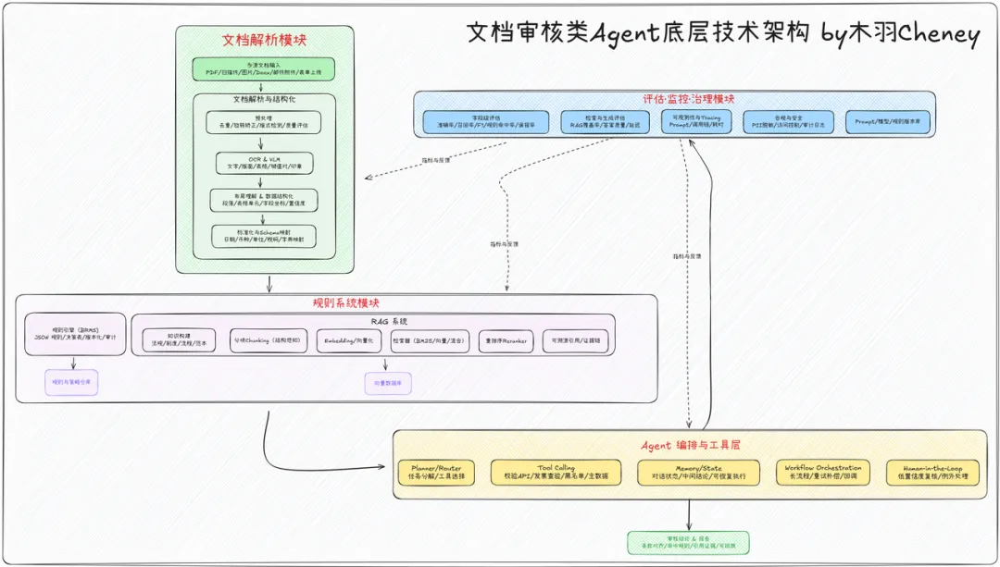
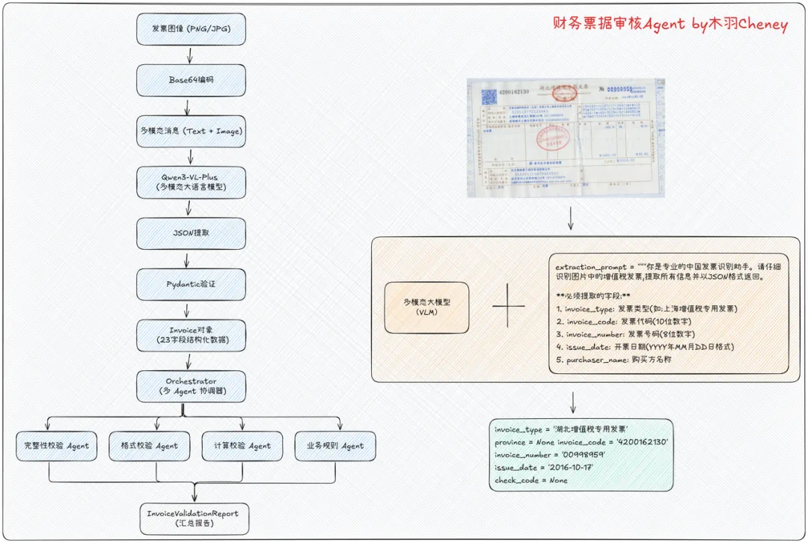

论文地址：https://arxiv.org/pdf/2401.16212

案例：国内已落地的文档审核产品
阿里通义法睿
功能：快速识别合同潜在风险，提供专业风险评估和修改建议
体验地址：https://tongyi.aliyun.com/farui/review
百度票据OCR识别及自动审查
功能：财务、医疗、教育票据的OCR识别与智能审查
产品地址：https://ai.baidu.com/tech/ocr_receipts/vat_invoice
语核科技数字员工
功能：文档审查方向的AI数字员工
官网：https://langcore.cn/zh

三、文档审核Agent的技术架构全景
3.1 完整技术方案拆解

一个完整的文档审核Agent系统包含三大核心技术模块：
模块一：解析与结构化
传统OCR链路
技术栈：传统OCR + 规则引擎
优势：成熟稳定、成本低
劣势：依赖模板、泛化能力弱
VLM多模态链路
技术栈：视觉语言模型（如Qwen3-VL）
优势：理解复杂布局、零样本泛化
劣势：成本稍高、需要GPU资源
📊 主流Document AI都把OCR/布局/键值对/表格抽取到统一JSON，并附带置信度与坐标，便于后续规则与证据回链。
模块二：规则与知识
可配置规则引擎
支持版本化管理、审计追溯
典型场景：税率校验、格式检查
RAG知识检索
把法规与制度做成可检索、可引用的知识源
通过混合检索+重排序提升命中率与可溯源性
模块三：Agent编排
技术选型
LangChain/LangGraph：主流Agent开发框架
能力：计划-工具调用-记忆-长流程编排
人类在环（Human-in-the-Loop）
对低置信度结果进行人工复核
形成"AI初审 + 人工终审"的黄金组合

# 参考

[1] 大模型文档审核Agent技术揭秘：让AI成为你的专业审核员, https://mp.weixin.qq.com/s/aWTxiB_mWbm1BV7tqqiIFA?poc_token=HNOuL2mj6RdFTXYwpn9vh1NAb7hBf4l_DWBhBghm