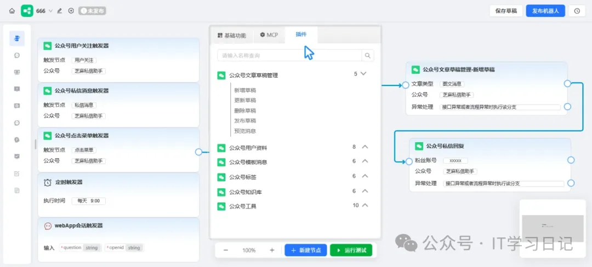

技术栈
前端：vue.js
后端：golang +python
数据库：PostgreSQL16+pgvector+zhparser
开源地址
 项目地址：https://github.com/zhimaAi/chatwiki

简介
ChatWiki是一款专注微信生态的开源工作流自动化平台（GitHub 已获 1.4k Star），以国内首创的公众号 AI 知识库 Agent为核心突破，重新定义公众号智能化运营。

平台深度集成公众号开放能力，通过可视化拖拽即可快速搭建专属微信生态应用，让每个公众号都能一个超级AI智能体。

其核心亮点在于一键 AI 仿写文章能力，可精准理解公众号历史内容与风格，输入关键词或需求后，秒级生成符合账号调性的原创推文，大幅降低内容创作门槛。同时支持推文一键智能改稿、留言 AI 精选回复等功能，从内容生产到用户互动全链路提效，真正实现“公众号即超级 AI 智能体”。

特性
全行业首创：未认证公众号私信自动回复，支持文本、语音、图片、小程序卡片、视频消息等。

微信工作流：集成用户私信、留言、关注、取关、点击菜单等触发场景，支持回复私信，粉丝打标签，生成草稿文章、发布文章等多种处理流程。

一键AI仿写与改稿：支持抓取公众号文章素材，一键建立知识库，轻松实现推文的智能改写、润色与仿写。

核心功能
未认证公众号回复：动响应未认证公众号的私信与留言，AI即时生成互动内容，突破接口权限限制。

留言AI精选回复：智能筛选高价值用户留言，自动生成个性化回复内容，提升互动效率与质量。

公众号推文一键改稿：集成AI 改稿能力，支持推文内容优化、风格调整、错漏修正，一键生成高质量版本。

UnionId微信全域打通：通过UnionId跨公众号、小程序等平台统一用户身份，实现数据互通与精准触达。

推文素材导入知识库：将历史推文一键导入知识库，构建专属内容素材库，便于AI检索与引用。

自定义微信工作流：拖拽式可视化操作，无需代码即可搭建个性化工作流，对接公众号各类开放能力，满足多样化自动化业务需求。

更多功能
模型支持：支持DeepSeek R1、doubao pro、qwen max、Openai、Claude 等全球20多种主流AI大模型。

文档知识库：支持上传pdf、docx、ofd、txt、md、xlsx、csv、html、网页链接等格式文件；支持url 读取、文档批量导入、API 对接、支持AI分段、QA分段、父子分段；支持知识图谱、向量混合检索，可视化查看知识图谱。

问答知识库：上传文档自动抽取问答知识，支持未知问题自动聚类，支持从人工对话中总结常用FAQ。

工作流编排：对话工作流、插件工作流，包含基础的工作流节点、双向MCP、Agent 模式、用户交互。

多种部署方式：提供桌面客户端、支持发布为WebApp，支持嵌入网站、公众号服务号、微信客服、微信小店客服、钉钉机器人、飞书机器人等渠道。

MCP&API集成：可引入外部MCP服务，或将工作流发布为MCP服务。完整的OpenAPI接口，轻松集成现有业务系统。

多账号权限管理：管理、编辑、查看三级权限体系，实现数据权限隔离。IP白名单、登录日志永久留存。

转人工客服：通过机器人处理一般的用户咨询，同时支持人工客服接待。机器人处理不好的问题可以由人工客服介入处理，支持多客服协同分配。

# 参考

[1] 斩获1.4k star！国内首款开源公众号AI知识库Agent，支持一键仿写，改稿，自动回复等核心功能, https://mp.weixin.qq.com/s/kwWP1NA1gspPuK3qE5hGHA