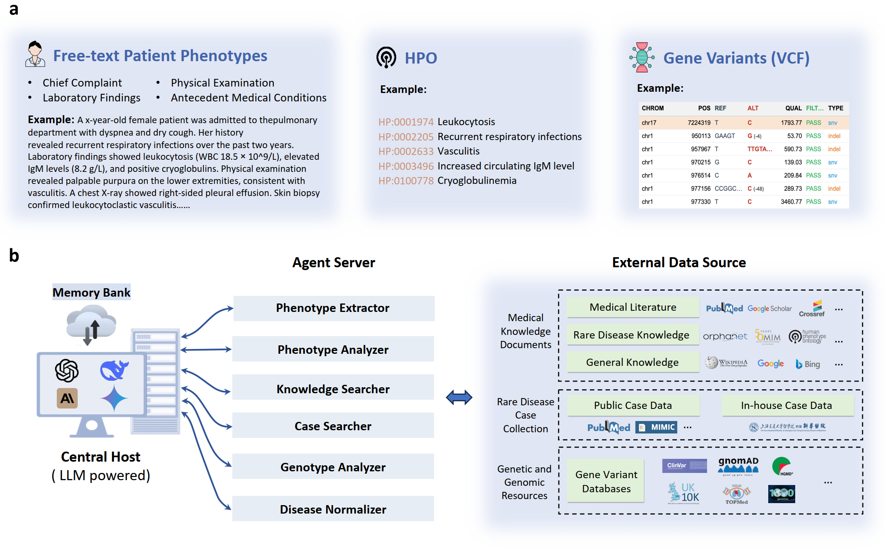
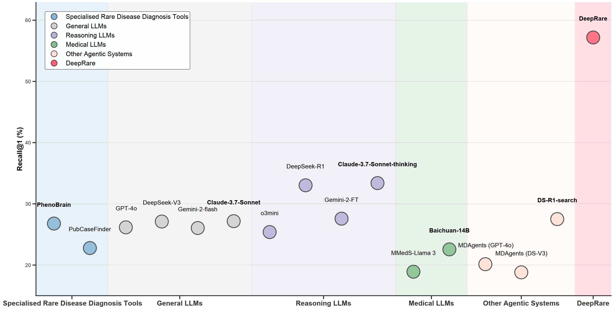

- Github (73 stars): https://github.com/MAGIC-AI4Med/DeepRare
- 论文：An agentic system for rare disease diagnosis with traceable reasoning
  - https://arxiv.org/abs/2506.20430

[自然]DeepRare：一个具有可追溯推理的罕见病诊断智能系统

概述

罕见病在全球累计影响超过3亿人，但及时且准确的诊断依然是一个普遍的挑战。这主要归因于其临床异质性、个体患病率低以及大多数临床医生对罕见病的熟悉有限。在这里，我们介绍DeepRare，这是首个由大型语言模型（LLM）驱动的罕见病诊断代理系统，能够处理异构临床输入。该系统生成罕见病的排序诊断假设，每个假设都配有透明的推理链，将中间分析步骤与可验证的医学证据连接起来。

DeepRare 包含三个关键组件：带有长期记忆模块的中央主机;负责领域特定分析任务的专业代理服务器集成了40多种专业工具和网络规模的、最新的医学知识源，确保访问最新的临床信息。这种模块化且可扩展的设计使得复杂的诊断推理成为可能，同时保持可追溯性和适应性。

我们对DeepRare进行了八个数据集的评估。该系统在2919种疾病中展现出卓越的诊断表现。在基于HPO的评估中，DeepRare显著优于传统生物信息学诊断工具、大型语言模型（LLM）及其他代理系统，平均Recall@1得分为57.18%，并以23.79个百分点的优势大幅超越第二好的LLM推理方法。在多模态输入场景中，DeepRare 在Recall@1下达到了 70.60%，而 Exomiser 在 109 个案例中达到了 53.20%。临床专家对推理链进行人工验证，达成了95.40%的共识率。此外，DeepRare 系统被实现为用户友好的网页应用 http://raredx.cn/doctor。

