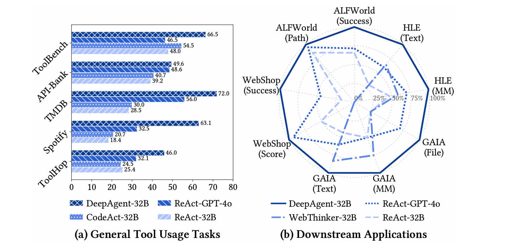
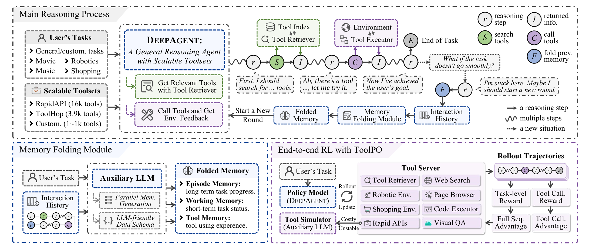

- Github (1k stars): https://github.com/RUC-NLPIR/DeepAgent
- https://arxiv.org/abs/2510.21618

DeepAgent 是一款端到端的深度推理代理，能够在单一连贯的推理过程中实现自主思考、工具发现和动作执行。这种范式摒弃了传统的预设工作流（例如 ReAct 的“理性-行动-观察”循环），使智能体能够对整个任务保持全局视角，并根据需要动态发现工具。

为了处理长视野交互并避免陷入错误的探索路径，我们引入了自主记忆折叠机制。这使得DeepAgent能够“喘口气”，将交互历史压缩成结构化、受大脑启发的记忆图式，从而重新考虑策略并高效推进。

此外，我们提出了ToolPO，一种面向通用工具使用的端到端强化学习（RL）训练方法，能够提升智能体掌握这些复杂机制的能力。

我们对广泛的基准测试进行了广泛实验：

（1）通用工具使用任务：我们在ToolBench、API-Bank、TMDB、Spotify和ToolHop上评估DeepAgent，这些平台的工具集可从数万个扩展到超过一万个不同工具。
（2）下游应用：我们在ALFWorld、WebShop、GAIA和Humanity's Last Exam（HLE）上测试其性能，这些平台需要使用领域专用工具集。图中的总体结果表明，DeepAgent在所有场景下都实现了卓越的性能。

主要特色：

统一代理推理：DeepAgent 背离了僵化的预定义工作流。它以单一思维流运作，自主推理任务，动态发现必要工具，并执行动作。这使得LRM能够保持全球视野，释放其全部自主化潜力。

自主记忆折叠与脑启发记忆：面对复杂问题时，DeepAgent可以自主触发记忆折叠。这一过程将交互历史整合为结构化记忆，使智能体能够以简洁而全面的进展理解重新开始推理。记忆架构受大脑启发，包括：

情节记忆：关键事件、决策和子任务完成的高层次日志。
工作记忆：包含最新信息，包括当前子目标和近期计划。
工具记忆：整合工具相关交互，使智能体能够从经验中学习并完善策略。
端到端强化学习（RL Training with ToolPO）：为了有效训练代理，我们引入了 ToolPO，一种策略优化方法，具备：

基于LLM的工具模拟器，模拟现实世界的API，确保训练的稳定和高效。
工具调用优势归因，该机制为正确的工具调用令牌赋予细粒度的功劳，提供更精确的学习信号。