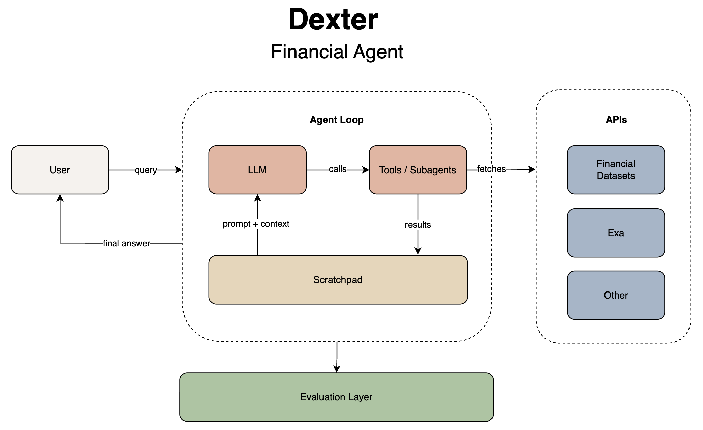

- Github (17.7k stars): https://github.com/virattt/dexter

Dexter是一位自主的金融研究员，边工作边思考、规划和学习。它通过任务规划、自我反思和实时市场数据进行分析。可以想象成Claude Code，但专门为金融研究设计。

Dexter将复杂的财务问题转化为清晰的、逐步的研究计划。它使用实时市场数据执行这些任务，核对自身工作，并不断优化结果，直到得到一个有信心、有数据支持的答案。

主要功能：

- 智能任务规划：自动将复杂查询分解为结构化的研究步骤
- 自主执行：选择并执行合适的工具来收集财务数据
- 自我验证：检查自身工作并不断迭代直到任务完成
- 实时财务数据：访问损益表、资产负债表和现金流量表
- 安全功能：内置环路检测和步进限制以防止失控执行

