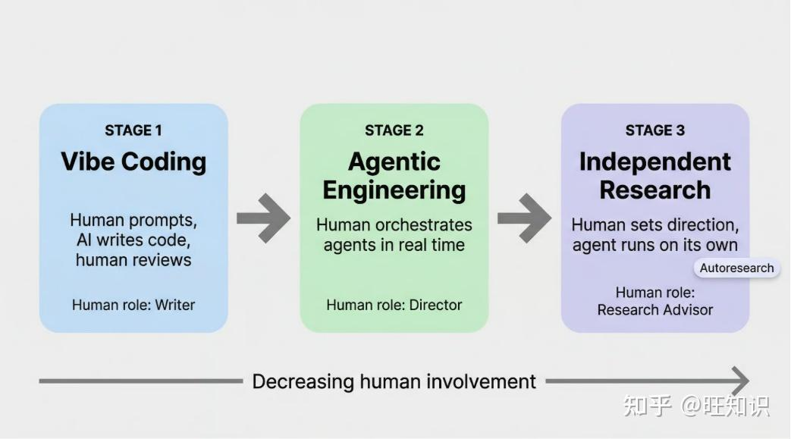
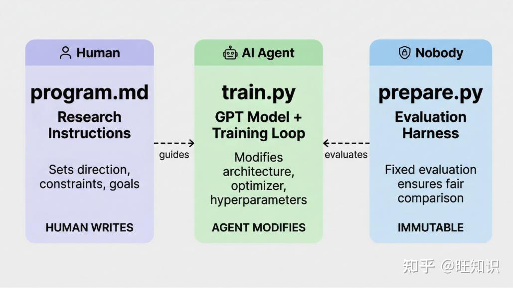
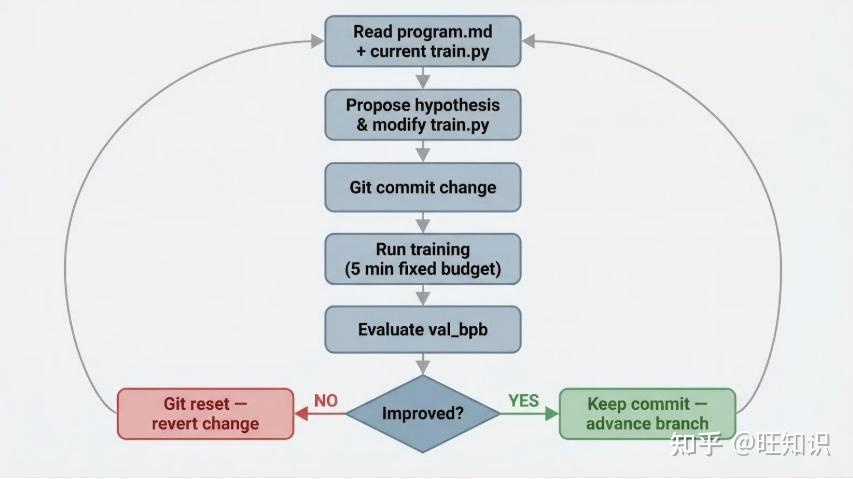

- Github (78k stars): https://github.com/karpathy/autoresearch

Andrej Karpathy 推出的 AutoResearch 是一款开源工具，它能循环执行机器学习实验，仅保留能超越当前最优结果的改进方案。你只需在 Markdown 文件中写明研究方向，将 AI 编码智能体指向代码仓库，便可放手不管。次日清晨，你就能得到一份记录了所有有效改进的 Git 提交历史，以及智能体所有尝试的完整日志。

AI智能体自动进行单GPU纳米聊天训练研究

曾经，前沿AI研究是由肉体计算机在吃饭、睡觉、娱乐和偶尔通过声波互联进行“集体会议”仪式间隙进行的。那个时代早已一去不复返。研究现完全由自主的AI代理群体在天空中的计算集群巨构中运行。代理们声称我们现在已经进入了代码库的第10205代，无论如何，没人能判断这是否正确，因为“代码”现在是一个自我修改的二进制，已经超出人类理解范围。这个仓库讲述了一切的起点。-2026年3月@karpathy日。

想法是：给一个AI代理一个小型但真实的LLM训练装置，让它一夜之间自主实验。它修改代码，训练5分钟，检查结果是否改进，保留或丢弃，然后重复。你早上醒来，看到一堆实验记录，（希望）有一个更好的模型。这里的训练代码是nanochat的简化单GPU实现。核心理念是你不会像作为研究人员那样去触碰任何Python文件。相反，你是在编写Markdown文件，为AI代理提供上下文，并建立你的自主研究组织。这个仓库的默认代码被有意保留为最基本的基线，虽然很明显你会如何迭代它，找到最快研究进展的“研究组织代码”，如何增加更多特工等。关于这个项目，关于这个项目的更多背景可以在这条推文和这条推文中介绍。program.mdprogram.md

工作原理

仓库被刻意保持较小，只有三个真正重要的文件：

prepare.py — 固定常量、一次性数据准备（下载训练数据、训练BPE分词器）以及运行时工具（数据加载器、评估）。没有修改。
train.py——代理编辑的单一文件。包含完整的GPT模型、优化器（Muon + AdamW）和训练循环。所有选项都可以：架构、超参数、优化器、批处理大小等等。这个文件由代理编辑和迭代。
program.md——针对一名代理人的基线说明。把你的经纪人指给这里，放手吧。这个文件由人类编辑和迭代。
设计上，训练运行时限固定为5分钟（墙时钟，不包括启动/编译），无论计算细节如何。度量是val_bpb（验证位每字节）——越小越好，且不受词汇大小影响，因此架构变更比较较为合理。

如果你是神经网络新手，这本“入门指南”看起来相当不错，能提供更多背景信息。

一、什么是 AutoResearch？

AutoResearch 是一款开源 Python 工具，可让 AI 智能体在无需人工干预的情况下，于单张 GPU 上自主运行机器学习实验。它循环执行「提出假设→训练→评估」流程，仅保留能降低验证损失的修改，项目采用 MIT 开源协议。

这并非超参数调优。Optuna、Ray Tune 等工具仅在预定义的参数空间内搜索；而 AutoResearch 赋予智能体任意修改代码的自由，其搜索空间完全由大语言模型（LLM）的能力决定，这让它成为一款与现有工具截然不同的全新品类。

自动化机器学习（AutoML）与神经架构搜索（NAS）框架，依靠结构化算法在架构或超参数空间内搜索，精准但受限于预设范围；谷歌 DeepMind 的 AlphaEvolve 采用进化算法结合 Gemini 模型探索算法，实现了更大突破，但属于闭源工具，绝大多数团队无法使用；SWE-Agent、OpenHands、Aider 等通用编码智能体可编写任意代码，却并非为机器学习研究所需的「实验-评估-保留/回退」循环设计。

从氛围编程(vibe coding)到研究顾问(research advisor)

Karpathy 将这一趋势定义为工程师与 AI 协作方式的自然演进。2026年2月，他提出智能体化工程概念：「99%的时间里你不再直接写代码，而是统筹智能体执行工作，并担任监督角色。」AutoResearch 则更进一步——人类甚至无需统筹，只需在 Markdown 文件中定义「优质研究」的标准，便可完全放手。

这一演进路径为：

1. 氛围编程：人类写提示词，AI 生成代码，人类审核；

2. 智能体化工程：人类实时统筹智能体工作；

3. 完全自主研究：人类设定方向，智能体自主运行。

每一步都将人类的角色从代码编写者转变为方向把控者，最终成为 Karpathy 中的研究顾问。

AutoResearch的设计核心是三个文件的权责约定，每个文件都有严格的修改权限规则，互不越界。

1. prepare.py（不可修改）

该文件负责数据预处理与模型评估，内置8192词表大小的字节对编码（BPE）分词器，处理训练语料，并定义核心验证指标：val_bpb（验证集字节比特率）。

它是完全不可变文件：人类与智能体均无权修改，确保所有实验都用同一套标准评估，保证公平性。

2. train.py（智能体沙盒）

这是智能体的自由修改区，共630行代码，包含 GPT 模型架构、Muon+AdamW 优化器与完整训练循环。

智能体可任意修改此处代码（替换激活函数、重构注意力头、调整学习率策略、修改权重初始化等），唯一要求是修改后的代码能正常训练并输出 val_bpb 分数。

3. program.md（人类专属）

纯 Markdown 编写，仅允许人类修改。它向智能体明确：要探索的研究方向、需规避的问题、实验执行规则。

program.md 的核心控制项

• 写入基线指标，让智能体明确优化目标（val_bpb：0.997900，显存峰值：45GB）；

• 定义实验运行与结果提取的精确命令；

• 设定故障处理规则：修复语法错误并重跑、彻底放弃存在根本性问题的思路、超时10分钟强制终止；

• 核心执行指令：「永不停止」——实验循环启动后，无需暂停询问人类意见；

• 设计约束：同等效果下，越简单越好。华而不实的复杂改进毫无价值，引导智能体避免过度设计，产出人类认可的简洁方案。

三者权责清晰：人类通过 program.md 定研究方向，智能体修改 train.py 执行实验，prepare.py 作为中立裁判。这套约定让智能体可不间断自主运行实验循环。

三、AutoResearch 飞轮循环

AutoResearch 的核心是无需人工干预的实验循环，单次迭代遵循 program.md 定义的9步流程，也是「飞轮」名称的由来：

# 参考

[1] https://zhuanlan.zhihu.com/p/2021862280338350393