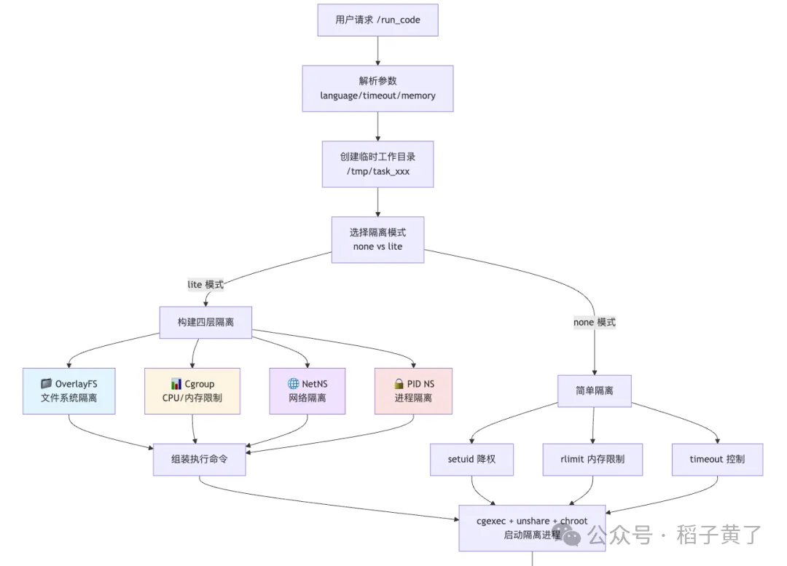
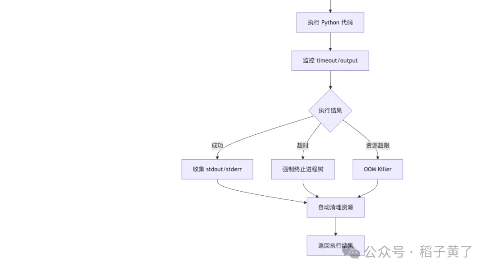

📌 开篇：为什么 AI 时代需要"沙箱化执行"？
想象这样一个场景：

你正在开发一个 AI 代码助手，用户可以提交任意 Python 代码让 LLM 执行。或者你在做在线评测系统，需要运行成千上万份学生提交的代码。

这时你会遇到三个致命问题：

1. 💣 安全性：用户代码可能读取 /etc/passwd，访问内网服务
2. 💥 资源耗尽：恶意代码可能耗尽内存，fork bomb 炸掉系统
3. 🐌 性能瓶颈：Docker 启动慢（秒级），大规模并发扛不住
传统方案是用 Docker或 Firecracker，但它们都有明显短板：

• Docker：启动慢、镜像管理复杂、资源开销大
• Firecracker：启动快但运维复杂，依赖 KVM
那么，有没有一种方案，既轻量又安全，还能毫秒级启动？

答案就是：SandboxFusion—— 字节跳动开源的"裸机容器"方案。

🎯 核心思路：用 Linux 原语手工构建"容器"
SandboxFusion 的设计哲学非常纯粹：

不依赖 Docker Engine，直接使用 Linux 内核的隔离特性（cgroup、namespace、overlayfs），在宿主机上手工构建一个"一次性容器"。

听起来很极客对吧？其实实现起来也很优雅。

整个项目核心就两个文件：

• sandbox/runners/base.py：执行命令的主逻辑
• sandbox/runners/isolation.py：四层隔离机制的实现
下面我们从架构概览到源码拆解，一步步看它是怎么做到的。

🏗️ 一、整体架构：从 API 请求到安全执行
执行流程图

# 参考

[1] 从零拆解 SandboxFusion：字节如何在不依赖 Docker 的情况下实现毫秒级代码隔离, https://mp.weixin.qq.com/s/qrJW-0uA63kc4e9yjDt2QA