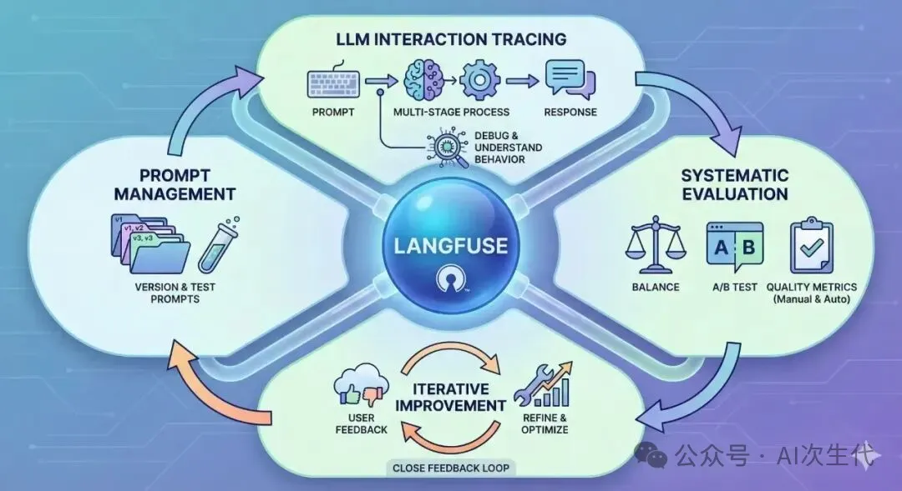
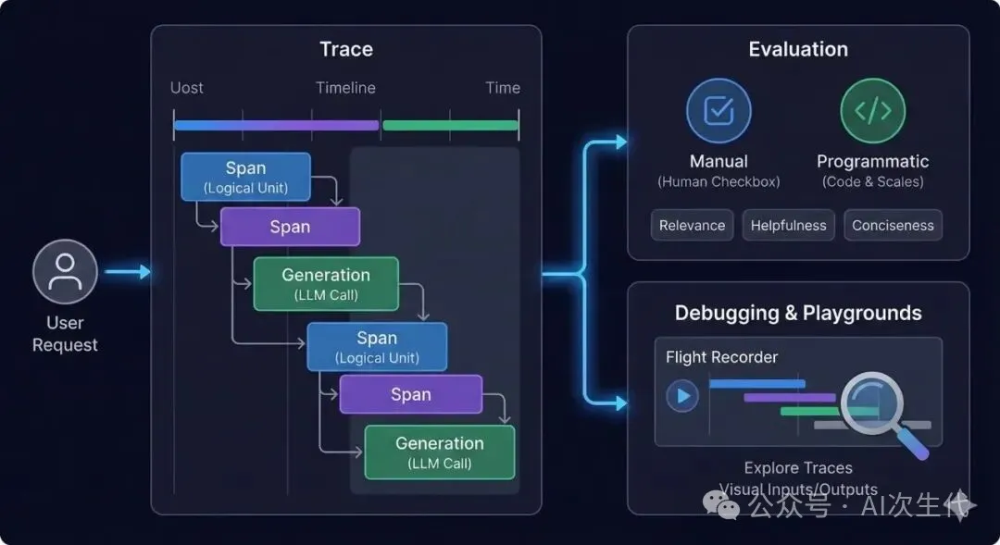

构建和部署基于大型语言模型（LLMs）的应用会带来一系列意想不到的问题。LLM 的非确定性、产生听起来合理但错误信息（幻觉）的倾向，以及在复杂调用序列中难以追踪其行为，都令人头疼。接下来，我们将使用 Langfuse 来探讨是如何成为解决这些问题的关键工具的，它为 LLM 应用提供了全面的可观测性、评估和提示词管理的坚实基础。

什么是 Langfuse？
Langfuse 是一个开源的、专为 LLM 应用设计的革命性可观测性与评估平台。无论是简单的 API 调用还是复杂的、涉及多轮代理的对话，Langfuse 都是追踪、可视化和调试 LLM 交互所有阶段的核心：从最初的提示词（Prompt）到最终的响应（Response）。

Langfuse 不仅仅是一个日志记录工具，它还提供了一种系统化的方法来：

系统评估 LLM 性能：用预定义指标衡量 LLM 响应的质量。
A/B 测试提示词：比较不同提示词的效果。
收集用户反馈：将用户反馈整合到追踪流程中，形成迭代改进所需的闭环。
它带来的核心价值是为 LLM 世界提供了透明度，使开发者能够：

理解 LLM 行为：准确找出发送了哪些提示词、收到了哪些响应，以及多阶段应用中的所有中间步骤。
快速排查问题：迅速定位错误、性能瓶颈或意外输出的根源。
评估质量：通过手动和自动方式，针对预设指标来衡量 LLM 响应的有效性。
迭代优化：利用数据驱动的洞察力来完善提示词、模型和应用逻辑。
管理提示词：控制提示词版本，并对其进行测试以获取最佳的 LLM 效果。
核心功能
Langfuse 提供了一系列关键功能：

追踪与监控 (Tracing and Monitoring)
Langfuse 能够捕获 LLM 每次交互的详细追踪。

“追踪 (Trace)”：代表一次端到端的用户请求或完整的应用流程。
“区间 (Span)”：追踪中表示逻辑工作单元的部分，例如工具调用、数据检索。
“生成 (Generation)”：特指对 LLM 的调用及其产生的输出。
评估 (Evaluation)
Langfuse 支持手动和编程方式进行评估。开发者可以定义自定义指标，针对不同数据集运行评估，并集成基于 LLM 的评估器。

提示词管理 (Prompt Management)
Langfuse 提供对提示词的直接控制，包括存储和版本控制功能。您可以进行 A/B 测试来比较不同提示词的效果，并在不同环境中保持一致性，从而实现数据驱动的提示词优化。

反馈收集 (Feedback Collection)
Langfuse 能够将用户评分或建议直接整合到您的追踪中。您可以将特定的评论或用户评分关联到产生该输出的精确 LLM 交互上，从而获得用于排查和改进的实时反馈。

解决了什么问题？
传统的软件可观测性工具在以下几个方面难以满足 LLM 应用的需求：

非确定性：LLM 即使输入相同，输出也可能不同，这使得调试极具挑战性。Langfuse 记录了每次交互的完整输入和输出，清晰地展现了当时的运行情况。
提示词敏感性：提示词中的微小变化可能彻底改变 LLM 的响应。Langfuse 可以帮助您跟踪提示词的版本及其对应的性能指标。
复杂调用链：大多数 LLM 应用涉及多个 LLM 调用、外部工具和数据检索（例如 RAG 架构）。追踪是理解流程和定位瓶颈或错误的唯一途径。Langfuse 为这些交互提供了可视化的时间线。
主观质量：判断 LLM 响应的“好坏”往往是主观的。Langfuse 支持客观（例如延迟、Token 数量）和主观（人类反馈、基于 LLM 的评估）的质量评估。
成本管理：调用 LLM API 是有成本的。Langfuse 监控您的 Token 使用量和调用次数，让您更容易理解和优化成本。
缺乏可见性：开发者无法了解他们的 LLM 应用在实际运行中的表现，缺乏可观测性使得持续改进变得困难。
Langfuse 不仅提供了一种系统化的方法来理解 LLM 交互，它还将 LLM 的开发过程从试错转变为一个数据驱动、迭代的工程学科。

# 参考

[1] 用 Langfuse 构建生产级、可信赖的 AI 智能体！https://mp.weixin.qq.com/s/FqlUSs9V33LtW5mPm0sWxQ