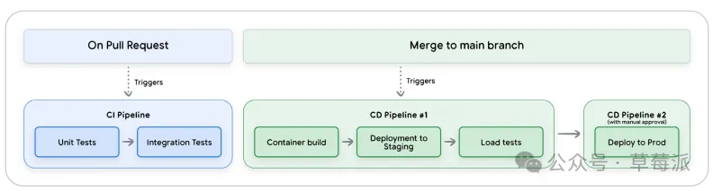

Google新发布的Agent《从原型到生产》指南

这份白皮书旨在为 AI Agent的生命周期提供全面的技术指南，重点关注部署、扩展和生产化。主要包含下面几个核心指南。

一个成功的，能落地的生产级Agent需要的人员配置如下：

云平台团队 ： 管理云基础设施、安全和访问控制。

数据工程团队 ： 构建和维护数据流水线。

数据科学与 MLOps 团队： 负责模型实验及自动化端到端 ML 流水线。

生成式 AI 团队：包括提示工程师，和负责将 GenAl 解决方案扩展到生产环境，构建包含评估和护栏的后端系统的AI工程师。

建立Agent Quality评估体系。

关于如何对Agent的质量进行评估，我们在Google 11月发布了Agent质量白皮书，输出了四大评估支柱，两大评估层级、三大可视化基石这篇文章中进行了详细阐述。

这里尤其需要注意Agent安全性的评估。

由于Agent的自主性带来了提示注入、数据泄露和记忆中毒等风险，需要通过系统指令定义Agent的“法则”。

使用输入过滤（如 Perspective API）和输出过滤（如 Vertex AI 安全过滤器）以及人机协同（HITL）来确保Agent的安全性。

建立CI/CD自动化pipeline

在CI阶段，运行单元测试、代码检查和Agent质量评估套件，在合并前提供即时反馈。

在CD阶段，将Agent部署到模拟生产的预发布环境，进行负载测试、集成测试和内部用户测试。

经过验证后，通常在获得人工批准后，将Agent部署到生产环境。

发布Agent，为了最大限度地降低风险，建议采用渐进式发布模式：

 先采用金丝雀发布模式， 从 1% 的用户开始，监控提示注入和异常工具使用情况。

再用蓝绿部署模式，运行两个相同的环境，通过流量切换实现零停机和瞬间回滚。

进行A/B 测试，在真实业务指标上比较智能体版本。

部署代码但动态控制发布，先针对特定用户测试新功能。

Agent一旦上线，运营模式转变为一个持续的循环：观察--行动--进化：

观察：建立可观测性的三个支柱，包括日志，链路追踪和指标。我们在Google 11月发布了Agent质量白皮书，输出了四大评估支柱，两大评估层级、三大可视化基石这篇文章中有详细阐述。

行动。这是实时干预阶段，用于管理系统健康和风险。将智能体设计为无状态服务；对于耗时任务，使用事件驱动模式（如 Pub/Sub）卸载工作；通过缓存和更小的模型提高速度；通过重试机制（需幂等工具）提高可靠性；通过批处理和缩短提示控制成本。

检测到威胁时的顺序是：遏制----熔断机制、分类----路由到人工审核、解决-----部署补丁。

进化：利用生产数据进行长期改进。分析生产日志 -> 将失败案例转化为新的评估数据集 -> 提交改进代码（触发 CI/CD） -> 安全部署。发现新的攻击（如提示注入）后，将其添加为永久测试用例，并更新护栏。

当组织拥有数十个孤立的Agent时，需要标准化协议来实现协作。如 MCP 与 A2A 。

当工具或Agent数量庞大（如数千个）时，需要建立注册表来解决发现和治理问题 。

   比如工具注册表 (Tool Registry)，用来解决工具发现瓶颈和安全审计需求。

    比如Agent注册表 (Agent Registry)，允许团队发现和重用现有的专业Agent。

# 参考

[1] 你的Agent上线后大概率会失败？Google新发布的Agent《从原型到生产》指南告诉你如何避免失败, https://mp.weixin.qq.com/s/5cHUQtm2NFl1rO0p-eL4xg