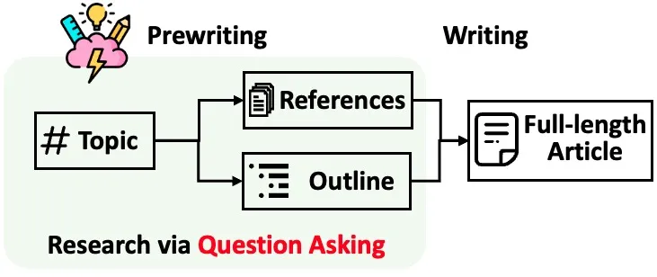

# 1. 资源

[1] Github地址: https://github.com/stanford-oval/storm

[2] examples文件夹: https://github.com/stanford-oval/storm/tree/main/examples

[3] STORM项目主页: http://storm.genie.stanford.edu

[4] STORM论文: https://arxiv.org/abs/2402.14207

# 2. 简介

STORM[1] 是一个由斯坦福大学开发的，基于大型语言模型（LLM）的知识整理系统。它能够针对特定主题进行互联网搜索，生成带有引用的完整报告。

虽然STORM生成的文章可能需要进一步编辑才能达到出版标准，但经验丰富的维基百科编辑发现它在预写阶段非常有用。

主要特点
- 预写阶段：系统通过基于互联网的研究收集参考资料，并生成大纲。
- 写作阶段：系统使用大纲和参考资料生成带有引用的全文文章。
- 多角度问题提问：通过调查类似主题的现有文章，发现不同视角，并用它们来控制问题提问过程。
- 模拟对话：模拟维基百科作者与基于互联网资源的主题专家之间的对话，使语言模型能够更新对主题的理解并提出后续问题。

使用场景

STORM适用于需要快速生成关于特定主题的详细报告的场景，尤其是在需要大量参考资料和引用的情况下。

它可以帮助研究人员、作家和编辑在写作的早期阶段快速构建文章框架和内容。

# 参考

[1] 10.8K+ Star！STORM：一个基于LLM的知识整理系统，https://mp.weixin.qq.com/s/x72eW958UbhrscvKghO6og