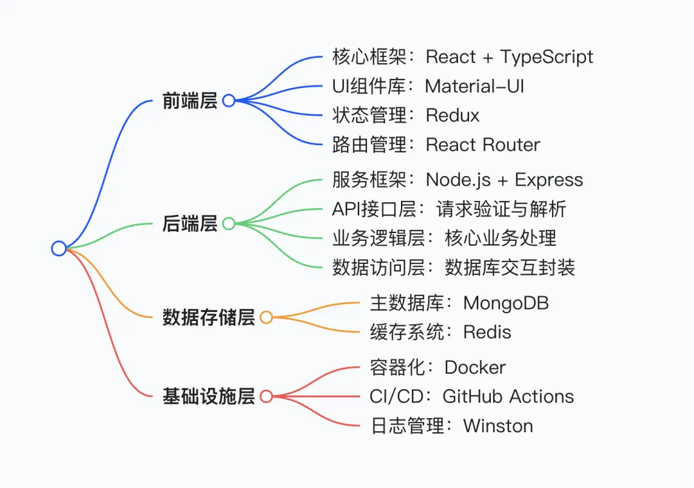
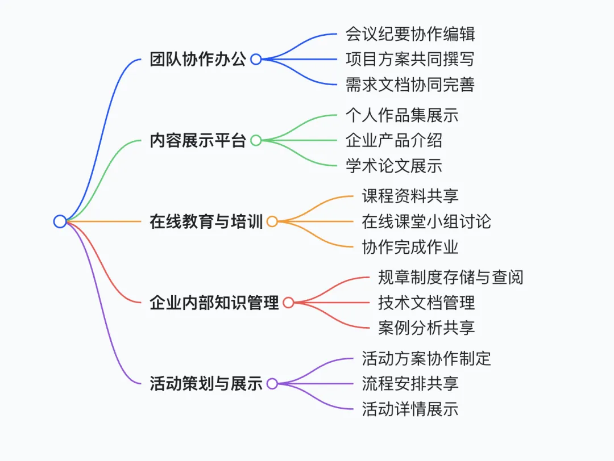

# 1. 资源

github地址：https://github.com/presenton/presenton

Presenton 是一款用于借助AI生成演示文稿的开源应用程序，所有功能都可以本地运行。在使用 OpenAI、Gemini 等模型时，我们能始终掌控自己的数据与隐私，也可以通过 Ollama 使用自己托管的模型。

Presenton 支持目前常用的操作系统，比如window，linux，MacOS等。

# 2. 介绍

在深度研究了这个开源项目之后，我总结了以下几个功能亮点：

```text
✅ 自带密钥 —— 支持 OpenAI、Gemini（更多模型即将上线……）
✅ API 演示文稿生成 —— 可作为 API 托管，通过请求生成演示文稿
✅ Ollama 支持 —— 集成 Ollama，本地运行开源模型
✅ 兼容 OpenAI API—— 可将任何兼容 OpenAI 的 API 端点与自有模型配合使用
✅ 支持本地运行 —— 所有代码均在我们的设备上运行
✅ 隐私优先 —— 无跟踪，不存储任何数据
✅ 灵活性高 —— 可根据提示词或大纲生成演示文稿
✅ 便于导出 —— 可保存为 PowerPoint（PPTX）和 PDF 格式
✅ 完全开源 —— 基于 Apache 2.0 许可证授权
```



通过这张思维导图大家可以更清晰的了解这个项目的技术特点，同时基于我自身对这款开源项目的体验和行业认知，我总结了它的一些应用场景：




# 参考

[1] 安利一款可本地部署的开源AI PPT项目，一键生成精美PPT！https://mp.weixin.qq.com/s/QTMVGD_aP41qrwtbjLxV8Q